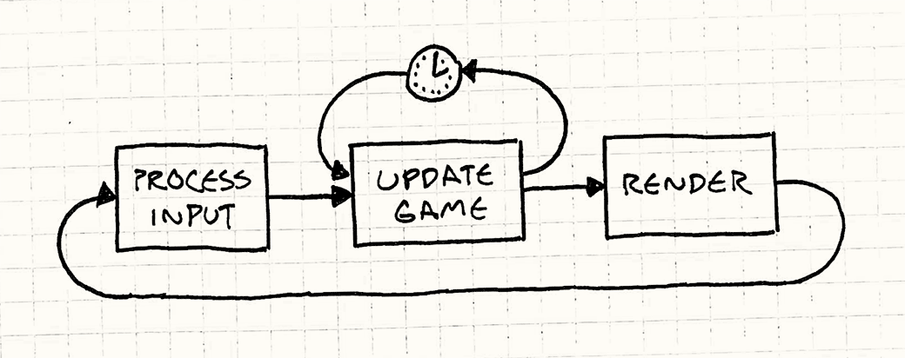
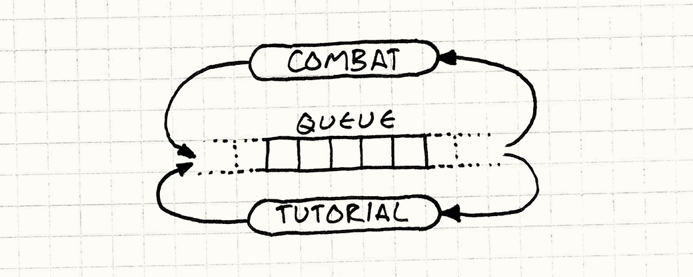

# Microservice API Patterns

> Moderator: Loris Keller

## Language scope and organization

### Language Foundations

[Glossar](./Glossar)

### Motivation

Erforderliche Architekturentscheide beim Entwerfen von Schnittstellen:

- Message exchange pattern (request-response vs. one way)
- Message exchange format: JSON, XML, etc.
- **Data contract**

Die beschriebenen Patterns sind unabhängig vom gewählten Message exchange Format und Pattern und fokusieren sich auf den Aspekt des **Data Contracts**.

Für die beschriebenen Patterns und die entsprechenden Architekturentscheidungen werden folgende Aspekte berücksichtigt (**forces**):

- **Latency** (_Client_): Netzwerkverhalten und Rechenaufwand des Endpoints inklusive (un-)marshalling
- **Throughput** und **scalability** (_Provider_): Antwortzeiten sollten nicht langsamer werden wenn Last grösser wird
- **Learning effort** und **modifiability**: Aspekte der Wartbarkeit (z.B. Rückwartskompatibilität für parallele Entwicklung, flexibilität beim Deployment)
- **Security**: Aspekte der Datensicherheit wie _Confidentiality_ und _Integrity_
- **Coupling**: Kopplung und Wissen zwischen _Provider_ und _Client_

### Language Organization


Zur Orentierung ist die Sprache in 7 Kategorien aufgeteilt:

- Interface **Responsibility**: Rolle der API Endpoints in der Architektur un deren Verantwortlichkeiten, _Wieso?_
- **Structure**: Wie viele Parameter sollen verwendet werden und wie werden diese strukturiert, _Was?_
- Delivery **Quality**: Sicherstellung der Qualität und effziente Nutzung der Resource, _Wie?_
- **Foundations**: Kontext der Sprache und Vokabular, Kriterien zu _Coupling_
- **Identification**: Prozess-Patterns zur Identification von API _Call_ Kandidaten
- Service **Evolution**: Lifecycle management (Versionierung / Verwaltung)
- API **Management**: Distribution, Kontrolle und Analyze von APIs

## Structural representation patterns

### Context

_Atomic Parameter, Atomic Parameter List, Parameter Tree,_ und _Parameter Forest_ teilen den folgenden Context: Ein Provider will eine oder meherere Operationen seiner Clients mitels einem API Endpoint zur Verfügung stellen. Um die Kommunikation sicherzustellen, müssen sie einer Struktur für die Nachrichten zustimmen.


### Problem

Die `Structural representation pattern` beschreiben grundlegende Patterns die verschieden auf das gleiche übergeordnete Designanliegen beim erstellen der Schnittstelle reagieren. Dazu gehört das beantworten der Frage:

> Was ist eine angebrachte Anzahl von `in` und `out` paremeter eines API calls.

### Forces

- Structure of the domain model and the system behavior and its impact on understandability
- Performance und resource use
- Loose coupling und interoperability
- Developer convenience und experience
- Maintainability
- Security und privacy

### Atomic Parameter Pattern

#### Problem (Atomic Parameter)

Wie kann der API provider **einen** primitiven Datentypen als `in` oder `out` Parameter in der request / response messages definieren?

#### Forces (Atomic Parameter)

Oben erwähnte Strukturen der In-/Outputparameter sind essenziell in Service Contracts und teilen bereits beschriebene high-level forces.

Auch die Strukturen der request und response messages sind ein wichtiger Teil des technischen Service Contracts. Sie schaffen ein gemeinsames Verständnis zwischen dem Provider und Consumer.


Bei Unterspezifizierung des service contracts kann es zu Problemen der Interoperability führen wenn z.B. Optionalität realisiert wird. Bei Überspezifizierung wird es schwierig Rückwärtskompatibilität zu gewährleisten.

Hier kommen die simplen Datenstrukturen zum Zug. Manchmal werden nur minimale Daten benötigt um die für den Kommunikationspartner benötigten Informationen zu übertragen. Zum Beispiel beim Abfragen eines Status einer Ressource. Meistens ist es aber keine gute Idee Key-Value Paare auszutauschen, da dadurch der Test und Unterhaltsaufwand vergrössert wird und die Message dadurch unnötig aufgeblasen wird.

#### Solution (Atomic Parameter)

Man definiert einfach einen einzelnen Input- und Outputparameter im API Contract in Form von simplen, unstrukturierten Daten. Der Parameter bekommt einen Namen und einen Wertebereich. Es sollten immer wenn möglich primitive Datentypen gewählt werden, welche vom darunterliegenden Appliaktionsprotokoll unterstützt werden. Man sollte nur in Ausnahmefällen Typerweiterungen oder neue Typen als Parameter verwenden um den allgemeinen Test- und Unterhaltsaufwand zu minimieren.

Beispiel für einen RESTful HTTP Request welcher eine Instanz dieses Patterns implementiert:

```java
@GET
@Path("/{claimId}")
    public ClaimDTO getClaimById(@PathParam("claimId") UUID claimId) {
    return claims.findById(claimId).map(ClaimDTO::create).orElseThrow(noSuchClaim);
}

curl http://localhost:8080/claims/a1e00494-e982-45f3-aab1-78a10ae3e3bd
```

#### Consequence (Atomic Parameter)

Bei Requests welche zusätzliche Informationen übermitteln sollen ist Atomic Parameter nicht geeignet, da sonst mehrere Requests abgesetzt werden müssten. Dazu greift man besser zu Atomic Parameter List.

#### Aktuelle Praxisbeispiele (Atomic Parameter)

Alle heute eingesetzen messagebasierten remote APIs verwenden dieses Pattern an verschiedenen Orten.

- Amazon Web Services (AWS) verwenden es um einen neuen Bucket zu erstellen mit einem `bucketName` als Parameter.
- Web API Spezifikationssprache Swagger hat die Notation von einem _parameter object_ um einen skalaren Parameter zu definieren.

### Atomic Parameter List Pattern

#### Problem (Atomic Parameter List)

Wie kann der API provider **mehrere** primitive Datentypen als `in` oder `out` Parameter in der request / response messages definieren?

#### Forces (Atomic Parameter List)

Die Datenstrukturen der request/repsone messages sind ein essenzieller Teil des API contracts.
Die oben genannten [Forces](#forces) müssen ausbalanciert werden.

#### Solutions (Atomic Parameter List)

Für das Übermitteln von einem oder meherere einfachen, unstrukturierten Datentypen muss eine Liste von 'Atomic Parameters' (Number, string, or boolean values) definiert werden.

```console
curl https://api.twitter.com/1.1/statuses/update.json?status=Hi%20there&lat=47.2266&lon=8.8184
```


### Consequences

Einige Integrationsplattformen verbieten den Kommunikationspartner mehrer Skalare in einem bestimmten Nachrichtentyp zu senden. Zum Beispiel erlauben viele Programmiersprachen nur einen `out` Parameter oder ein einzelnes Objekt als Rückgabewert.

## Prüfungsfragen

1. Wenn eine Operation mehrere Informationen benötigt, müssten mit dem Atomic Parameter Pattern mehrere Requests/Calls ausgeführt werden?

   _Ja, Atomic Parameters würden mehrere API calls benötigen._

2. Kann der Parameter im Atomic Parameter Pattern auch ein Objekt enthalten solange es nicht zu komplex ist?

   _Nein, es dürfen nur skalare Werte verwendet werden._

# Microservice API Patterns (continued)

> Moderator: Leonard Obernhuber

## Parameter Tree

### Context (Parameter Tree)

Der Context wurde bereits auf der Ebene der [structural representation patterns](./VW03#Context) definiert.

### Problem (Parameter Tree)

Wie kann der API provider **Tree Data Structures** in den Parameter einer Message definieren?  
Wie kann der API provider **repetitive** oder **verschachtelte** Elemente in den Parameter einer Message definieren?

### Forces (Parameter Tree)

Die Forces wurden bereits auf Ebene der [structural representation patterns](./VW03#Forces) definiert.

### Solution (Parameter Tree)

Die Basis der Parameterdarstellung ist ein einzelnes Element, welches wiederum eine oder mehrere untergeordnete, zusammengesetzte Datenstrukture(n) enthält.

`Tuple`, `Array` und `Trees` sind in den meisten Syntaxen verfügbar (Bsp. JSON-Objekte) und können als Basis dienen. Durch rekursive anwendung dieser Typen kann eine verschachtelt Strukur kreiert werden.


Parameter Tree pattern mit zwei Variationen: Verschachtelte Liste, und homogene, flache Collection.

```java
public class ClaimDTO {
    private final UUID id;
    private final String dateOfIncident;
    private final double amount;
    private final List<Link> links;
}

@PUT
@Path("/{claimId}")
public ClaimDTO updateClaim(@PathParam("claimId") UUID claimId,
                            @NotNull @Valid Claim claim) {
    boolean result = claims.update(claim);
    if (!result) {
        throw noSuchClaim.get();
    }
    return ClaimDTO.create(claim);
}
```

```console
GET http://localhost:8000/claims/0afeb849-6d63-40b6-b52f-21dee16fdda5
```

```json
{
  "claim": {
    "id": "0afeb849-6d63-40b6-b52f-21dee16fdda5",
    "dateOfIncident": "2021-10-12",
    "amount": 1024.0,
    "links": [
      {
        "uri": "http://localhost:8080/claims/0afeb849-6d63-40b6-b52f-21dee16fdda5",
        "title": null
      }
    ]
  }
}
```

### Consequences

Wenn sich die Strukur des Domain Models natürlich als Tree abbilden lässt, ist dier Parameter Tree die optimale Variante.

#### Pros

- Wenn zusätzliche Daten (z.B. Sicherheitsinformationen) mit der Message übertragen werden müssen, kann der Parameter Tree die zusätzlichen Daten strukturell von den Domain-Daten trennen.
- Falls nötig, können zusätzliche Daten (z.B. Security Informationen) mit der Message übermittelt werden.
- Parameter Trees sind komplex und können unnötige Elementen enthalten wodurch Brandbreite verschwendet wird. Ist das Domain Model jedoch eine komplexe Baumstruktur, ist die Verarbeitung und auch die Bandbreitennutzung wesentlich effizienter, als das Verwenden von einfacheren Stukruren, die mehrer Messages brauchen.

#### Cons

- Zu grosse Komplexität: Es kann Sinnvoll sein, die Parameter Trees durch einfachere Strukuren zu ersetzen, wenn diese nicht wesentlich mehr Messages versenden.
- Die Komplexität kann zu Security und Privacy issues führen.
- Die Komplexität kann dazu führen, dass zu viele (strukturelle) Informationen geteilt werden -> Verletzung des _Loose coupeling_ Prinzips.

### Know Uses

- [JIRA Cloud REST APIs](https://developer.atlassian.com/cloud/jira/platform/rest/v3/api-group-issues/#api-rest-api-3-issue-post) benutzt dieses pattern in ihrer `issue-createIssue' message.
- [Twitter REST API](https://developer.twitter.com/en) benutzt dieses pattern in ihrem GET collections request. Die Response enthält ein einziges JSON-Object, dass untergeordnet z.B. alle Benutzer aufliestet.

## Parameter Forest

### Context (Parameter Forest)

Der Context wurde bereits auf der Ebene der [structural representation patterns](./VW03#Context) definiert.

### Problem (Parameter Forest)

Wie tauscht man umfassende, sich wiederholende oder verschachtelte Daten in einer messagebasierten API zwischen Producer und Consumer aus?

### Forces (Parameter Forest)

Die Forces wurden bereits auf Ebene der [structural representation patterns](./VW03#Forces) definiert.

### Solutions (Parameter Forest)

Jeder der Parameterstrukturen ist entweder ein Atomic Parameter, Atomic Parameter List, Parameter Tree oder ein weiterer Parameter Forest.


```java
public interface IRPService {
    ResponseDTO forestInTreeOut(RequestDTO complexParameter1, AnotherRequestDTO complexParameter2);
}

public class RequestDTO {
  private float value;
  private String unit;

  [...]
}

public class AnotherRequestDTO {
  private int id;
  private NestedRequestDTO[] toothOfComb;

  [...]

public class ResponseDTO {
  private int id;
  private String dataField1;
  private String dataField2;

  [...]
}
```

### Consequences (Parameter Forest)

#### Pro

- Wenn die Parameter eines Domänenmodells nicht einfacher dargestellt werden können als mit dem Parameter Forest Pattern, dann bietet es sich gegenüber den Alternativen Parameter List oder Parameter Tree mit einem künstlichen Root-Knoten an (wobei das dem Parameter Forest sehr ähnelt). Das sorgt für eine verständliche und schlanke Lösung.
- Wenn zusätzliche Daten mit dem Request mitgesendet werden müssen, bietet der Parameter Forest die Möglichkeit neben den komplexen Datenstrukturen zusätzliche Daten einfach zu übermitteln.
- Bei komplexen Strukturen wie z.B. einem Graphen ist die Übertragung und Verarbeitung sehr effizient.

#### Con

- Aufgrund der Komplexität eignen sich Parameter Forests hinsichtlich der Einfachkeit der Implementierung und Verständlichkeit für die Entwickler nicht immer. Oftmals kann man simplere Strukturen verwenden, wenn sie die Anzahl zu sendenden Requests nicht massgeblich erhöhen und die Komplexität verringern.
- Eine komplexe Verarbeitungslogik kann zu Sicherheitsproblemen führen, falls versehentlich schützenswerte Daten mitgesendet werden.
- Es ist verlockend unnötige Daten in den komplexen Datenstrukturen mitzusenden, was für unnötig aufgeblasene Requests und Responses führt.

### Know Uses (Parameter Forest)

Die in der [Twitter REST API](https://dev.twitter.com/rest/collections/responses) verwendete Antwortstruktur verwendet ebenfalls einen Parameter Forest, wobei ein Baum ein Array von Objekten und ein zweiter Baum Kontrollinformationen und Metadaten wie Cursor und Page Tokens enthält.

## Pagination

### Context (Pagination)

In der Regel müssen Clients APIs anfragen, um Daten zur Darstellung für einen Nutzer oder zur weiteren Verarbeitung zu erhalten. Oft antwortet die API auf eine solche Anfrage mit einer grossen Anzahl von Daten, die eventuell sogar grösser ist als was der Client für die aktuelle Aufgabe braucht oder behandeln kann.

Daten können der gleichen Struktur entsprechen, typescherweise wenn Zeilen von einer relationalen Datenbank abgefragt werden. Sie können aber auch unterschiedliche Strukturen enthalten, zum Beispiel wenn sie von einer NoSQL Datenbank wie MongoDB abgefragt werden.

### Problem (Pagination)

Wie können _heterogene_ oder _homogene_ Daten inkrementell an einen Client ausgeliefert werden, damit dieser nicht überfordert wird?

### Forces (Pagination)

- Performance (latency, message processing), scalability, and resource use (bandwidth, memory, CPU power)
- Data set size and data access profile
- Loose coupling and interoperability
- Developer convenience and experience
- Security and data privacy
- Session awareness and isolation

### Solutions (Pagination)

Grosse Datensets sollten in kleinere, verwaltbare Stücke (Pages) zerteilt werden. Pro Response sollte eine dieser Pages mit zusätzlichen Informationen wie "Totale Anzahl Einträge" oder "Anzahl verbleibende Pages" ausgeliefert werden. Zusätzlich sollte es dem Client möglich sein, den Resultatbereich selbst einzuschränken oder zu selektieren. Zu beachten ist auch, dass eine Reihenfolge für die Daten definiert werden muss.


```ts
interface PagedListResponse<T> {
  meta: {
    count: number;
    pageCount: number;
    totalItemCount: number;
    pageNumber: number;
    pageSize: number;
  };

  links: {
    previousPage: string;
    nextPage: string;
  };

  data: T[];
}
```

### Varianten (Pagination)

| Variante     | Beschreibung                                                                                                                                                                                                   |
| ------------ | -------------------------------------------------------------------------------------------------------------------------------------------------------------------------------------------------------------- |
| Paged-Based  | Daten wird in gleichmässige Stücke (Pages) aufgeteilt. Eine einzelne Page wird über ihren Index identifiziert.                                                                                                 |
| Offest-Based | Client definiert einen Offset der Angibt, wie viele Elemente vom Datenset übersprungen werden. Zusäzlich gibt er an, wie viele Elemente vom Set ausgwählt werden sollen. (Skip/Take)                           |
| Cursor-Based | Ist nicht abhängig von der absoluten Position eines Elementes im Set. Client gibt ein Wert zur Identifizierung eines Elements an und die Menge, die vom Set (von diesem Element aus) ausgewählt werden sollen. |
| Time-Based   | Ähnlich zu _Cursor-Based_ aber statt `Id` wird ein `Timestamp` benutzt. Wird seltener verwendet aber relevant für zeitbasierte Daten/Anzeigen.                                                                 |

### Consequences (Pagination)

### Pro

- Pagination verbessert den Verbauch von Ressourcen, sowie die Perfomance allgemein dramatisch. Dies ist dadurch bedingt, dass nur die Daten gesendet werden, welche zu einem bestimmten Zeitpunkt auch absolut nötig sind.
- Aus einem Sicherheitsstandpunkt, verhindert korrekte Pagination Denial-of-Service Attacken, die durch das übermässige Abfragen von Daten entstehen könnte.

### Con

- Pagination ist nur dann anwendbar, wenn die Response sich an einem Datenset orientieren und in kleine Stücke (Pages) zerlegt werden können.
- Eine Response welche Pagination verwendet ist komplexer und sicher auch unangenehmer zu Benutzen als eine "einfache" Response.
- Pagination erhöht die Kopplung von Client und Provider. Dies kann aber durch ein konsistente Umsetzung der Pagination minimiert werden.
- Wenn ein Client nicht sequentiell auf Pages zugreiffen möchte, sondern mehr Kontrolle über die Selektion des Resultats haben möchte, müssen zusätzliche Parameter definiert und validiert werden.

### Know Uses (Pagination)

Viele Verwendungen, gerade in der aktuellen Web-Entwicklung.

- [Twitter API](https://developer.twitter.com/en/docs/twitter-api/pagination)
- [Confluence API](https://developer.atlassian.com/server/confluence/pagination-in-the-rest-api/)
- [StackExchange API](https://api.stackexchange.com/docs/paging)

## Prüfungsfragen

1. Ein Parameter Tree Pattern, das nur aus Atomic-Parametern besteht ist äquivalent zum Atomic Parameter List Pattern?
   _Ja_

1. Wird Pagination vor allem dazu verwendet, Datensets besser zu strukturieren?
   _Nein_

# Interface Evolution Patterns

> Moderator: Daniel Els

## Version Identifier

### Context

Produktiv eingesetzte APIs werden stetig weiterentwickelt. Versionen mit neuen Features erscheinen, welche ab einem bestimmten Zeitpunkt nicht mehr abwärtskompatibel sind.

### Problem

Wie kann ein API Provider seine technischen Möglichkeiten und das Vorhandensein inkompatibler Änderungen an Clients spezifizieren um Fehlverhalten vorzubeugen?

### Forces

- _Exakte Identifikation_ der API Version
- Minimierung der durch API-Änderungen verursachten _Auswirkungen_ auf den Client
- Gewährleistung, dass API-Änderungen nicht _versehentlich die Kompatibilität_ zwischen Client und Provider auf semantischer Ebene _unterbrechen_
- _Rückverfolgbarkeit_ der verwendeten API-Versionen zur _Governance_

### Non-solution

Oft releasen Firmen ihre APIs ohne einen Plan zur Kontrolle über die Versionen zu haben weil sie denken das könne man im Nachhinein irgendwann machen. Das ist einer der Hauptfaktoren warum viele Projekte gescheitert sind.

### Solutions

Man verwendet eine explizite Versionsangabe. Dieser Versionsidentifikator gehört in die API-Beschreibung und in die ausgetauschten Nachrichten.
Oftmals verwendet man hierzu einen numerischen Wert um den Entwicklungsfortschritt und Reifegrad der Software anzugeben.
Die Versionsangabe sollte nur an einem Ort in der API zugänglich gemacht werden um Konsistenzprobleme zu verhindern.

#### XML Namespaces

```xml
<soap:Envelope>
    <soap:Body>
        <ns:MyMessage xmlns:ns="http://www.nnn.org/ns/1.0/">
            ...
        </ns:MyMessage>
    </soap:Body>
</soap:Envelope>
```

#### JSON dediziertes Versionsattribut

```json
{
    "version": "1.0",
    "products": [
        {
            "productId": "ABC123",
            "quantity": 5;
            "price": 5.00;
        }
    ]
}
```

#### Endpunkt URL

```http
GET v2/customers/1234
```

#### API Domain Name

```http
GET /customers/1234
Host: v2.api.service.com
```

#### HTTP content type header

```http
GET /customers/1234
Accept: text/json+customer; version=1.0
```

### Consequences

#### Pros

- Die Verwendung dieses Patterns hilft bei der Identifizierung von APIs und der klaren Kommunikation über API-Operationen und Messages.
- Verringert Probleme aufgrund von unerkannten semantischen Änderungen zwischen API-Versionen, die die Kompatibilität versehentlich unterbrechen.
- Ermöglicht die Nachverfolgung, welche Version der Nutzdaten von den Clients tatsächlich verwendet wird.

#### Cons

- Durch die Änderung des Versions-Identifiers müssen Clients möglicherweise auf eine neue API-Version aktualisieren, obwohl sich die Funktionalität, welche sie benutzen, garnicht geändert hat.

### Know Uses

Die meisten Firmen, welche intern Software produzieren verwenden entweder intern oder extern ein solches Versionsidentifizierungsschema. Beispiele dafür sind Public Web APIs wie [Facebook Graph API](https://developers.facebook.com/docs/graph-api/) oder [Twitter API](https://developer.twitter.com/en/docs/twitter-api).

## Semantic Versioning

### Context

Bei der Versionserkennung aus einer einzigen Zahl geht **nicht** Zwingend hervor, wie bedeutend eine Änderung zwischen verschiedenen Versionen ist.
Die Clients möchten Auswirkungen schnellstmöglich erkennen, um Migrationen auf neue Version ohne grossen Aufwand machen zu können.
Die Providers müssen verschiedene Versionen verwalten, um den Clients Garantieren zu können, dass breaking changes ihre Applikation nicht beeinträchtigen.

### Problem

Wie kann ein Steakholder API-Versionen vergleichen und deren Kompatibilität erkennen?

### Forces

- Minimaler Effort zum erkennen von _Inkompatibilitäten der Versionen_
- _Verwaltbarkeit_ der API-Versionen und Steuerungsaufwand
- Klarheit über _Auswirkungen von Veränderungen_
- Klare _Trennung von Änderungen_ mit unterschiedlichen Auswirkungen und unterschiedlicher Kompatibilität
- Klarheit beim _Zeitplan_ für die Entwicklung der API.

### Solutions

Hierarchisches Versionsschema mit drei Zahlen `x.y.z`, welches eine Abstufung der Änderungen ermöglicht. Meistens **Major-, Minor-** und **Patch-** Version genannt.

| Versionsname | Alte Versionsnummer | Neue Versionsnummer | Veröffentlichung von...                       |
| ------------ | :-----------------: | :-----------------: | --------------------------------------------- |
| **Major**    |        1.2.4        |        2.0.0        | Inkompatiblen Änderungen _(breaking changes)_ |
| **Minor**    |        1.2.4        |        1.3.0        | Neuen, ergänzenden, kompatiblen Features      |
| **Patch**    |        1.2.4        |        1.2.5        | Bugfixes, Dokumentationsanpassungen           |

### Consequences

#### Pros

- Grosse Klarheit bei der Darstellung von Auswirkung und Änderungen zweier API-Versionen auf deren Kompatibilität

#### Cons

- Erhöhter Aufwand bei der Ermittlung der Versionen, da es schwer sein kann, zu welcher Kategorie eine Änderung gehört

### Know Uses

Das Pattern ist weit verbreitet und wird im Zusammenhang mit Remote-APIs und anderen Software-Artefakten verwendet.

Beispiel [Azure DevOps](https://docs.microsoft.com/en-us/azure/devops/get-started/?view=azure-devops) [Commits - Get](https://docs.microsoft.com/en-us/rest/api/azure/devops/git/commits/get-commits)

- `GET https://dev.azure.com/{organization}/{project}/_apis/git/repositories/{repositoryId}/commits?api-version=6.0`
- `GET https://dev.azure.com/{organization}/{project}/_apis/git/repositories/{repositoryId}/commits?api-version=5.1`
- `GET https://dev.azure.com/{organization}/{project}/_apis/git/repositories/{repositoryId}/commits?api-version=5.0`

## Two in Production

### Context

Eine API verändert sich über die Zeit, wobei die Funktionalität erweitert, verbessert und verändert wird. Früher oder später sind die Änderungen einer neueren Version nicht mehr Rückwärtskompatibel mit älteren Versionen, was zu einem _Breaking Change_ auf den Clients führt. Clients verschiedener APIs haben unterschiedliche _Life Cycles_, welche nicht zwingend mit denen der Provider übereinstimmen. Entsprechend kann ein Upgrade auf die neue API Version nicht forciert werden.

### Problem

Wie kann ein Provider eine API schrittweise anpassen, ohne _Breaking Changes_ beim Client auszulösen und gleichzeitig nicht eine grosse Anzahl von API Versionen pflegen zu müssen?

### Forces

- Unterschiedliche _Life Cycles_ zwichen Provider und Client ermöglichen, Provisonierung einer neuen API Version ohne _Breaking Change_ bei Client
- Undetected backwards-compatibility problems bei neuen API Änderungen verhindern
- Roll back einer API Version
- Changes auf Client minimieren
- Verwaltungsaufwand für Clients einer älteren API Version minimieren

### Solutions

Zwei oder mehrere sukzessive Versionen einer API bereitstellen, wobei die älteren Versionen entfernt oder deprecated werden. Dadurch ist sichergestellt, dass Clients zu einem späteren Zeitpunkt migrieren können.

- Variante zur Versionierung wählen [Version Identifier Pattern](#version-identifier).
- Anzahl an Versionen definieren (normalerweise Zwei) die parallel in Betrieb sind und Clients über _Life Cycle_ Modell informieren.
- Wenn eine Version der API bereitgestellt wird, wird die älteste Version entfernt oder deprecated. Zusätzlich sollten alle Clients der älteren Version über Migrationsmöglichkeiten informiert werden. (Zusätzlich HTTP-Redirects)


### Consequences

#### Pros

- Clients können Änderungen planen und müssen nicht direkt migrieren, wenn eine neue API Version veröffentlicht wird
- Parallele Versionen haben einen hohen Kompatibilitätsgrad und erlauben einen Roll Back einer API Version
- Reduziert die Chance von undetected compatibility changes
- Reduziert Verwaltungsaufwand, da technische Änderungen ohne Rücksicht auf Rückwärtskompatibilität gemacht werden können

#### Cons

- Clients müssen _Breaking Changes_ über die Zeit adaptieren
- Limitiert die Möglichkeit auf dringende Changes zu reagieren
- Aufwand/Kosten werden höher durch Verwaltung mehrerer API Versionen
- Zyklus der Änderungen an API gibt Migrationszeitraum vor

### Known Uses

[GitHub API](https://docs.github.com/en/developers/overview/about-githubs-apis)

## Limited Lifetime Guarantee

### Context

Eine API Version wurde bereitgestellt und wird von mindestens einem Client benutzt. Der API Provider kann nicht beurteilen in welchen Zyklen die Clients angepasst werden und welcher Schaden entstehen würde, wenn man die Clients zu einem _Upgrade_ zwingt. Der Provider möchte aber seine API weiterentwickeln, ohne _Breaking Changes_ in der publizierten Version zu verursachen.

### Problem

Wie kann ein Provider seinen Clients mitteilen, wie lange eine publizierte Version seiner API zur Verfügung steht?

### Forces

- Anpassung des Clients aufgrund von Veränderungen an der API sollten planbar sein
- Verwaltungsaufwand für den Support von alten Clients minimieren

### Solutions

Der API Provider garantiert keine _Breaking Changes_ in einer publizierten Version für eine definierte Zeitdauer. Entsprechend muss ein Endzeiptunkt für jede API Version bezeichnet/bekanntgegeben werden.

Ein grosser Vorteil gegenüber Two in Production Pattern ist, dass keine weitere Koordination zwischen Provider und API erfolgen muss. Es ist bereits im Voraus bekannt, wie lange eine API Version unterstützt wird. Dieses Pattern richtet sich vor allem an die Stabilität des Clients, um ihn vor unerwarteten Änderungen zu schützen und Anpassungen planbar zu machen.

### Consequences

#### Pros

- Gute Planbarkeit aufgrund der bereits bekannten Supportdauer

#### Cons

- Limitiert die Möglichkeit auf dringende Changes zu reagieren
- Zwingt Clients zu einem Upgrade an einem gewissen Zeitpunkt, welcher eventuell in Konflikt zu der Roadmap des Clients steht
- Keine Möglichkeit mit Clients umzugehen, die nicht mehr weiterentwickelt werden

### Knwon Uses

[Facebook Platform Versioning](https://developers.facebook.com/docs/graph-api/guides/versioning)

## Prüfungsfragen

1. Muss die Rückwärtskompatibilität gewährleistet werden wenn die Major-Version inkrementiert wird?
   _Nein_

2. Bei Limited Lifetime Guarantee ist ein wesentlicher Vorteil, dass keine Koordination mit den Clients nötig ist. Korrekt?
   _Ja_

# Game Loop Pattern

> Moderator: Loris Keller

## Context

Früher waren Programme Batch-Orientiert, man hat sie gestartet und gewartet bis man ein Resultat erhält. Mit der Zeit hat man realisiert, dass es sehr ineffiezient ist ein Programm zu starten und Stunden später die Resultate abzuholen, besonders auch im Bezug auf die Erkennung und Behebung von Fehlern. Dies war die Entstehung von interaktiven Programmen, wobei Games mitunter die ersten dieser Art waren.

Die Grundlage von interaktiven Programmen sind User Inputs. Das Programm wartet auf einen Event vom User und behandelt diesen in sogenannten _Event Loops_.

```ts
while (true)
{
  Event* event = waitForEvent();
  dispatchEvent(event);
}
```

Im Unterschied zu anderer Software warten Games nicht explizit auf einen User Input. Sprich, dass Game läuft weiter auch wenn keine Eingabe erfolgt. Dies ist die Essenz eines echten Game Loops: Es verarbeitet User Input aber wartet nicht darauf.

```ts
while (true) {
  // Handles user input since last call
  processInput();

  // Advances game simulation (AI and physics)
  update();

  // Draws the game
  render();
}
```

## Problem

Wie können User Inputs nicht blockierend verarbeitet und der Lauf der Zeit korrekt adaptiert werden?

## Forces

- Keine Blockierungen
- Leistungsfähigkeit der Hardware
- Stromverbrauch
- Gameplay speed
- Entkopplung von Inputverarbeitung, Spiellogik und Rendering
- Koordination mit dem Event Loop der Plattform

## Run, run as fast as you can (Fixed time step with no synchronization)

```csharp
while (true)
{
    processInput();
    update();
    render();
}
```

Dies ist der simpelste und einfachste Game Loop, welcher aber nur einen kleinen Teil unserer Probleme löst.

### Benefits

- Einfache implementierung
- User Inputs werden nicht blockierend verarbeitet
- Funktioniert gut, wenn spezifische Hardware vorausgesetzt ist und Stromverbauch nicht von Relevanz ist

### Problems

- Keine Kontrolle wie schnell das Spiel läuft
- Auf schneller Hardware würde man nicht sehen was passiert
- Content-heavy oder Teile mit mehr AI oder Physics würden auf minderer Hardware real langsamer laufen

## Take a little nap (Fixed time step with synchronization)

Das Problem, wie schnell ein Spiel laufen darf, kann mit einer fix definierten Zeitperiode für ein `sleep()` gelöst werden..


```csharp
while (true)
{
    var start = getCurrentTime();

    processInput();
    update();
    render();

    // Sleep to make sure the game does not run too fast!
    sleep(start + MS_PER_FRAME - getCurrentTime());
}
```

### Benefits

- Immer noch sehr einfache Implementierung
- Schonend für Stromverbrauch
- Spiel läuft nicht zu schnell

### Problems

- Spiel kann zu langsam laufen
- Wenn `update` und `render` zu lange brauchen, wird gameplay verlangsamt

## One small step, one giant step (Variable time step)

- Mit jedem `update` wird die **game time** um einen bestimmte Zeit vorwärts getrieben.
- Es braucht eine bestimmte **real time** um das zu verarbeiten.

Wähle ein variable time step , die von der **real time** abhängig ist. Dauert das verarbeiten länger, desto grössere Schritte macht das Spiel. Somit hält das Game immer mit der realen Zeit mit.

```csharp
var lastTime = getCurrentTime();
while (true)
{
    var current = getCurrentTime();
    // Calculate the real time since last update()
    var elapsed = current - lastTime;
    processInput();
    // Update is responsible for advancing the game forward by the elapsed time.
    update(elapsed);
    render();
    lastTime = current;
}
```

_Beispiel:_ Bei einem fixen time step bewegt sich ein Gegenstand entsprechend ihrer Geschwindigkeit über den Screen. Bei der variable time step skaliert die Geschwindigkeit mit der verstrichenen **real time** und bewegt sich weiter, je grösser dieser Zeitabschnitt ist. D.h egal ob mit 20 kleinen, schnellen oder vier grossen, langsamen Schritten, der Gegenstand benötigt die gleiche Zeit, um sich über den Screen zu bewegen.

### Benefits

- Das Spiel läuft auf unterschiedlicher Hardware mit gleichbleibender Geschwindigkeit
- Spieler mit schnelleren Rechnern werden mit einem flüssigeren Spielablauf belohnt

### Problems

- Nicht mehr Deterministisch
  - Auf unterschiedlichen Hardware werden Berechnungen unterschiedlich oft durchgeführt (floating point operations)

## Play catch up (Fixed update time step, variable rendering)

Ein Teil der Engine welcher oft nicht an die Zeitvariable gekoppelt ist is das Rendering. Es wiedergibt nur einen Zeitpunkt und es ist daher egal wieviel Zeit seit dem letzten Rendering vergangen ist. Das kann man zu seinem Vorteil nutzen und einfach fixe Zeitschritte definieren. Das macht die Angelegenheit um einiges einfacher und stabiler.

Man nimmt die Echtzeitperiode zwischen den Ausfürungen des Game Loops. Daraus wird definiert wie viel Gamezeit simuliert werden muss für die Synchronisierung zwischen Echt- und Gamezeit. Das macht man mit fixen Zeitintervallen:

```csharp
double previous = getCurrentTime();
double lag = 0.0;
while (true)
{
  double current = getCurrentTime();
  double elapsed = current - previous;
  previous = current;
  lag += elapsed;

  processInput();

  while (lag >= MS_PER_UPDATE)
  {
    update();
    lag -= MS_PER_UPDATE;
  }

  render();
}
```

Anfangs jedes Frames wird der `lag` anhand der verstrichenen Echtzeit definiert. Daraus wird errechnet wieviel die Gamezeit hinter der Echtzeit hinterherhinkt. Die Update-Aktion wird isoliert und so lange ausgeführt bis die Echt- und Gamezeit wieder synchron laufen und dann wird gerendert.



Der Zeitintervall sagt hier aber nichts mehr über die _sichtbare_ Framerate aus. `MS_PER_UPDATE ` beschreibt nur die Granularität in der das Spiel aktualisiert wird. Bei längeren Intervallen wird die Rechenzeit grösser und die Framerate kleiner.

### Benefits

- Gameplay speed ist Konsistent
- Updates in fixen Zeitintervallen
- Entkopplung von `update` und `render`

### Problems

- Komplexität
- Update time step so klein wie möglich für high-end und genug gross für low-end

### Stuck in the middle

Bei dem vorherigen Ansatz wird zwar in fixen Zeitintervallen aktualisiert, aber an zufälligen Zeitpunkten gerendert. Das führt dazu, dass die Anzeige oft Zeitpunkte zwischen Updates darstellt.


_Beispiel:_ Ein Gegenstand fliegt von einer Seite des Bildschirms zur anderen. Zwei Updates berechnen Start und Endpunkt. In Echtzeit wäre der Gegenstand in der Mitte des Screens, das Rendering zeigt aber nur den Startpunkt links. Der `lag` sagt genau aus wo sich die Kugel befindet und man kann die Position berechnen. Dazu gibt man einfach folgende Rechnung ins Rendering mit und lässt die Position berechen:

```ts
render(lag / MS_PER_UPDATE);
```

Diese sogenannte Interpolation kann aber in bestimmten Situationen falsch sein falls das Objekt durch etwas abgebremst wird. Das macht sich aber in den meisten Fällen nur minimal bemerkbar und ist gegenüber der flüssigen Darstellung zu vernachlässigen.

## Design Decisions

### Game Loop Owner

- **Platform:** Keine Entwicklung oder Optimierungen nötig, gute Plattformintergation, wenig Kontrolle
- **Game Engine:** Keine Entwicklung oder Optimierungen nötig, wenig Kontrolle
- **Write it yourself:** Totale Kontrolle, Integration mit Plattform muss selbst erarbeitet werden

### Power Consumption

- **Run as fast as it can:** Desktop-PCs, Überschüssige Cycles werden zur erhöhung von FPS oder verbesserung von Graphik verwendet
- **Frame Rate limitieren:** Mobile Games, Sleep wenn Berechnungen abgeschlossen sind

## Prüfungsfragen

1. Mit der Variante variable time step läuft das Spiel auf unterschiedlicher Hardware mit gleichbleibender Geschwindigkeit und eignet sich somit für multiplayer Spiele?  
   _Nein_

2. Wird ein einfaches `sleep` in den Gaming Loop eingebaut, so wird Gameplayqualität von langsamen Maschinen beeinflusst?  
   _Nein_

# Component Game Pattern

> Moderator: Leonard Obernhuber

## Context

Moderne Computerspiele haben diverse Aufgaben wie Inputverarbeitung, Physik-/Kollisionsberechnungen, Rendering und Soundwiedergabe. Dabei können schnell unübersichtliche und nicht wartbare Klassen entstehen, die zu viele unterschiedliche Aufgaben haben.

Beispiel der Nichteinhaltung von _separation of concern_:

```ts
if (collidingWithFloor() && getRenderState() != INVISIBLE) {
  playSound(HIT_FLOOR);
}
```

Eine starke Kopplung kann insbesondere bei der Verwendung von Multi-Core Spielen zu Concurrency Problemen führen. Daher sollte man die Aufgabenbereiche klar definieren und in Komponenten auslagern. Das sorgt für etwas mehr Komplexität, aber dafür auch für weniger Fehleranfälligkeit, Entkopplung und Wiederverwendbarkeit des Codes.

## Problem

Wie ermöglicht man, dass eine einzelne Entität mehrere Domänen umfassen kann, ohne dass die Domänen aneinander gekoppelt sind?

## Forces

- Entkopplung der Domänen (Separation of Concerns)
- Wiederverwendbarkeit der Komponenten
- Wartbarkeit des Codes
- Multi-Threading

## Solution

### Bjorn the problematic baker

Hier dargestellt ist die problematische Bjorn-Klasse. Aktuell wäre die Klasse noch gut verwaltbar, jedoch wäre in einem realen Spiel die Logik viel komplexer und wir müssten beispielsweise ebenfalls Sound-Effekte für Bjorn implementieren.

Die Logik der aktuellen `update` Methode hat nichts mit dem Pattern zu tun, sondern dient nur zur Illustration. Wichtig ist zu erkennen, das wir momentan 3 verschiedene _Domains_ verarbeiten: User Input, Physik und Rendering.

```ts
const WALK_ACCELERATION: number = 1;
class Bjorn {
  private positon: Position;
  private volume: Volume;
  private velocity: number = 0;
  private spriteStand: Sprite;
  private spriteWalkLeft: Sprite;
  private spriteWalkRight: Sprite;

  update(world: World, graphics: Graphics): void {
    // Apply user input to hero's velocity.
    switch (Controller.getJoystickDirection()) {
      case Direction.Left:
        this.velocity -= WALK_ACCELERATION;
        break;

      case Direction.Right:
        this.velocity += WALK_ACCELERATION;
        break;
    }

    // Modify position by velocity.
    this.position.x += velocity;
    world.resolveCollision(this.volume, this.position, this.velocity);

    // Draw the appropriate sprite.
    sprite = this.spriteStand;
    if (velocity < 0) {
      sprite = this.spriteWalkLeft;
    } else if (velocity > 0) {
      sprite = this.spriteWalkRight;
    }

    graphics.draw(sprite, this.position);
  }
}
```

### Components

Wir erreichen eine Entkopplung der verschiedenen Domains, indem wir diese in verschiedene Komponenten aufteilen. Wir haben eine Komponente welche Input vom Benutzer verarbeitet, sowie spezifische Bjorn-Komponenten welche sich um die Physik und das Rendering von Bjorn kümmern. Die `DemoInputComponent` zeigt ebenfalls einen grossen Vorteil dieses Patterns, da wir für einen "Demo-Modus" den Input des realen Spielers durch einen Computergesteuerten Input ersetzen können.

```ts
class PlayerInputComponent implements InputComponent {
  constructor(readonly walkAcceleration: number = 1) {}

  update(gameObject: GameObject): void {
    switch (Controller.getJoystickDirection()) {
      case Direction.Left:
        gameObject.velocity -= this.walkAcceleration;
        break;

      case Direction.Right:
        gameObject.velocity += this.walkAcceleration;
        break;
    }
  }
}

class DemoInputComponent implements InputComponent {
  update(gameObject: GameObject): void {
    /* Demo functionality */
  }
}

class BjornPhysicsComponent implements PhysicsComponent {
  update(gameObject: GameObject, world: World): void {
    /* Much physics, such gravity */
  }
}

class BjornGraphicsComponent implements GraphicsComponent {
  update(gameObject: GameObject, graphics: Graphics): void {
    /* Draw all the things */
  }
}
```

### Transformed Bjorn

Nach der Transformation der Bjorn-Klasse enthält die Klasse keine spezifische Logik, welche nur für Bjorn gelten würde. Sie dient als Container und kann entsprechend auch generisch und mit unterschiedlichen Komponenten zusammengesetzt werden. Aufgrund dessen können wir auch sagen, dass dieser Container ein generisches `GameObject` darstellt.

```ts
class GameObject {
  velocity: number = 0;
  position: Position;

  constructor(
    private readonly input: InputComponent,
    private readonly physics: PhysicsComponent,
    private readonly graphics: GraphicsComponent
  ) {}

  update(world: World, graphics: Graphics): void {
    this.input.update(this);
    this.physics.update(this, world);
    this.input.update(this, graphics);
  }

  static createBjorn(): GameObject {
    return new GameObject(
      new PlayerInputComponent(),
      new BjornPhysicsComponent(),
      new BjornGraphicsComponent()
    );
  }
}
```

## Consequences

### Pros

- Bessere Wiederverwendbarkeit von Logik der einzelnen _Domains_
- Reduziert Kopplung der einzelnen _Domains_ massiv
- Austauschbarkeit der Komponenten

### Cons

- Je nach Granularität der Komponenten nimmt die Komplexität enorm zu
- Korrekte Kommunikation zwischen den Komponenten ist anspruchsvoll
- Golden Hammer

## Design Decisions

Die wichtigste Design Frage, die es zu beantworten gilt, ist: "**Welche Sets von Components werden gebraucht?**"

-> Je grösser und komplexer die Engine, desto feiner die Components.

Es gibt nicht die absolute Lösung und meistens werden auch mehrere Designs angewendet.

### Wie kommt das Objekt zu seinen Components?`

#### Das Objekt erstellt seine eigenen Components

- Es ist sichergestellt, dass immer **alle** Components erstellt werden.
- _High Coupling:_ Das Objekt kann nicht ohne weiters neu konfiguriert werden.

#### Das Objekt wird ausserhalb des Components erstellt.

- Mehr flexibilität, da das Verhalten des Objekts durch die übergabe von verschiedenen Components komplett verändert werdern kann.
- _Low Coupling._

### Wie kommunizieren die Components untereinander?

Perfekt entkoppelte Components, die isoliert funktionieren, sind ein schönes Ideal, das sich in der Praxis aber nicht wirklich umsetzten lässt.

#### Durch das Ändern des Objektstates

- Components sind weiterhin decoupled.
- Alle Informationen müssen in das Container-Objekt übertragen werden.
  - Nicht immer relevant für alle Components
  - Zu viele Component-Konfigurationen können Speicher verschwenden
- Die Kommunikation wird implizt und abhängig von der Reihenfolge

#### Durch direkte kommunikation untereinander

Alle Components, die miteinaner kommunizieren müssen, erhalten eine direkte Referenz zueinander.

- Einfach und schnell, die Kommunikation muss nicht über das Container-Objekt.
  - _Free-for-all_: Es können alle `public` methoden aufgerufen werden.
- Die beiden Components sind tightly coupled.

```ts
class BjornGraphicsComponent implements GraphicsComponent {
  constructor(private readonly physics: BjornPhysicsComponent) {}

  update(gameObject: GameObject, graphics: Graphics): void {
    /* Much physics, such gravity */
    if (this.physics.isOnGround()) {
      /* do ground action */
    } else {
      /* do some flips */
    }
  }
}
```

#### Via dem Versenden von Messages

Die komplexeste Alternative ist das bauen eines Nachrichtensystems im Container-Objekt, damit die Components nachrichten untereinander austauschen können.

- _Sibling components are decoupled._
- Container-Objekt ist weiterhin einfach.

```ts
// Base component that will be implemented by all other components
class Component {
  public abstract receive(message: number): void;
}

class ContainerObject {
  private readonly components: Component[];

  // Send the messsage to each component
  public send(message: number): void {
    for (let component of this.components) {
      component.receive(message);
    }
  }
}
```

## Aktuelle Praxisbeispiele

- `Unity` framework’s core `GameObject`
- `Delta3D` engine base `GameActor`
- `Microsoft’s XNA` game framework core `Game` class.

## `Component`-Pattern vs `Strategy`-Pattern

Dieses Pattern hat viele Ähnlichkeiten mit dem _GoF_ `Strategy`-Pattern.
Beide Patterns kümmern sich um das Verhalten eines Objekts und das delegieren zu Sub-Objekten.

- Das `Strategy`-Pattern ist jedoch meistens **Stateless** -> Es kapselt einen Algorithmus, aber keine Daten.
- Components sind etwas selbständiger, da sie meist auch einen eigenen State haben.

## Prüfungsfragen

1. Sollte man für die Kommunikation zwischen Komponenten nur eine Variante verwenden?
   **Nein**
2. Mit Hilfe dieses Patterns kann ein Auto-Pilot für einen Spieler auf einfache Art und Weise implementiert werden?
   **Ja**

# Event Queue

> Moderator: Daniel Els

## Intro

Fast jedem sind die Ausdrücke _Event Queue_, _Message Queue_ oder auch _Event Loop_ geläufig. Typescherweise finden sich solche _Event Loops_ vor allem bei der GUI Programmierung. Für jeden Klick eines Buttons oder Tastenanschlag generiert das Betriebssystem einen Event, welcher von der Applikation behandelt werden muss. Sprich, die Applikationen wartet auf die Eingabe von User Inputs.

Wie wir bereits gelernt haben, warten Spiele nicht auf die Eingabe von Benutzern, sondern arbeiten diese nach und nach in Form von einem _Game Loop_ ab. Spiele verwenden aber oft eine _Event Queue_ zur Kommunikation der Systeme oder _Komponenten_. Beispielsweise will man eher nicht eine Logik zur Anzeige von Tutorials innerhalb der "Combat Logik" implementieren.



## Problem

Wie kann die Verarbeitung vom Auftreten eines Events oder von der Anfrage eines Requests entkoppelt werden?

## Forces

- Kommunikation zwischen oder innerhalb von Komponenten / Domains
- Keine blockierenden "Aufrufe"
- Entkopplung zwischen dem Senden eines _Requests_ oder eines _Events_ und dessen Verarbeitung, vor allem zeitlich
- _Requests_ aggregiert verarbeiten
- Ausnutzung Multi-Threading
- Komplexität
- Scope

## Solution

- Nutze eine Datenstrukture (`PlayMessage`) um Details für einen pendenten Request zu speichern.
- Nutze ein einfacher `array` Ring-Buffer (`Head` und `Tail` anstelle eines `PendingCount`) um die versendeten Messages abzulegen.
  - `Head` und `Tail` jeweils mittels Modulo-Rechnung den array in einer loop (ring) durchlaufen.
- Fange duplizierte Nachrichten bereits beim einreihen von neuen Messages ab.

```csharp
public struct PlayMessage
{
    Guid SoundId;
    int Volume;
}

public class Audio
{
    private const int MAX_PENDING = 16;
    private static readonly PlayMessage[] pending = new PlayMessage[MAX_PENDING];

    private int Head { get; set; }
    private int Tail { get; set; }

    public void PlaySound(Guid soundId, int volume)
    {
        // Check if any pending requests is the same..,
        for (int i = Head; i != Tail; i = (i + 1) % MAX_PENDING)
        {
            if (pending[i].SoundId == soundId)
            {
                // Use the larger of the two volumes...
                pending[i].Volume = Math.Max(volume, pending[i].Volume);
                // No need to enqueue a duplicated item
                return;
            }
        }

        // Check if Tail would overlap Head
        // TODO: You may wan't tp grow array by N to allow more messages
        Assert((Tail + 1) % MAX_PENDING != Head);

        // Add sound to the end of queue
        pending[Tail].SoundId = soundId;
        pending[Tail].Volume = volume;

        Tail = (Tail + 1) % MAX_PENDING;
    }

    // Called within GameLoop or similar methods
    public void Update()
    {
        if (Head == Tail) return; // No pending updates

        var resource = LoadSound(pending[Head].SoundId);
        var channel = FindOpenChannel();
        if (channel == -1) return;
        StartSound(resource, channel, pending[Head].Volume);

        Head = (Head + 1) % MAX_PENDING;
    }
}
```

## Consequences

### Pro

- Der Code für das Empfangen einer Nachricht ist vom Code für das versenden einer Nachricht entkoppelt.
- Wir haben eine Queue für die Koordination zwischen den Sender und Empfänger.
- Die Queue ist entkoppelt vom rest des Programmes.

Somit muss nur noch die "Thread-Safty" im Programm garantiert werden, welcher im Higher-Level gemacht werden kann.

### Cons

- Komplexität eher hoch -> Observer- oder Command-Pattern eventuell ausreichend
- Notwendige Information über den aktuellen Context muss immer in der Datenstruktur (`PlayMessage`) übergeben werden, da alles asynchron ist.

## Design Decisions

### Inhalt der Queue

#### Events

Ein Event beschreibt ein bereits vergangenes Ereignis wie z.B. "Monster died". Dieses wird in die Queue eingereiht um von anderen bearbeitet zu werden. Das ist mit einem asynchronen Observer zu vergleichen.

- Mehrere Listeners existieren und es irrellevant ist welcher das Event abbekommt.
- Event-Queues werden oftmals verwendet um Broadcast zu machen. Daher macht man diese global sichtbar.

#### Messages

Eine Message beschreibt eine Aktion, welche in der Zukunft passiert, wie z.B. "play sound". Man könnte das auch als asynchrone API zu einem Service bezeichnen (Bsp. Command pattern).

- Es ist üblich, dass es hier genau einen Listener gibt, der die Nachricht auf eine spezifische Art und weise verarbeitet.

### Empfänger der Queue

#### Single-cast

Single-Cast ist die beste Wahl wenn es darum geht eine Queue in die Klassen API einzupflegen. Der Aufrufer kann dann z.B. eine Methode aufrufen, die dann von einem Empfänger verarbeitet wird.

- Warteschlange nur Implementierungsdetail des Lesers
- Besser gekapselte Queue
- Keine Kommunikation zwischen Empfängern nötig

#### Broadcast

Broadcast ist der empfehlenswerte Event-Queue Lösungsansatz. Wenn ein Event ausgelöst wird können alle Listener die Information verarbeiten.

- Event können bei fehlendem Leser einfach fallen gelassen werden ohne Bearbeitet zu werden.
- Events müssen gefiltert werden, da sonst bei vielen Events mit vielen Lesern massenhaft Event Handler unnötigerweise aufgerufen werden.

#### Work Queue

Auch hier gibt es mehrere Listeners. Der Unterschied ist, dass alle Items in der Queue genau einem Listener zugewiesen werden. Das wird üblicherweise verwendet wenn ein Pool von Anweisungen auf verschiedene Threads verteilt werden müssen.

- Man muss Scheduling betreiben. Das kann mittels Round Robin oder Zufallslogik gemacht werden.

### Sender der Queue

#### Ein Sender

Hat Ähnlichkeit zum synchronen Observer Pattern. Ein privilegiertes Objekt generiert Events, welche andere empfangen.

- Herkunft des Items bekannt
- Mehrere Leser sind möglich

#### Mehrere Sender

Als öffentliche Schnittstelle zugänglich ausserhalb der Klasse.

- Man muss auf Zyklen achten
- Referenz auf Sender in Queue-Item hinzufügen

### Lebenszyklus der Objekte

Es kann sein, dass Objekte nicht mehr existieren bevor sie in der Queue bearbeitet werden.

#### Pass ownership

Beim Übergeben zur Queue wird die Queue der Besitzer, beim Verarbeiten durch den Empfänger wird dieser der Owner und ist für die Deallokation zuständig.

#### Share ownership

Mit Garbage Collection ist das möglich. Solange das Objekt eine Referenz besitzt lebt es in der Queue.

#### Queue ownership

Die Queue besitzt das Objekt immer und gibt den Empfängern nur Referenzen darauf.

## Aktuelle Praxisbeispiele

- State Pattern besitzt stream von inputs welche mittels Queue verarbeitet werden sollten.
- Go Lang besitzt einen "channel" type welcher genau für message und event queueing existiert.

## Prüfungsfragen

1. Das Event Queue Pattern dient primär zur "statischen" Entkopplung von Sender und Empfänger?
   _Nein_
2. Versendet eine Queue Nachrichten immer an mehrere Empfänger?
   _Nein_
