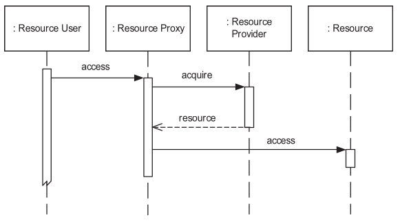

# Whole Part Pattern

## Intro

Das Whole-Part Pattern zeigt sich dann, wenn ein Objekt sich aus mehreren Zusammensetzt / mehrere Objekte beinhaltet. Es hilft dabei, Komponenten welche eine semantische Einheit bilden zu gruppieren und zu aggregieren, und orchestriert die Zusammenarbeit ebendieser Komponenten.

## Problem

Eine Gruppierung / Ansammlung von Objekten hat möglicherweise emergente Eigenschaften, also Eigenschaften welche sich nur dann ergeben, wenn gewisse Objekte speziell zusammenarbeiten.

## Forces

Ein komplexes Objekt sollte entweder in einzelne, kleinere Objekte zerlegt werden, oder aus bestehenden Objekten zusammengesetzt werden.

Diese komplexen Objekte sollen von aussen als eine einzige, atomare Einheit wahrgenommen werden, sie sollen also keinen direkten Zugriff auf die darunterliegenden Objekte ermöglichen.

## Solution

Es wird eine Struktur eingeführt welche kleinere Objekte / Strukturen umfassen kann. Für diese Aggregation wird ein Interface definiert welches die einzige Möglichkeit ist auf die Funktionalitäten der enthaltenen Objekte zuzugreifen.

Es gibt dabei die folgenden 3 Arten von Relationships:

#### assembly-parts

Alle Parts sind fest integriert und in die interne Struktur eingebunden. Parts können nicht dynamisch entfernt oder hinzugefügt werden.

#### shared-parts

Parts können von mehreren Wholes gleichzeitig genutzt werden. Sie sind darauf angewiesen, dass ihr Life-cycle von einem zentralen komponenten gehandhabt wird, oder müssen ihren Life-cycle selbst managen.

#### container-contents

Die Parts sind weniger fest integriert als in _assembly-parts_, und das Whole erlaubt eine dynamischere Handhabung. So ist es vorgesehen, dass zur Laufzeit Teile des Inhalts ausgetauscht, hinzugefügt oder entfernt werden.

#### collection-members

Die Parts sind 'ähnliche' Objekte und werden durch das Whole gruppiert. Funktionalitäten wie Iterieren oder eine Aktion für alle / auf allen Parts durchzuführen. Es gibt keine Unterscheidung zwischen den enthaltenen Parts, es sind also alle Gleichwertig und haben keine speziellen Funktionen oder Eigenschaften

### Structure


## Consequences

#### Vorteile

- Austauschbarkeit der Komponenten
  - das ganze Whole kann neu implementiert werden ohne den Client zu verändern
- Aufteilung der Verantwortlichkeiten
  - einzelne Verantwortlichkeiten sind an einzelne Parts delegiert
- Wiederverwendbarkeit
  - einzelne Parts / ganze Wholes können wiederverwendet werden

#### Nachteile

- Weniger effizient aufgrund Indirektion
  - Overhead zur Laufzeit (verglichen mit einem Monoliten)
- Komplexität der Zerlegung von Funktionalität in einzelne Teile

## Known Uses

- OO-Klassenbibliotheken / Frameworks stellen collection-members Anwendungen zur Verfügung (lists, sets, maps, etc.)
- Eine Spezialisierung des Whole-Part Patterns ist das Composite Pattern nach GoF, welches erlaubt, dass Whole und Part identisch behandelt werden können. Dies setzt jedoch voraus, dass Whole und Part ein identisches Interface besitzen.

## Wichtige Eigenschaften

- Interface von aussen atomar
  - kein Zugriff auf Komponenten welche darin enthalten sind
- ermöglicht emergente Eigenschaften / Verhaltensweisen

## Examples

Das Whole-Part Pattern tritt extrem oft auf, z.B. in

- HttpClient (https://docs.oracle.com/en/java/javase/11/docs/api/java.net.http/java/net/http/HttpClient.html)
- Als Spezialisierung (Composite Pattern) in GUI-Libraries
  - Java AWT
  - WPF
  - Android
- OO-Libraries (collection-member)
  - Lists
  - Sets
  - Maps

## Prüfungsfragen

1. Beim Whole-Part Pattern ist es wichtig, dass das Whole weiterhin den direkten Zugriff auf die Parts ermöglicht. [ Nein ]
2. Lists, Sets und Maps sind eine Anwendung des _collection-member_ Whole-Part Pattern. [ Ja ]

# Forwarder-Receiver Pattern

## Intro

Nur wenige Systeme laufen auf einem einzelnen Computer. Viele sind darauf angewiesen zu kommunizieren. Das Forwarder-Receiver Design Pattern ermöglicht eine abstrahierte Kommunikation über peer-to-peer Verbindungen (Jedes System kann als Client oder Server agieren).

## Problem

Beim bauen von verteilten Systemen werden aufgrund von Performance oft low-level Komponenten verwendet anstatt höher abstrahierte Konzepte zur inter-Prozess Kommunikation. Diese low-level Komponenten (z.B. Sockets) sind oftmals Betriebssystem abhängig und wenn genutzt schwierig zu ersetzen.

## Forces

Besonders nützlich ist das Forwarder-Receiver Pattern wenn folgende Bedingungen zutreffen auf das System das gebaut werden soll:

- Der Kommunikationsmechanismus soll austauschbar sein.
- Das Kommunikationsmodell ist peer-to-peer.
- Die Performanz der Kommunikation ist für die Applikation wichtig.

## Solution

Alle Kommunikationsdetails werden in separate Komponenten ausgelagert. Dazu werden drei verschiedene Arten von Komponenten benötigt, **Forwarders**, **Receivers** und **Peers**. Die Kommunikation zwischen den Peers findet wie auf der Abbildung unten ersichtlich nur noch via Forwarder und Receiver statt.

### Structure


#### Peers

Peers sind Teile einer Applikation die während ihrer Ausführung mit anderen Peers kommunizieren. Jeder Peer kennt den Namen oder die Adresse (Variante Forwarder-Receiver without name-to-address mapping) der Peers mit welchen er kommunizieren möchte. Der Peer verwendet Forwards um Nachrichten zu versenden und Receiver um Nachrichten zu empfangen. Peers sind Prozesse die sich auf derselben oder unterschiedlichen Maschinen befinden.

#### Forwarders

Forwarder werden zum Versenden von Nachrichten verwendet und bieten eine Abstraktion für einen IPC (interprocess communication) Mechanismus an. Die Details des IPC Mechanismus sind dem Aufrufer des Forwarder nicht bekannt. Forwarder werden via `sendMsg` aufgerufen, dazu muss der Aufruf den Namen des Receiver angeben.

Forwarder verfügen über folgende interne Funktionalität:

- Mapping von Namen zu physischen Adressen
- Funktionalität zum Umwandeln der Nachricht in etwas das vom IPC Mechanismus verstanden wird (`marshal`)
- Funktionalität zum Versenden der Nachricht (`deliver`)

#### Receivers

Receiver sind das Gegenstück vom Forwarder und empfangen Nachrichten. Receiver bieten ebenfalls eine Abstraktion über einen IPC Mechanismus, so dass die Aufrufer des Receiver nichts über die Details des IPC Mechanismus wissen müssen. Ein Aufrufer teilt dem Receiver via `receiveMsg` mit das eine Nachricht erwartet wird, sobald die Nachricht eingetroffen ist leitet der Receiver die Nachricht dem Aufrufer weiter.

Receiver verfügen über folgende interne Funktionalität:

- Funktionalität zum empfangen von Nachrichten (`receive`)
- Funktionalität zum umwandeln der empfangenen Nachrichten zu etwas das vom Aufrufer verstanden wird (`unmarshal`)

### Ablauf von Messageübertragung


## Consequences

#### Vorteile

- Effiziente IPC
  - die Kommunikation zwischen Prozessen wird strukturiert
  - `Forwarders` kennen die physikalische Erreichbarkeit der `Receivers`, entsprechend müssen Remotecomputer nicht erst gefunden werden
- IPC relevante OS Abhängigkeiten sind in `Forwarders` und `Receivers` abgekapselt

#### Nachteile

- Flexible Rekonfiguration von Komponenten ist nicht möglich
- Falls die Verteilung von Peers sich zur Laufzeit ändern ist es schwer Anpassungen vorzunehmen
  - _(dies kann mittels Central-Dispatcher [siehe Client-Dispatcher-Server Pattern] gelöst)_

## Wichtige Eigenschaften

- Peers müssen die konkreten Mechanismen zur Kommunikation nicht kennen
- IPC Implementation ist flexibel austauschbar

## Examples

Konkrete Beispiele für das Forwarder-Receiver Pattern konnten wir nicht finden. Wir gehen aber stark davon aus, dass dieses Pattern - besonders auch weil es naheliegend und elegant ist - in vielen Softwarelösungen angewendet wird.

## Prüfungsfragen

1. Das Forwarder-Receiver Pattern nutzt eine hohe Abstraktionsebene der Netzwerkkommunikation [Nein]
2. Das Forwarder-Receiver Pattern ist für eine peer-to-peer Kommunikation ausgelegt [Ja]

# Blackboard Pattern

## Intro

Das Blackboard Architekturpattern wird für Probleme verwendet für die es keine deterministische Lösungsstrategie gibt.
In einem Blackboard arbeiten verschiedene Subsysteme zusammen und generieren eine Lösung.
Die Lösung kann unvollständig oder eine Annäherung sein.
Eine Analogie für das Pattern ist das gemeinsame Lösungsfinden unter verwendung eines Blackboards,
jeder Teilnehmer (Subsystem) an diesem Lösungsfindungstreffen hat Zugriff auf das Blackboard.
Jeder Teilnehmer kann seine Gedanken äussern und das Blackboard anpassen.
Indem das Blackboard ständig von immer anderen Teilnehmern verändert wird erarbeitet man gemeinsam eine Lösung.

## Problem

Das Blackboard Pattern kann für Probleme verwendet werden für die es keine machbaren deterministischen Lösung gibt um
raw data in eine high-level Struktur umzuwandeln. Unter high-level Struktur versteht man z.B. Diagramme oder Tabellen .

Typische Beispiele sind:

- Vision
- Image recognition
- Speech recognition
- Surveillance

Probleme für welche das Blackboard Pattern angewendet werden kann, lassen sich meistens in Teilprobleme zerlegen.
Die Teilprobleme hängen oft nicht zusammen und können aus verschiedenen Fachgebieten stammen.
Die Teilproblemlöser erwarten oft unterschiedliche Repräsenetation der Daten oder unterschiedliche Muster in den Daten.

Der grosse Unterschied zu einer funktionalen Vorgehensweise ist, dass die Teilproblemelöser nicht nach einer
vorgegebenen Reihenfolge durchgeführt werden können.

Jede Durchführung eines Teilproblemlösers generiert eine Lösung sowie optional auch alternative Lösungen, das System muss sich dann darum kümmern,
dass eine optimale Lösung ausgewählt wird.

**Wichtig:**

- Immer die Einschränkungen des Systems dokumentieren
- Wichtige Entscheidungen verifizieren

Artiffial Intelligence (AI) Systeme werden oft zum Lösen solcher Probleme verwendet,
es gibt aber drei Gründe warum das zu mangelhaften Lösungen führt:

- Alle Teilprobleme müssen mit derselben Datenrepräsentation gelöst werden,
  obwohl es sich um Teilprobleme unterschiedlicher Fachgebiete handelt, die mit unterschiedlichen Datenrepräsentation aufgerufen werden sollten.
- Lösungen werden nur von einer Komponente (inference engine) getroffen, obwohl Teilproblemem mit unterschiedlichen Repräsentationen
  eigene Komponenten zur Lösungsfindung benötigen.
- AI Systeme folgen aus einem Tree, eine Lösungsfindung / Suche findet immer in diesem Tree statt und anhand von Attributen / Wissen
  wird ein vorgegebener Weg zu einem Leaf gefunden. Für ein Blackboard ist es wichtiger das Wissen dynamisch verändert werden kann und
  sich dadurch die Lösung verändert, dass kann mit einer AI nicht abgebildet werden.

## Forces welche die Lösungen beeinflussen

- Das finden aller Lösungen kann nicht in absehbarer Zeit durchgeführt werden.
- Für ein Teilproblem können unterschiedliche Algorithmen angewendet werden.
- Unterschiedliche Algorithmen die sich überschneiden.
- unterschiedliche Repräsentationen von Input und Resultat, sowie Algorithmen die nach unterschiedlichen Mustern implementiert sind.
- Abhängigkeit zwischen Algorithmen, ein Algorithmus arbeitet mit dem Resultat eines anderen weiter.
- Angenäherte Daten werden verwendet.
- Algorithmen werden parallel durchgeführt.

## Solution

Die Idee des _Blackboard Patterns_ ist eine Ansammlung von unabhängigen Programmen welche gemeinsam koorperativ eine geteilte Datenbasis bearbeiten. Jedes dieser Programme ist auf einen bestimmten Teil der Lösungsfindung spezialisiert. Eine zentrale Kontrollkomponente orchestriert die Zusammenarbeit und den Ablauf der Programme.

Die Lösungsvorschläge (_Hypothesis_) der einzelnen Programme werden im Verlauf der Lösungssuche vereint, verändert oder sogar zurückgewiesen.

### Struktur


### Blackboard

Das Blackboard ist der zentrale Datenspeicher und umfasst Elemente aus dem Lösungsraum und Kontrolldaten, das **Vokabular**. Es stellt eine Schnittstelle zur Verfügung mit welcher die **Knowledge Source**s Daten Lesen und Schreiben können, vor allem Lösungsvorschläge. Ein Lösungsvorschlag welcher zur Laufzeit von einer **Knowledge Source** geschrieben wird, wird als **Hypothesis** bezeichnet. Später verworfene Lösungsvorschläge werden vom Blackboard entfernt.

### Hypothesis

Lösungsvorschläge haben eine 'Abstraktionsstufe', wobei höhere Stufen näher an der resultierenden Lösung sind, und tiefere Stufen näher am ursprünglichen Input in das System. Ebenfalls weisen sie eine _Credibility_ aus, also wie wahrscheinlich es ist, dass der Lösungsvorschlag korrekt ist.

### Knowledge Sources

Diese Komponenten sind getrennte, unabhängige Subsysteme welche auf einzelne Aufgaben spezialisiert sind. Sie können die Lösung nicht alleine finden, aber die Kombination der Vorschläge verschiedener Komponenten führt schlussendlich zur Lösungsfindung. Knowledge Sources kommunizieren nicht direkt miteinander, Datenaustausch findet nur mit dem Blackboard statt. Jede Source ist dafür verantwortlich anzugeben ob sie mit dem aktuellen Datenstand zur Lösung beitragen kann oder nicht.

### Control

Die Control überwacht Änderungen auf dem Blackboard und entscheidet welche **Knowledge Source** als nächste zum Zug kommt. Diese Entscheidung wird aufgrund des Datenstandes auf dem Blackboard getroffen. Es ist möglich, dass die Control auf einen Zustand trifft in dem keine der Knowledge Sources angewendet werden kann - dann scheitert das System und kann kein Resultat liefern. Meist ist es jedoch eher so, dass (da einzelne Anwendungen von **Knowledge Source**s zu mehreren Lösungsvorschlägen führen) eher das Gegenteil das Problem ist - also dass zu viele Optionen vorhanden sind und die Ausführung ebendieser eingeschränkt werden muss.

Eine spezialisierte **Knowledge Source** entscheidet, wann das System fertig ist und welches das schlussendliche Resultat ist.

## Implementation

Die folgenden Schritte zur Implementation empfehlen sich:

1. Definieren des Problems

   > Wie sieht der Input aus? Sind Muster erkennbar? Gibt es Rauschen in Input?
   > Welcher Output soll erreicht werden? Wie kann sichergestellt werden, dass die Resultate vertrauenswürdig sind?

2. Definieren des Lösungsraums

   > Wie kann eine 'top-level' Lösung erkannt werden? Welche Abstraktionsstufen im Lösungsverlauf kann es geben? Kann eine Lösung aufgeteilt werden und unabhängig weiterverarbeitet werden?

3. Aufteilung der Lösungfindung in Schritte

   > Wie werden Lösungen zu 'higher-level' Lösungen verfeinert? Welches Wissen wird benötigt um Teile des Lösungsraums auszuschliessen?

4. Aufteilung des Wissens in spezializierte **Knowledge Source**s

5. Definieren des **Vokabulars**

6. Spezifizieren der Kontrollkomponente

   > Welchen Lösungsvorschlägen kann vertraut werden?

7. Implementieren der **Knowledge Source**s

## Consequences

Das Blackboard pattern kann alle Forces adressieren und diese elegant lösen.

### Vorteile

- **Experimentieren:** Probleme ohne konkreten Lösungsansatz können ohne alle möglichkeiten auszuprobieren gelöst werden.
- **Maintainability / Austauschbarkeit:** Durch die modulare struktur und unabhängigkeit der Komponenten können einzelne Teile einfach erweitert und ausgetauscht werden.
- **Wiederverwendbarkeit:** Knowledge Sources können für andere Probleme wiederverwendet werden.
- **Robustheit / Fehlertoleranz:** Jegliche Resultate sind hypothesen und verschiedene Pfade werden gegeneinander gewichtet um die optimale Lösung zu finden.

### Nachteile

- **Testing:** Die Resultate sind nicht reproduzierbar und folgen keinem deterministischen algorithmus.
- **Lösung nicht garantiert:** Nicht alle aufgaben können gelöst werden.
- **Gute Control Strategy schwierig zu finden:** Ein experimenteller ansatz wird jenachdem benötigt um eine Control Strategy zu finden.
- **Effizienz**: Durch zurückgewiesene hypothesen die ausprobiert wurden ist die effizienz eines Blackboard systems tiefer als bei einem deterministischen algorithmus
- **Hoher aufwand**: Die entwicklung eines Blackboard systems ist sehr aufwändig.
- **Paralellisierbarkeit:** Paralellisierung vom pattern nicht angedacht, aber theoretisch möglich.

## Wichtige Eigenschaften

- Undeterministischer Ansatz (Heuristisch)
- Für Komplexe Aufgaben ohne definierten Lösungsweg.
- Löst Teilprobleme und kann diese Lösungsansätze aufeinander aufbauen.
- Kein einheitliches Format der Daten benötigt für die verschiedenen Knowledge Sources.

## Examples

- **HEARSAY II**: Dies ist eher ein historisches Projekt und ist der Ursprung dieses Patterns. Es wurde genutzt für eine der ersten Sprach-Verständnis Systeme und wurde 1980 publiziert.
- **CRYSALIS**: Eine Software benutzt um die dreidimensionale struktur von Protein Molekülen aufgrund von Röntgenstrahlen beugung herauszufinden.

## Prüfungsfragen

1. Knowledge Sources interagieren direkt miteinander um gemeinsam eine Lösung zu finden. [Nein]
2. Das Blackboard Pattern nutzt einen Deterministischen Ansatz. [Nein]

# Lazy Acquisition Pattern

## Intro

Das **Lazy Acquisition Pattern** verschiebt das Laden von externen Ressourcen auf den spät möglichsten Zeitpunkt. Dies führt zu einer optimierten Verwendung von Ressourcen.

## Problem

Ein System mit limitierter Verfügbarkeit von Hardwareressourcen oder Zeit muss hohen Ansprüchen gerecht werden. So sollen externe Inhalte schnell und zeitgerecht Verfügbar sein.

Moderne Software beinhaltet oft eine Vielzahl an externen Ressourcen in Form von Bildern, Dokumenten oder grossen Sammlungen von Datensätzen. Wenn all diese Ressourcen zu Beginn der Ausführung geladen werden, so kann es sein, dass ein Programm sehr lange braucht bis es bereit zur Verwendung ist.

## Forces

##### Verfügbarkeit

Die Ressourcenbeschaffung soll eingerichtet werden, dass Ressourcenengpässe minimiert werden, und die richtigen Ressourcen zur richtigen Zeit verfügbar sind.

##### Stabilität

Ressourcenengpässe in einem System können zu Instabilität führen, entsprechend sollten Ressourcen in einer Art beschafft werden, dass sie möglichst kleine Auswirkungen auf die Stabilität des Systems haben

##### Schneller Systemstart

Die Ressourcenbeschaffung zur Startzeit soll so gestaltet werden, dass die Startzeit minimeirt wird.

##### Transparenz

Die Lösung für diese Herausforderungen soll für Anwender transparent sein, also keinen Unterschied zur Ausgangslage machen.

## Solution

Die Resources werden alloziert am letzten möglichen Zeitpunkt. Erst wenn auf die tatsächlichen Daten einer Resource zugegriffen wird, wird die Resource geladen. Vorher existiert ein Proxy object das beim eigentlichen Resourcen aufruf erstellt wird und die möglichkeit beinhaltet die tatsächliche Resource nachzuladen. Sobald die Resource geladen wurde, werden alle Anfragen an den Proxy direkt an die Resource weitergeleitet. Somit ist der Proxy komplett transparent gegenüber dem Endbenutzer.

## Implementation

### Model


- Ein "Resource User" alloziert und benutzt Resourcen.
- Ein "Resource Proxy" ist der Platzhalter für eine Resource und lädt diese sobald sie tatsächlich benötigt wird.
- Der "Resource Provider" managed verschiedene Resourcen und stellt diese zu Verfügung.

### Szenarien

#### Resource Proxy erstellung


Der "Resourcen Provider" ist für die Interaktion mit dem "Resource User" verantwortlich. Er agiert als Factory und erstellt die angefragen "Resource Proxies".

#### Resource Proxy benutzung



Der "Resource User" kann nun über den Proxy auf die Resource zugreifen. Die allokation der tatsächlichen Resource wird wieder über den "Resource Provider" gemacht.

### Steps

1. Identifizieren der Resourcen die "Lazy" geladen werden müssen.

- Resourcen die aufwändig sind zu allozieren
- Resourcen die eine limitierte auflage haben
- Resourcen die lange nach der allokation unbenutz bleiben

2. Proxy Interface definieren
3. Resource Proxy implementieren
4. Allokations strategie definieren
5. Resourcenfreigabe strategie definieren

## Consequences

### Vorteile

- Verfügbarkeit: Es werden nicht alle Ressourcen von Beginn angefordert, dadurch wird die Möglichkeit verringert, dass Ressourcen geladen werden die nicht gebraucht werden.
- Stabilität: Es wird sichergestellt das Ressourcen nur geladen werden, wenn sie benötigt werden.
- Optimaler Systemstart: Ressourcen die nicht sofort benötigt werden, werden erst zu einem späteren Zeitpunkt geladen, dadurch wird die Start zeit optimiert.
- Transparenz: Lazy Acquisiotion ist transparent gegenüber dem Benutzer der Ressource.

### Nachteile

- Space overhead: Es wird wegen der Indirektion des Proxys zusätzlicher Speicher benötigt.
- Time overhead: Es kann zu einer Verzögerung kommen beim Anfordern von Ressourcen und die Indirektion verursacht ebenfalls eine Verzögerung beim Ausführen des Programms.
- Vorhersagbarkeit: Wenn mehrere Teile des Systems den Zugriff auf eine Ressource hinausschieben und alle zur selben Zeit den Zugriff machen ist die Zugriffszeit nicht vorhersagbar.

## Wichtige Eigenschaften

- Zugriff auf eine Ressource wird nur gemacht wenn sie benötigt wird.
- Performance und Stabilität eines Systems können besser gewährleistet werden.
- Vorhersagbarkeit der Zugriffszeit kann nicht mehr gewährleistet werden.

## Examples

- **Singleton**: Wird beim ersten Gebrauch initialisiert
- **Haskell**: Expressions werden lazy evaluiert.
- Weitere: J2EE, Ad hoc networking, Operating systems, .NET Remoting, COM+, JIT compilation, Java, Manufactoring, ...

## Prüfungsfragen

1. Wenn alle Ressourcen zu Beginn geladen werden damit die optimale Performance gewährleistet werden kann, redet man von Lazy Acquisition? [Nein]
2. Lazy Acquisition führt dazu, dass die Startdauer eines Systems sehr viel grösser wird. [Nein]

# Coordinator Pattern

## Intro

Das Ziel des Coordinator Pattern ist es Konsistenz beizubehalten in einem System welches einen Task
durch die Zusammenarbeit von mehreren Teilnehmern löst.
Entweder wird der gesamte Task abgeschlossen also alles Teilnehmer lösen ihr Problem erfolgreich
oder im Falle eines Fehlers bei einem Teilnehmer wird alles auf einen konsistenten Zustand zurückgesetzt,
der Zustand bevor der Task begonnen wurde.

Ein typisches Beispiel sind Datenbank Transaktionen.

## Problem

Oft verwenden Systeme zum ausführen eines Tasks mehrere Teilnehmer.
Ein Teilnehmer kann in diesem Fall ein Ressource user und ein Ressource provider sein
oder auch eine aktive Ressource wie ein Service, welcher am Task beteiligt ist.
Teilnehmer laufen auf:

- demselben Prozess wie das System,
- mehreren erzeugten neuen Prozessen,
- sowie auf mehreren Nodes.

Jeder Teilnehmer ist für die Durchführung eines Teil des Tasks zuständig, die Teilnehmer
werden nach einer fixen Reihenfolge aufgerufen.

Damit der Task erfolgreich abgeschlossen werden kann müssen alle Teilnehmer ihren Teiltask erfolgreich abschliessen.
Nach dem erfolgreichen abschliessen eines Tasks ist das System in einem **konsistenten** Zustand.
Falls aber ein Fehlerauftritt und ein Teilnehmer nicht erfolgreich abgeschlossen hat ist das System in einem **inkonsistenten**
Zustand, da bereits alle erfolgreich Abgeschlossenen Teilnehmer von einem neuen Zustand ausgehen aber alle fehlgeschlagenen
oder noch nicht ausgeführten Teilnehmer vom alten Zustand ausgehen.

Ein inkonsistenter Zustand führt dazu, dass das Ausführen von weiteren Tasks fehlschlägt oder zu einen falschen Ergebnis führt.

## Forces

Damit man dieses Problem lösen kann muss folgendes beachtet werden.

- Konsistenz: Ein Task erstellt entweder einen neuen validen Zustand oder setzt alles zurück auf Zustand bevor der Task ausgeführt wurde.
- Atomarität (Abgeschlossenheit): In einem Task der 2 oder mehr Teilnehmer hat müssen alle Teilnehmer abgeschlossen sein oder keiner,
  auch wenn sie nicht voneinander abhängig sind.
- Location transparency: Die Lösung muss auch in verteilten Systemen funktionieren.
- Skalierbarkeit: Die Lösung muss skalieren mit der Anzahl Teilnehmer, sod das sich die Performance nicht signifikant verschlechtert.
- Transparenz: Die Lösung muss transparent sein dem Benutzer gegenüber und sollte ein Minimum an Codeänderungen erfordern.

## Solution

Die Lösung ist das Einführen eines **Coordinator**s. Der Coordinator ist verantwortlich für Ausführung und Fertigstellung eines _Tasks_ durch alle Teilnehmer.

Um dies zu erreichen, wird der Ablauf dabei in 2 Phasen aufgeteilt; die `prepare` Phase, und die `commit` Phase.

#### Prepare Phase

In dieser Phase weist der Coordinator alle Teilnehmer an ihre Arbeiten vorzubereiten. Dabei ist jeder Teilnehmer angehalten die Konsistenz zu überprüfen, und sicherzustellen, dass das Ausführen einer Aufgabe nicht scheitern würde.

Falls nach dieser Phase ein (oder mehrere) Teilnehmer **nicht** erfolgreich sind, bricht der Coordinator die Ausführung ab und weist alle erfolgreichen Teilnehmer an die Ausführung ihrer (Teil-)Aufgabe abzubrechen und den Zustand vor Beginn der Aufgabe herzustellen.

#### Commit Phase

Diese Phase wird nur erreicht, wenn alle Teilnehmer die Prepare Phase erfolgreich abgeschlossen haben.

Der Coordinator kann sich jetzt also sicher sein, dass alle Teilnehmer die Aufgabe erfolgreich bearbeiten können, und weist alle Teilnehmer an ebendies zu tun.

### Struktur

Die folgende Aufstellung gibt einen Überblick:


Grundsätzlich gibt es 2 Interaktionspunkte zwischen den möglichen Komponenten.

1. Der Client weist den Coordinator an, eine Aufgabe durchzuführen
2. Der Coordinator kommuniziert mit dem Teilnehmern

#### Erfolgreicher Ablauf:


#### Ablauf mit Abbruch:


## Implementation

Um das Coordinator Pattern grundlegend zu implementieren sind 3 Schritte nötig.

1. _Teilnehmer identifizieren_
   Teilnehmer deren Aufgaben koordiniert werden sollen, müssen identifiziert werden. Teilnehmer können dabei Ressourcen, Ressourcenanbieter oder Ressourcennutzer sein.

2. _Koordinationsschnittstelle definieren_
   Dieses Interface wird von allen Teilnehmern welche Arbeiten ausführen implementiert sein. Es stellt die Grundlage für die Fähigkeiten des Coordinators dar.
   Dieses interface könnte wie folgt aussehen:

   ```java
   public interface Coordination {
   	boolean prepare ();
   	void abort();
   	void commit();
   }
   ```

3. _Koordinatorschnittstelle definieren_
   Dieses Interface ermöglicht Clients eine Aufgabe zu beginnen oder abzuschliessen.
   Dieses interface könnte wir folgt aussehen:

   ```java
   public interface Coordinator {
       void beginTask();
       void register(Coordination participant);
       boolean commitTask();
   }
   ```

   Wenn der Client `beginTask()` aufruft passiert vorerst noch nichts - die `participant`s müssen sich erst noch registrieren. Sobald alle `participant`s sich registriert haben, ruft der Client `commitTask()` auf. Dies zeigt dem Coordinator, dass alle Teilnehmer vorhanden sind, und dass er damit beginnen kann die Aufgabe mit den Teilnehmern auszuführen.

### Varianten

**Third-Party Registration**

Die Registrierung auf dem Coordinator kann bei dieser Variante durch eine Drittpartei geschehen, und nicht zwingend durch die Teilnehmer. Dies kann nützlich sein, wenn der Client ggf. kontrollieren können muss weile Teilnehmer sich an einer Aufgabe beteiligen.

**Participant Adapter**

Diese Variante sieht vor, dass Teilnehmer nicht zwingend direkt das `Coordination` Interface implementieren müssen, stattdessen werden Teilnehmer mit einem Adapter versehen welche diese Aufgaben übernimmt. Diese Variante ist ggf. nützlich um _legacy_ Code besser integrieren zu können.

**Three-phase Commit**

Diese Variante ermöglicht die Behandlung von Fehlern welche in der Commit-Phase auftreten. Ist diese Variante gewünscht, wird bei der Implementation ein 4ter Schritt nötig:

4. _Behandeln von Fehlern_
   Obwohl alle Teilnehmer in der `prepare` Phase eine mögliche Ausführung angezeigt haben, könnte es trotzdem vorkommen, dass (z.B. aufgrund Netzwerkproblemen) eine Aufgabe nicht abgeschlossen werden kann. In diesem Error-Handling könnte der Coordinator ggf. eine `rollback()` Methode auf den erfolgreichen Teilnehmern ausführen um diesen die Möglichkeit zu geben gemachte Änderungen rückgängig zu machen.

## Consequences

### Vorteile

- **Atomarität**: Es wird sichergestellt, dass alle Aufgaben erfolgreich abgeschlossen werden oder sonst nichts gemacht wird. "All or nothing" prinzip.

- **Konsistenz**: Die konsistenz des Systems wird gewährleistet, da ein System von einem validen Zustand in den nächsten wechselt. Und falls das nicht möglich ist, wird das System im alten konsistenten Zustand belassen.

- **Skalierbarkeit**: Es spielt keine Rolle wie viele "Participants" existieren. Denn der Client interagiert nur über den Coordinator mit ihnen.

- **Transparenz**: Der Client kennt nur die Tasks und hat keine Kenntnis der 2-Phasen. Die Konsistenz und Atomarität ist transparent umgesetzt gegenüber dem Client.

### Nachteile

- **Overhead**: Jeder Task wird in zwei Phasen unterteilt. Die überprüfung in der ersten Phase und die ausführung danach stellen einen Overhead dar.

- **Zusätzliche Verantwortung**: Die registrierung der "Participants" beim "Coordinator" stellt eine zusätzliche Verantwortung dar welche die Participants erfüllen müssen.

## Wichtige Eigenschaften

- Das Pattern umfasst 2-Phasen welche nacheinander aufgerufen werden. Nur wenn eine problemlose ausführung möglich ist, wird diese auch umgesetzt.
- Das System befindet sich immer in einem Validen zustand.
- Der Client hat muss sich nicht um die Konsistenz und Atomarität kümmern.

## Examples

- **Java Authentication and Authorization Service (JAAS)**: Das Login in JAAS erlaubt dynamisch konfigurierbare login module welche alle abgeschlossen werden müssen für eine erfolgreiche Authentifizierung. Dies wurde mit 2-Phasen und einem Coordinator gelöst.

- **2-Phase Commit Protokoll**: Datenbanken brauchen das Coordinator pattern und das 2-Phase Commit Protokoll für die synchronisation von mehreren Datenbanksystemen.

- **Software Installationen**: viele Installationsprogramme brauchen eine Form des Coordinator Patterns um sicherzustellen das eine installation erfolgreich sein wird. Z.B. das sie erst überprüfen ob genug speicherplatz verfügbar ist.

## Prüfungsfragen

- Der Client gibt Tasks direkt an einen Participant welcher diesen dann für ihn atomar ausführt. [Ja | Nein]
- Das Ziel des Coordinator Patterns ist "All or nothing" [Ja | Nein]

# Resource Lifecycle Manager

## Intro

Die Frage wer nun schlussendlich verantwortlich ist und wann die Instanziierung und der Abbau von Ressourcen in einer komplexen Applikation geschieht kann verschieden beantwortet werden. Es könnte die Ressource selbst sein die sich abbaut oder auch der Benutzer der Ressource.

Man kann aber auch eine Komponente entwickeln welche speziell diese Responsibility übernimmt. Diese Komponente ist der Resource Lifecycle Manager.

## Problem

Ressourcen können von verschiedensten Typen sein, zum Beispiel Netzwerkverbindungen, Threads, Workers, oder auch Synchronisationsobjekte wie Mutexe und Semaphore. Wenn das Management all dieser Ressourcen in einem grossen System jeweils in den Aufrufern oder auf den Ressourcen geschieht geht der Überblick sehr schnell verloren.

Beim Beispiel der Netzwerkverbindungen geschehen diese meist synchron, heisst ein Client schickt an einen Server und dieser sendet eine Antwort. Wenn diese Kommunikation aber nun Stateful ist, und je nachdem sogar asynchron nach einer gewissen Zeit vom Server eine Antwort an einen Client geschehen muss wird das Handling dieser Verbindungen immer schwieriger. Da solche Applikationen oft mit tausenden Verbindungen zu tun haben, ist es wichtig das solche, die nicht mehr relevant sind, auch wieder zugemacht werden, denn sonst leidet die Stabilität des Systems.
Irgendwo muss nun dieses Management all dieser Verbindungen gemacht werden.

## Forces

**Verfügbarkeit**: Typischerweise wächst die Anzahl Ressourcen nicht gleichmässig mit der Grösse des Systems. Deshalb müssen Ressourcen in grossen Systemen effizient und effektiv verwaltet werden, damit die Verfügbarkeit gewährleistet werden kann.

**Skalierbarkeit**: Mit der Grösse des Systems steigt auch die Anzahl Ressourcen, dass kann das verwalten der Ressourcen erschweren.

**Komplexität**: Abhängigkeiten müssen genau beobachtet werden, damit Ressourcen rechtzeitig freigegeben werden können.

**Leistung**: Optimierungen sind wichtig damit alle "performance bottlenecks" eliminiert werden können, sind aber komplex wenn sie von einzelnen Ressource Usern angewendet werden.

**Persistenz**: Es darf nicht vergessen werden Ressourcen freizugeben und das die Verwendung der Ressourcen zu kontrollieren.

**Abhängigkeiten**: Ressourcen haben Abhängigkeiten auf andere Ressourcen und dadurch haben diese Abhängigkeiten auch einen Einfluss auf den Lebenszyklus der Ressource diese Abhängigkeiten müssen entsprechen kontrolliert werden.

**Anpassungsfähigkeit**: Ressourcen sollten flexibel verwaltet werden, so das verschiedene Strategien für das Verwaltungsverhalten gewählt werden können.

**Transparenz**: Das verwalten des Lebenszyklus sollte dem Ressourcenverwender gegenüber transparent sein.

## Solution

Es wird ein Resource Lifecylce Manager (RLM) eingeführt der dafür zuständig ist die Ressourcen eines Ressourcenverwenders zu verwalten.
Der RLM wird verwendet, um Zugriff auf spezifische Ressourcen zu erhalten und kann die Ressource, falls sie noch nicht vorhanden ist erstellen.
Ebenfalls verfügt der RLM über Wissen über die Ressource und kann deshalb den Zugriff auch verweigern, z.B. wenn zu wenig Speicher vorhanden ist.

Ein RLM kann für einen oder mehrere Typen von Ressourcen zuständig sein und kann falls vorhanden mit Anhängigkeiten zu anderen Ressourcen umgehen.
Die Abhängigkeiten werden entweder von einem zentralen RLM verwaltet, welcher die Ressource und deren Abhängigkeiten verwaltet
oder von einem separaten RLM der nur für das Verwalten der Abhängigkeiten zuständig ist.

Für die Lösung braucht es die folgenden Teilnehmer:


Die Teilnehmer interagieren wie folgt:


Der Ablauf dieses Systems sieht dann folgendermassen aus:


Falls dieselbe Ressource mehrmals angefragt wird, kann der RLM auch Optimierungen wie Pooling oder Caching vornehmen.

## Implementation

Zum Implementieren dieser Lösung braucht es 7 Schritte:

1. Ermitteln der zu verwaltenden Ressourcen
2. Definieren wie Ressourcen erstellt und Verwendung angefragt wird:

- Zum erstellen können z.B. das Factory Method Pattern oder das Abstract Factory Pattern verwendet werden.
- Zum Verwenden können z.B. das Eager Acquisition, das Lazy Acquisition und das Partial Acquisition Pattern verwendet werden.
- Falls Ressourcen knapp werden, kann der RLM Anfragen zurückweisen.
- Falls Ressourcen lazy erstellet werden muss beachtet werden, dass das Erstellen oder Verwenden von grossen Ressourcen lange dauern kann.

3. Definieren der Ressourcenverwaltungssemantik:

- Ressourcen müssen effizient und effektiv verwaltet werden.
- Pooling kann dafür verwendet werden eine fixe Anzahl Ressourcen ständig verfügbar zuhalten, wie z.B. Threads und Connections
- Caching kann verwendet werden, wenn die Identität und der Zustand der Ressource benötigt wird.
- Caching hilft die Ressourcenverwendung zu minimieren.

4. Ressourcen Abhängigkeiten verwalten

- Isolieren von verschiedenen Ressourcenlebenszyklen in separate RLM
- Optimierungen für voneinander Abhängige RLM sind schwer umzusetzen.
- Abhängige Ressourcen können zusammen gruppiert werden damit sie Zugriff auf denselben Kontext haben.

5. Definieren von Ressourcenfreigabe Semantiken:

- Wenn eine Ressource nicht mehr benötigt wird, sollte sie automatisch freigegeben werden.
- Dafür kann das Leasing oder das Evictor Pattern verwendet werden.
- Zusätzlich kann ein Garbage Collector verwendet werden, um unbenutzte Ressourcen zu identifizieren.

6. Definieren von Ressourcenzugriff Semantiken:

- Der Zugriff auf die Ressource sollte möglichst einfach sein, kann z.B. mit dem Lookup Pattern umgesetzt werden.

7. Konfigurationsstrategien implementieren:

- Für jeden der bisherigen Schritte sollte es möglich seine Strategien für die Umsetzung zu definieren.
- z.B.: teure Ressourcen werden erst geladen sobald sie benötig werden und günstige oft verwendete werden sofort beim Startup geladen.
- Reflection kann verwendet werden um die Strategie dem Environment anzupassen
- Falls Abhängigkeiten zwischen Ressourcen verwaltet werden müssen, kann das Coordinator Pattern verwendet werden.

## Consequences

### Vorteile

- Effizienz
- Skalierbarkeit
- Leistung
- Transparenz
- Stabilität
- Kontrolle

### Nachteile

- Single point of failure: Ein Bug kann dazu führen, dass das grosse Teile des RLM nicht mehr funktionieren.
- Flexibilität: Falls Ressourcen eine sehr spezifisches Behandlung brauchen ist der RLM vielleicht zu unflexibel um das umzusetzen.

## Wichtige Eigenschaften

- Transparenz: RLM ist gegenüber Ressourcenbenutzer transparent
- Anpassungsfähigkeit: RLM kann für verschiedene Bedürfnisse entsprechende Strategien zum Management der Ressourcen anwenden

## Examples

**Component Container**
Der Container verwaltet den Lebenszyklus von Applikationskomponenten, und den Lebenszyklus von Ressourcen welche von ebendiesen verwendet werden.
Beispiele:

- J2EE Enterprise JavaBeans
- COM+

**Remoting Middleware**
Middlewaretechnologien (i.e. CORBA, .NET Remoting) setzen RLMs auf verschiedenen Ebenen ein. Unter anderem werden Connections und Threads verwaltet.

**Grid computing**
Grid computing behandelt das Teilen und Aggregieren von verteilten Ressourcen. Teilnehmende Maschinen müssen ihre Ressourcen verwalten können. RLMs werden ebenfalls verwendet um die Ressourcen im Grid zur Verfügung zu stellen.

## Prüfungsfragen

1. Der Resource Lifecycle Manager verwendet einen Resource Provider zum akquirieren der Ressource. [Richtig|Falsch]

2. Abhängigkeiten von Resourcen haben einen Einfluss auf ihren Lifecycle. [Richtig|Falsch]
