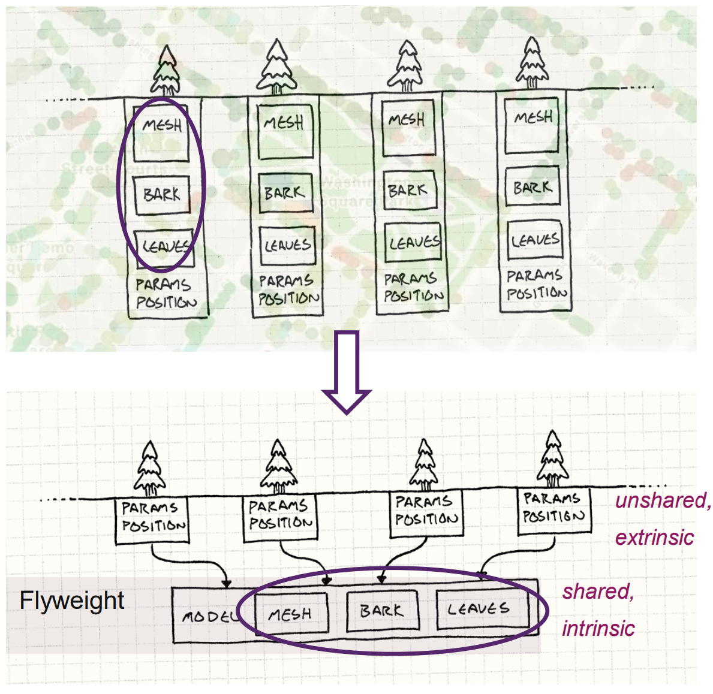
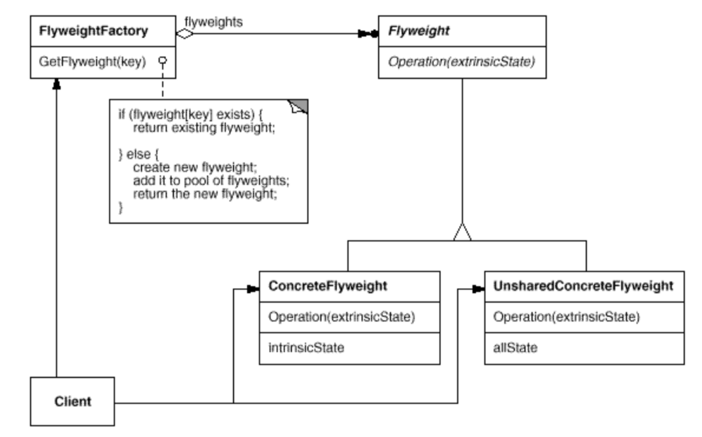
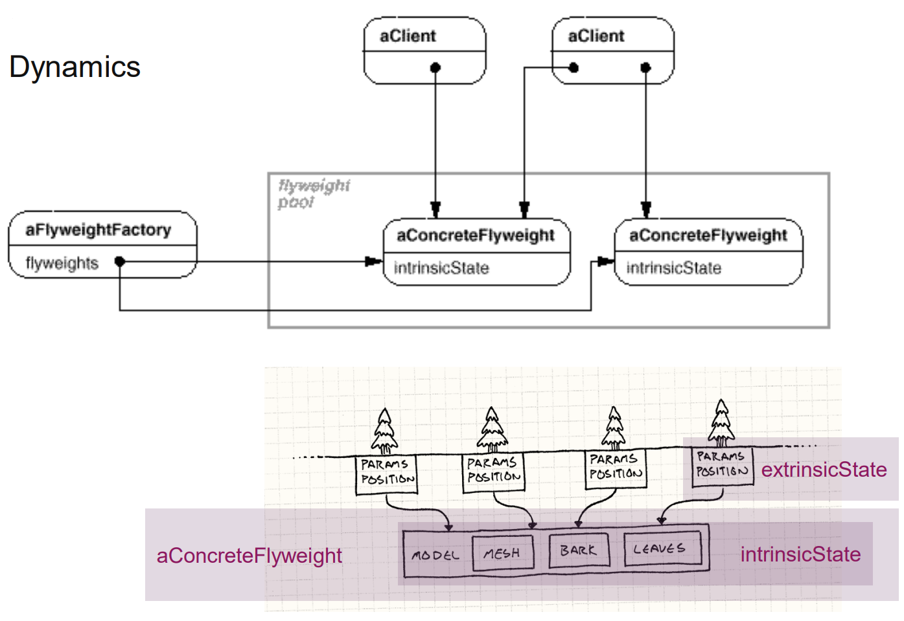
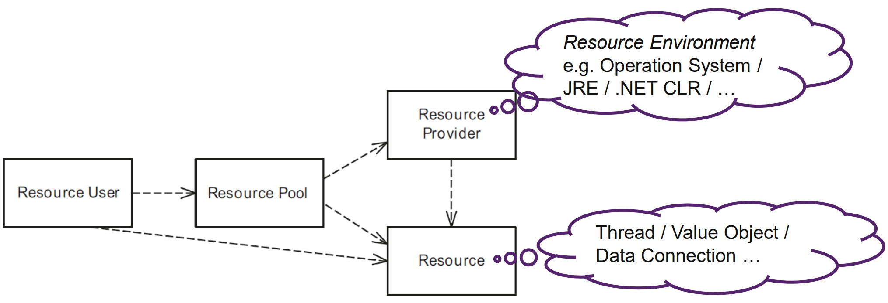
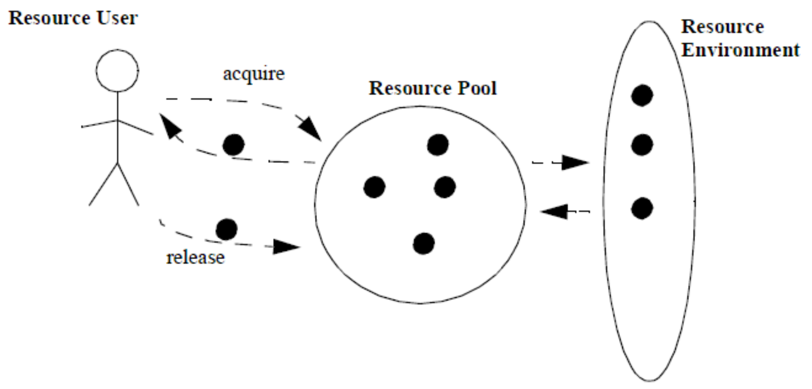
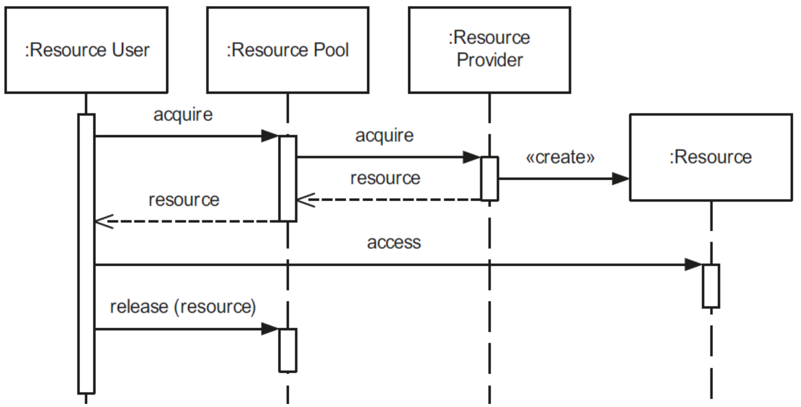

# Flyweight

## Problem

- Speicherkosten sind hoch wegen der hohen Anzahle von Objekten.
- Viele Objekte können mit wenigen geteilten Objekten ersetzt werden.
- Objekte hängen nicht von Objektidentität ab.

Wie kann das Existieren mehrerer Kopien von identischen konstanten Objekten vermieden werden?



## Lösung





## Implementation

```java
public interface FlyweightChar {
    int getCharCode();
}
public class ConcreteFlyweightChar implements FlyweightChar {
    private final char character;
    public int getCharCode() {
        return character;
    }
    ConcreteFlyweightChar(char character) {
        this.character = character;
    }
}

public class FlyweightFactory {
  private final Hashtable<Character, FlyweightChar> chars = new Hashtable<>();
  public FlyweightChar getFlyweight(char key) {
    if (!chars.containsKey(key)) {
      chars.put(key, createFlyweight(key));
    }
    return chars.get(key);
  }
  protected FlyweightChar createFlyweight(char key) {
    return new ConcreteFlyweightChar(key);
  }
}
public class FlyweightFactoryTest {
  @Test
  public void testFlyweight_getChar_succeed() {
    FlyweightFactory factory = new FlyweightFactory();
    FlyweightChar aChar = factory.getFlyweight('a');
    FlyweightChar bChar = factory.getFlyweight('b');

    assertEquals(aChar, factory.getFlyweight('a'));
    assertEquals(bChar, factory.getFlyweight('b'));
  }
}
```

## Vorteile

- Reduction of the total number of instances (space savings). Savings depend on several factors:
- the reduction in the total number of instances comes from sharing.
- the amount of intrinsic state per object.
- whether extrinsic state is computed (=computation time) or stored (= space cost).

## Nachteile

- Can’t rely on object identity; stored elements contain Value characteristics
- May introduce run-time costs associated finding Flyweights, and/or computing extrinsic state

## Zusammenhänge

- Wird oft mit `Composite` kombiniert.
  - Hierarchische Strukturen als Graph mit geteilten `leaf` notes.
    - `Leaf` nodes cannot store a pointer to their parent
    - Parent pointer is passed to the flyweight as part of its extrinsic state
    - Impacts on how the objects in the hierarchy communicate with each other
- Handhaben von `fine-grained` Elementen, welche `Immutable Value` Charakteristiken besitzen
- `Fine-grained` Objekte sind global gespeichert und werden lazy initialisiert.
  - Ähnlich zu einem `multi-Singleton`; eine einzige Klasse speichert mehrere geteilte Instanzen.
  - Objekte werden ähnlich wie eine `Class Factory` erstellt.
- Flyweight haltet einen Pool von geteilten Objekten.
  - Pooling by POSA3

## Diskussion

Was kann man einem Frameworkuser zur Verfügung stellen?


## Boxing

Was ist die vorwiegende Eigenschaft eines Flyweight?

- Erstellen
- Teilen
- use of extrinsic state
- immutability

Diese vielen Charakteristiken sowie die diffuse Beschreibung sind Gründe warum das Pattern selten verwendet wird. Das Pattern ist eine verkapselte Singleton Fabrik.

# Pooling

- Ein schneller und vorhersagbarer Zugriff auf Ressourcen muss gewährleistet sein.
- Das Verschwenden von CPU Zyklen durch wiederholte `acquisition / release` sollte vermieden werden.
- `acquisition / release` Komplexität muss minimiert werden.

Wie kann das teure Akquirieren und Freigeben von Ressourcen verhindert werden durch das Recyclen von nicht länger benötigten Ressourcen?

## Lösung

- Ein `resource pool` verwaltet die Ressourcen und stellt sie einem Benutzer zur Verfügung.
  - Objekte die Akquirieren und Freigegeben werden müssen, werden Ressourcen genannt.
- `Resource provider` wie beispielsweise Betriebssysteme besitzen und verwalten die Ressourcen.







## Implementation

- Definieren der maximalen Anzahl Resourcen, die vom resource Pool verwaltet werden.
  - Typischerweise während Initialization.
- Entscheiden zwischen `Eager` und `Lazy` Erstellen der Ressourcen.
- Definieren der Vorgehen zum Zerstören und wiederverwenden der Ressourcen.
  - Aufräumen des Stack, nachdem der Thread beendet wurde.
  - Verwenden von angebrachten `allocation` und `destruction` Patterns.

## Vorteile

- Improves the performance of an application
  - Helps reduce the time spent in costly release and re-acquisition
- Lookup and release of previously-acquired resources is predictable
- Simplified release and acquisition of resources
- New resources can be created dynamically if demand exceeds the available resources

## Nachteile

The management of resources results in a certain overhead

- Depending on the environment and resource type, resources must be released back to the pool
- Acquisition requests must be synchronized to avoid race conditions

## Fragen

**Q**: Which pattern can be combined with the Pooling pattern, if the same resources should be shared between users?

**A**: Pool acts as Mediator [GoF] Caution: consider synchronization when implementing Pooling in a multi-threading environment.

**Q**: What is the relation to the Flyweight pattern and how is it typically implementing the Pooling pattern?

**A**: Flyweight patterns implements a pool with immutable resources in a statically manner. Therefore, the Flyweight pattern behaves like a combination of Singleton and Class Factory Method.

**Q**: Is immutability of named resources key in the Pooling pattern? Explain your answer.

**A**: No, it can be implemented as immutable pool of resources (see previous answers). There are multiple options for pooling resources:

1. If the items are immutable, the pool is an implementation of the Flyweight pattern.
2. Items can be leased (e.g. Thread Pool), it is an implementation of the Leasing Pattern (see POSA 3).
3. Mutable resources in pools can be implemented as Prototype pattern. The consumers receives not the resource itself, but only a clone of them.

**Q**: What is the difference between pooling and caching?

**A**:

- A pool handles creation, destruction and reuse of the pooled objects.
- Caching is about managing resources with identity; pooling does not, all resources in the pool are equal.
- Caches manage only object lifetime in the cache, but not the lifecycle of the objects
