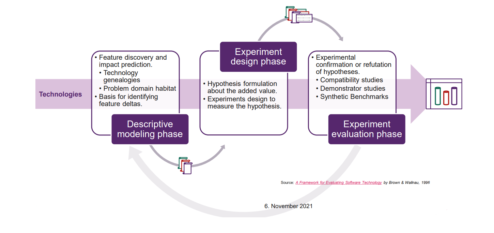
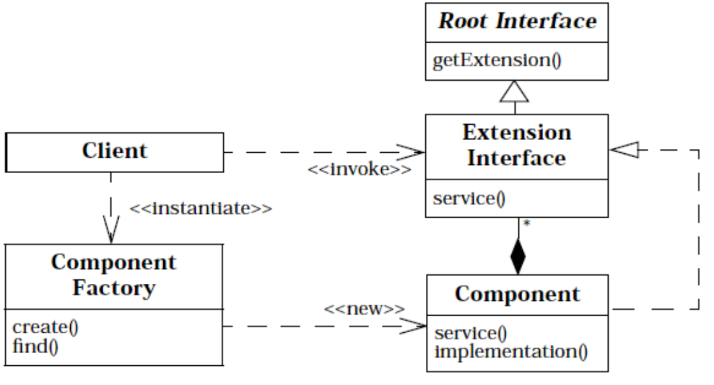
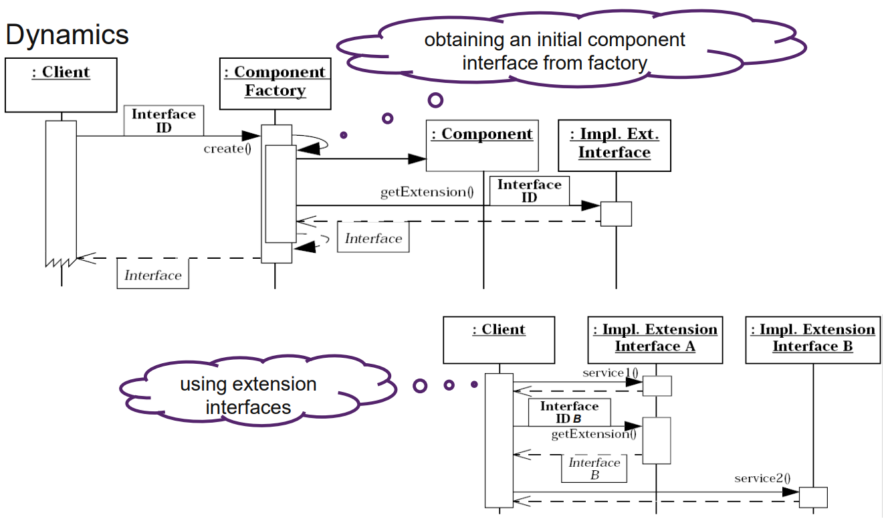

# Frameworkers Dilemma

## Vorteile von Frameworks

- Less code to write
- More reliable and robust code
- More consistent and modular code
- More focus on areas of expertise, less focus on areas of system compatibility
- Generic solutions that can be reused for other, related problems
- Improved maintenance and orderly program evolution
- Additionally, Application Frameworks provide improved integration
  - Often by implementing plug-ins for a specific product environment

## Frameworkers Lock-In

Frameworkbenutzer implementieren ihre Applikation indem sie von Frameworkklassen erben und vordefinierte Konfigurationen verwenden, dadurch entsteht ein Framework `lock-in`. Der `lock-in` verhindert `portability`, `testability` und `evolution`, weil die Vererbung `strong coupling` bewirkt.

`Portability` ist schwer umzusetzen, weil der Code zu fest auf dem Framework basiert, dadurch wir code portieren oder Framework auswechseln erschwert.

`Testability` ist schwer umzusetzen, weil das Framework stark integriert ist und es dadurch erschwert wird einzelne Teile zu isolieren und zu testen.

`Evolution` ist schwer umzusetzen, weil man sich auf die Frameworkentwickler verlassen muss und im Falle von `breaking changes` auf entsprechende Dokumentation angewiesen ist.

## Meta Frameworks

- A Framework for Evaluating Software Technology by Brown & Wallnau, 1996 Describes competing concerns regarding new frameworks:
  - Initial technology acquisition cost
- Long-term effect on quality, time to market, and cost of the organization’s products and services when using the technology
- Training and support services’ impact of introducing the technology
- Relationship of this technology to the organization’s future technology plans
- Response of direct competitor organizations to this new technology

### Framework Evaluation Deltas

1. understanding how the evaluated technology differs from other technologies; and
2. understanding how these differences address the needs of specific usage contexts.

### Phasen



### Result


## Developing Frameworks

- Frameworks need evolutionary improvement
- Stagnancy in framework development is often interpreted prematurely
  - Is the framework dead?
  - Are there alternative frameworks with similar features and further development?

Developers may choose competing frameworks due lack of visible progress; even if there’s still work in progress on the framework.

There are two reasons for lack of framework evolution and improvement:

1. no application uses the framework

- no users, no need to improve or evolve
- no experience on what to improve

2. one or more applications use the framework

- changing the framework risks breaking applications
- applications produce work-arounds to framework deficiencies and break when those "features" are fixed

## Dilema

Potential ways out of the dilemma:

1. Think very hard up-front

- Very very hard, may work a little bit the second or third time
- Requires very experienced persons
- Without concrete applications, it is hard to decide what to abstract and generalize in a framework
- Can lead to expensive and unusable over-engineered frameworks (e.g. Taligent)
- Takes too long to hit window of opportunity
- Might still be sub-optimal to use

2. Don't care too much about framework users

- Lay the burden of porting applications to the application's developer
- Provide many good and useful new features to make porting a "must"
- Might require porting tools, training/guidelines and conventions
- Support old versions indefinitely or fight hard to keep it backward compatible
  - Caution: inhibits framework evolution

3. Let framework users participate

- Social process can help, e.g. by giving users time to migrate
  - deprecated interfaces (that get never deleted)
  - Tendency for infinite backward compatibility
    - with a strong user community
  - Design by committee is almost always over-engineered and brittle

4. Use helping technology

- Configurability
  - less direct code-dependencies
- Simple and flexible interfaces
  - tendency to be more stable
- Patterns
  - Encapsulate Context, Extension Interface
  - already known: Reflection, Property List, Anything

### Konfiguration

- Use configuration to reduce code-dependencies
  - Let the framework do as much as possible without writing code
- Apply Reflection to identify interfaces, classes (extension points) and methods (hooks)
  - Rely on annotations (attributes) which configures application wiring
    - and can be extended later-on without breaking user’s code
    - e.g. Angular Dependency Injection (@Injectable / InjectionToken)
- Reflection allows to use Conventions over Configuration paradigm
  - Completely eliminates the need of directly coupling the framework API
  - …but introduces black magic

### Einfache und felxible Interfaces

- Choose carefully between calling and subclassing APIs
  - Subclassing of framework classes result in stronger coupling
    - No decoupling between framework and user’s code
    - User’s code may access and break framework internals (slicing / violate contract and invariant)
    - Further changes in framework classes break user’s code
- Rely on abstractions with generic method arguments
  - Specific arguments change more often; this may break framework user’s code
  - Most flexible and simplest interface specification defines methods with no arguments
- Encapsulate the parameters/properties into another object

## Encapsulate Context (Optional)

Ein Pattern zum vermindern des Framework Dilema

### Problem

- Ein System beinhaltet Daten, welche divergierenden Teilen des Systems zur Verfügung stehen.
- Wir möchten lange Parameter Listen für Funktionen oder globale Daten vermeiden.

Wie kann vermieden werden, dass spezfische Listen von Parametern an Funktionen übergeben werden müssen um die felxibilität der Interfaces zu gewährleisten?

### Lösung

- Einen `Context container` zur verfügung stellen, welcher alle Daten sammelt.
- Der Context agiert als Container für Zustandsdaten des Programms.
- Das Contextobjekt kann erweitert werden ohne bestehenden Code zu brechen.

### Beispiel für eine schlechte Lösung

```java
// Framework Code V1
public interface ProviderFactory {
  Provider create(
  int id,
  String name
  Object parent // V2
  );
}

// Framework User’s Code (based on V1)
public class WebProviderFactory implements ProviderFactory {
  public Provider create(int id,  String name ) {
    return new WebEndPointProvider(id, name);
  }
}
```

Zum Verwenden der Version 2 muss der Benutzer seinen Code anpassen und beim Aufruf von `create` zusätzlich den parent übergeben

### Beispiel für eine korrekte Lösung

```java
// Framework Code V1
public interface ProviderFactory {
  Provider create(FactoryContext context);
}
public interface FactoryContext {
  int getId();
  String getName();
  Object getParent(); // V2
}
// Framework User’s Code (compatible with V1 & V2)
public class WebProviderFactory implements ProviderFactory {
  public Provider create(FactoryContext context) {
    return new WebEndPiontProvider(
      context.getId(),
      context.getName());
  }
}
```

### Weitere Beispiele

schlecht:

```java
// Framework Code V1
public abstract class EndPointBase {
  protected String address; //V2: null is newly allowed for localhost connections
  protected int port;
  private Connection conn;
  protected abstract Connection open();
}

// Framework User’s Code (based on V1)
public class WebEndPoint extends EndPointBase {
  @Override
  protected Connection open() {
    return new WebConnection(address, port);
  }
}
public class WebConnection extends Connection {
  WebConnection(String address, int port) {
    if (address == null) { //Contract of V1 is enforced; breaks in V2
      throw new InvalidArgumentException();
    }
  }
}
```

gut:

```java
// Framework Code V1
public abstract class EndPointBase {
  // no access to fields (avoid slicing)
  protected abstract Connection open(@NotNull ConnectionContext connCtx);
}
// define contract as API part explicitly
public interface ConnectionContext {
  int getId();
  @NotNull String getAddress();
}

// Framework User’s Code (compatible with V1 & V2)
public class WebEndPoint extends EndPointBase {
  @Override
  protected Connection open(@NotNull connCtx) {
    return new WebConnection(connCtx);
  }
}
public class WebConnection extends EndPointBase {
  WebConnection(@NotNull ConnectionContext connCtx) {
  }
}
```

### Fragen

**Q**: Which already discussed patterns could be used to accomplish a similar result?

**A**: Anything Pattern, Property List Pattern

**Q**: Which pattern would you prefer in consideration of interface flexibility? Explain your answer.

**A**:

- Anything: benefits of Property List but hierarchically structured.
- Property List: Passing a property list as a parameter allows a client component to extend the amount of data passed to an operation at will. If you want to keep stable interfaces, shared by different teams, but are still heavily under development, property lists as parameters or attributes can be a real life-safer.

**Q**: Gibt es Gründe Patterns nicht zu verwenden?

**A**:

- Das Pattern muss ich immer für die Funktionalität eignen, es bringt nichts ein Pattern zu verwenden nur damit man es verwendet hat.
- Ein gutes Design hängt nicht von den verwendet Patterns ab sondern ob sich das Design zum Umsetzten der vorgegebenen Anforderungen eignet, Patterns können unterstützend wirken.
- Man stosst auf ein Problem und merkt dann das sich ein Pattern eignen würde, man fängt nicht mit einem Pattern an versucht dann alles dem Pattern anzupassen.

- sonstiges: Patterns sind nicht auf objekt-orientierte Programmierung begrenzt

## Extension Interface (Optional)

### Problem

- Erlauben mehrere Interfaces zur Verfügung zustellen aber gleichzeit Verhindern von `interface bloating`.
- Verhindern das client code bricht, wenn einer Komponente zusätzliche Funktionalität hinzugefügt wird.

Wie kann man Interfaces designen für unbekanntes und "bloated base classes" vermeiden?

### Lösung





### Vorteile

- Extensibility: Adding interfaces is easier (like adding properties)
- Separation of concerns
- Prevents bloated class interfaces, by aggregating extension interfaces
- Different clients can perceive an abstraction differently
- Classes need not be related to have a common interface (facet)
  - loser coupling, no inheritance required

### Nachteile

- Clients become more complex (first obtain facet then use it)
- Subject's original interface does not convey intent; less type-safety
- Run-time overhead
- May split APIs into in-coherent parts

### Fragen

**Q**: Which patterns are incorporated (eingebaut) by the Extension Interface Pattern?

**A**: Simple Factory, Composite
