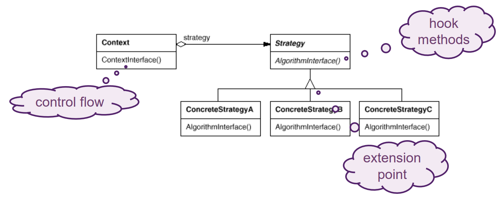

# Frameworks

## Wieso Frameworks

- Verhindern von Rad-neu-erfinden.
- Es ist einfach aber ineffizient dasselbe immer wieder zu programmieren.

## Was ist ein Framework

Objektorientierte Klassen die zusammenarbeiten, viele Design Patterns sind micro-frameworks.
Frameworks stellen `hooks` und `extension` zur Verfügung, Clients erben oder implementieren beispielsweise Klassen und Interfaces eines Frameworks.

Im Gegenteil zu einer `Library` kontrolliert ein Framework den Flow und nicht der Client. Das nennt man auch `Hollywood-Principle` "Don't call us, we call you!".

## Was ist ein Application Framework

- Objektorientiert Klassenbibliothek.
- `Main()` befindet sich im `Application Framework`.
  - Architektur wird vom Framework vorgegeben.
- Stellt `hooks` und `callback` zur Verfügung.
- Stellt ready-made Klassen zur Verfügung.
  - Hauptsächlich bei Konfiguration und Kombination.
- Wiederverwenden von Architektur und Infrastruktur für eine Art von Applikationen.
- Qualitätsansprüche an Application Frameworks sind sehr hoch.
- Die Entwicklung von Application Frameworks entsteht über Zeit, wenn man alles versucht zu planen führt das oft zu YAGNI (you ain't gonna need it).
- Tipp: Wenn man ein Framework entwickelt sollte man mindestens 2 -3 konkrete Applikationen, die das Framework verwenden parallel entwickeln.

### Beispiele

## Micro Frameworks

Viele Design Patterns sind Micro Frameworks

### Template Method

### Strategy

### Command Processor

{ width=90% }

### Fragen

**Q**: Explain the differences between Library / Framework / Application Framework

**A**:

- Libraries contain 3rd party features which do not control the application flow. Example: Math Library
- Frameworks provide hooks and extension points. They strongly rely on IoC principle: The framework defines when hooks (=activities) are called thus controls part of the application flow. Example: JRE, .NET Fx, Vue, React
- Application Frameworks contain the main()-Procedure. Clients implement plugins or components defined as extension points by the framework. The Application Framework completely controls the application flow. Example: Spring Boot, ASP.NET, Angular Often used by Application Families (JetBrains IntelliJ, Microsoft Office, Eclipse RCP).
