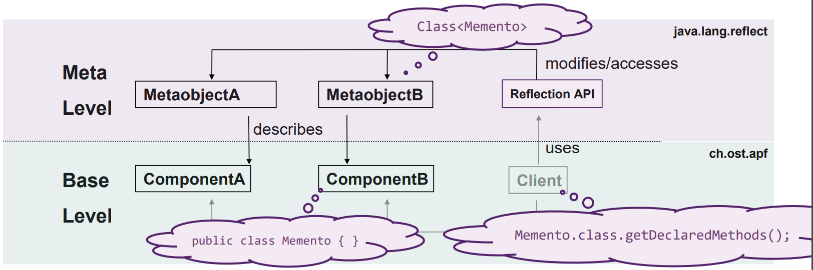
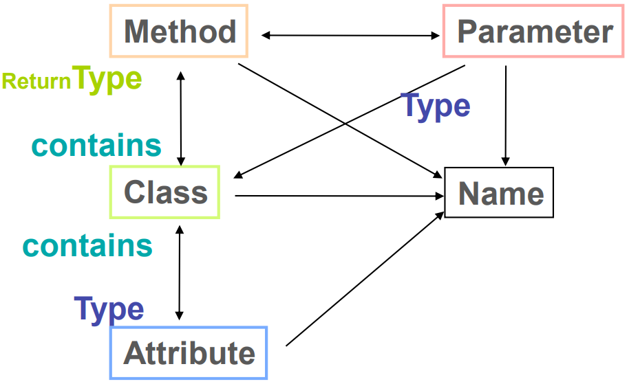
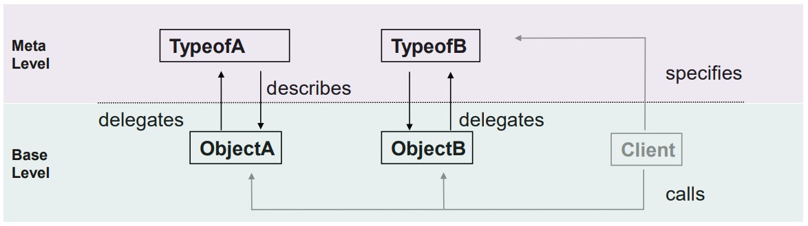
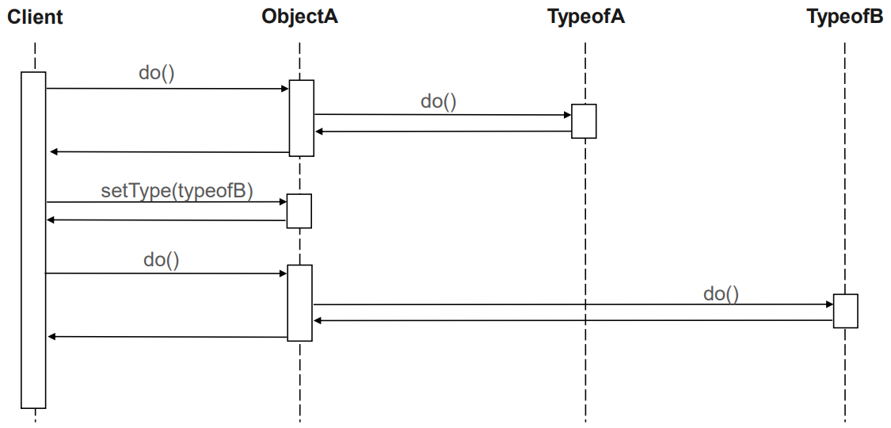
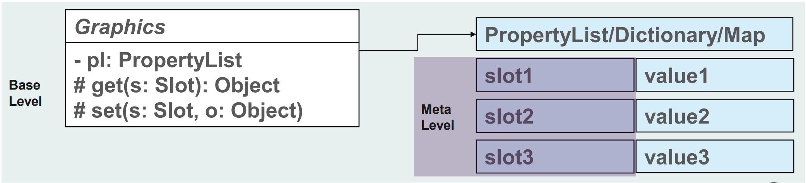
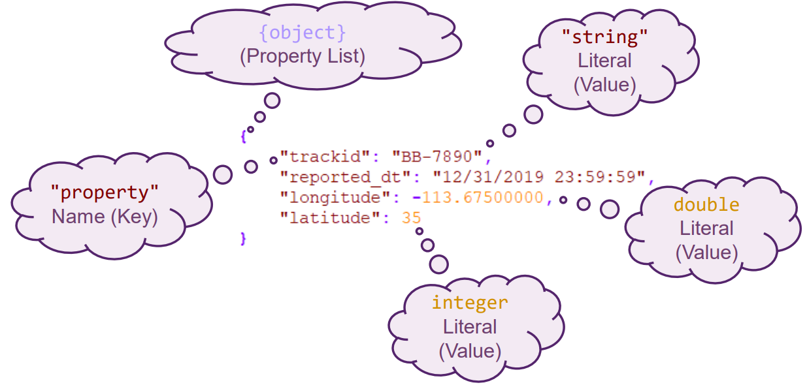
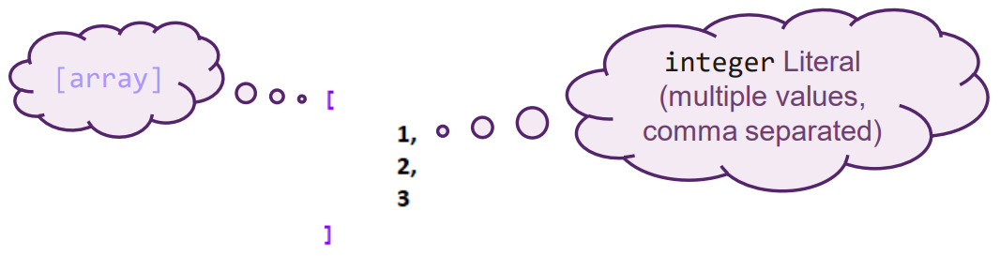
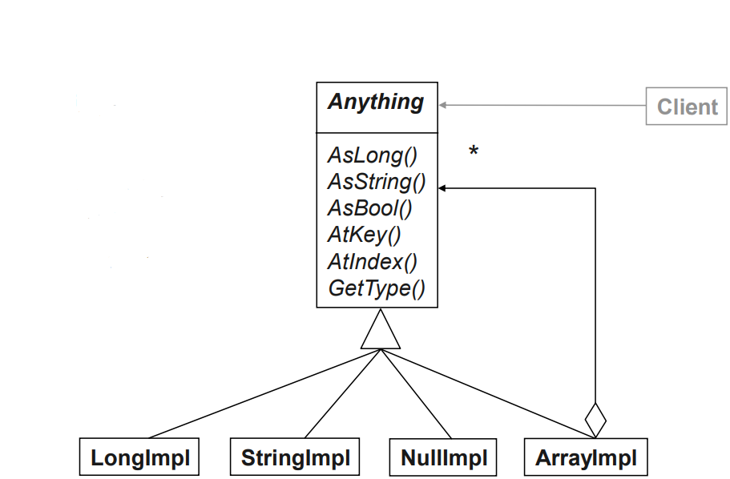

# Meta Patterns

- Reflection wird hauptsächlich verwendet für `Meta Programming`.
- Reflection wird verwendet um Implementation von `extension points` und `hooks` zu finden. Reflection hilft also unbekannte Komponenten zu integrieren
- Reflection stellt “-ilities” zur verfügung:
  - Flexibility
  - Adaptability
  - Generality

## Reflection Definition

**Introspection**: The ability for a program to observe and therefore reason about its own state.

**Intercession**: The ability for a program to modify its own execution state or alter its own interpretation or meaning.

- Meta level provides a self-representation
  - Gives the Software a knowledge of its own structure
  - Consists of meta objects
  - Interface for manipulating meta objects is called MOP (metaobject protocol)
- Base level defines the application logic
  - Its implementation may use the meta objects



### Meta Objects

{ width=75% }

## Reflection Usage

- Java:
  - Can be used to
  - load of JAR / DLL files at runtime
  - invoke methods
  - read out properties/fields
  - create object instances
  - search for annotations on Classes / Methods / Fields / …
- Unterstützt das Implementieren der folgenden Konzepte
  - Dependency Injection (DI)
  - Convention over Configuration
  - Object-Relation Mapper
  - Serialization / Deserialization (Remote Marshalling / Unmarshalling)
  - Plugin Architectures

### Beispiele

```java
if (origin instanceof Cloneable) {
  cloned = ((Cloneable)origin).clone();
} else {
  cloned = origin.getClass().getDeclaredConstructor().newInstance();
  // …
  BeanUtils.copyProperties(origin, cloned); // get data from getters, fill into setters
}
```

## Reflection Vorteile

- Adapting a software system is easy
  - Tool to build big systems that evolve over time
- Support for many kinds of changes

## Reflection Nachteile

- Produces non-transparent “black magic” APIs
  - control flow already hard to understand with polymorphism
- Binding at runtime (“Late Binding”)
  - limited type safety
  - lower efficiency, no compiler-optimization (often combined with code generation)

## Reflection Gefahren

- Different mechanisms for similar semantics confuse
- More indirection costs efficiency - sometimes too much
- Too much work to configure and instantiate systems
  - “you can do what you want with FLEX-TREME, it just takes you years to configure it”
- Users of reflective solutions misuse liberty which results in obscure APIs
- Overengineered solutions
  - “hey, lets just use another level of indirection and this problem can be solved”
- Security mechanisms get in the way or are undermined
  - obscurity (in control flow) is one reason

## DiY Reflection

Other self-representation approaches come with less liabilities

- Self-representation as a part of the domain
- Sometimes, descriptive (meta) data need to be persisted and even modified by the user

## Type Object

### Problem

- Wir wollen allgemeines Verhalten und Daten an einem Ort aufbewahren.
- DRY Implementation von Domain

Wie kann man Objekte kategorisieren, eventuell dynamisch?

### Lösung

- Create a category (type) object which describes multiple objects
- Objects forward the calls to the underlying type
- Allow objects to change their type at runtime
  - But ensure identity is kept





### Vorteile

- Categories can be added easily, event at runtime
- Avoids explosion of (trivial) subclasses
- Allows multiple ‘meta-levels’ (type-objects for type-objects)

### Nachteile

- Confusing mess of “classes” and class mutations, because of separation
- Lower efficiency because of indirection
- Changing database schemas can be tricky
  - Solution needs to store different object layouts persistently (mitigated with OR-mapping)

### Beispiel

```java
// Base Level
public class Copy {
  protected MediaType type; // typeof this
  protected int copyid; // e.g. inventory no
  // current identity of this copy
  public int getId() {
    return copyid;
  }
  // example of delegation
  public String getTypeId() {
    return type.getId();
  }
  public String getTitle() {
    return type.getTitle();
  }
  //…
}

// Meta Level
public class MediaType {
  protected String title;
  protected String typeid;
  public String getId() {
    return typeid;
  }
  public String getTitle() {
    return title;
  }
  //…
}
```

### Fragen

**Q**: On which GoF pattern is Type Object based?

**A**: Strategy Pattern; every type represents an own strategy for item objects

**Q**: Have you already encountered a similar intent of a GoF pattern?

**A**: Yes, it’s similar to the State pattern, which “seems to change its class” at runtime.

**Q**: Do you know any OOA Pattern with a similar intent?

**A**: Item-Descriptor pattern [Coad92].

## Property List

### Problem

- Attribute sollen nach dem Kompilieren hinzugefügt oder entfernt werden.
- Objekte teilen Attribute / Parameter über die Klassenhierarchie.

Wie definiert man Properties (und Argumente) auf eine flexible Art, welche es ermöglicht, dass sie während der Runtime entfernt und hinzugefügt werden können?

### Lösung

- Property list maps attribute names to values.
- Each name defines a “slot”.
  - May be represented by any Relative Value Type (e.g. a String).
- In a class hierarchy, the same slot can be used for attributes with identical semantics.
- Objects can be triggered to list all slot names and values.



### Vorteile

- Black-box extensibility of attributes, attributes can be added dynamically
- Object extension while keeping object identity
- Attribute iteration can be implemented easily
- Same "attribute" can be used for attributes with identical semantics across hierarchies
- (Property List as parameters, variation):
  Flexible parameters for generic method interfaces

### Nachteile

- Different ways to access regular and dynamic attributes
- Type safety left to the programmer
- Naming not checked by a compiler ('color' vs. 'colour')
- Semantics of attributes not given by class code only by clients
- Run-time overhead can be substantial because of name-lookup
- Memory Management: should get return a reference or a copy of an PL value

### Beispiel

```java
public class Graphics {
  private Properties pl;
  // generic access to properties
  public String get(String prop) {
    return pl.getProperty(prop, "");
  }
  public void set(String prop, Object value) {
    pl.setProperty(prop, value);
  }
}
```

```java
package java.util;
public class Properties {
  // …
  // Meta Level
  public Set<String> stringPropertyNames() {
    // …
  }
  public String getProperty( String prop, String defaultValue) {
    // …
  }
  public Object setProperty(String prop, Object value) {
    // …
  }
}
```

### Fragen

**Q**: Ideen zum milder der Nachteil?

**A**: A schema could be applied which dynamically perform type and name checks.

## Bridge Method

- Strict typing of well-known and predefined properties mitigate liabilities
- A typed schema allows to enforce property names and types
  - Class code can handle regular and dynamic attributes in the same way
  - Type safety enforced by Bridge Method
  - Slot name checked on a single point
- Bridge Methods can be added with Extension Methods (C#)
  - …or added to the Graphics prototype (TypeScript / EcmaScript)
- When using Java, Project Lombok can be used to create @ExtensionMethods

### Beispiel

```java
public class Graphics {
  private HashMap<String, Object> pl;
  private static final NAME_PROP = "name";
  // optional: Bridge Method for property name
  public String getName() {
    return (String)getProp(NAME_PROP, "name");
  }
  public void setName(String name) {
    return setProp(NAME_PROP, name);
  }
  // protected access to properties
  protected Object get(String prop, String def) {
    return pl.getOrDefault(prop, def);
  }
  protected void set(String prop, Object value) {
    pl.put(prop, value);
  }
}
```

```java
package java.util;
public class HashMap<Key, Value> {
  // …
  // Meta Level
  public Set<Key> keySet() {
    // …
  }
  public Object get(Key key) {
    // …
  }
  public Value put(Key key, Value value) {
    // …
  }
}
```

## Anything

- What is Anything?
  - Arbitrary data structure
  - Recursively structured Property List
  - Internal representation of today’s JSON structure

```json
[
  {
    "trackid": "AA-1234",
    "reported_dt": "12/31/2019 23:59:59",
    "longitude": -111.125,
    "latitude": 33.355
  },
  {
    "trackid": "BB-7890",
    "reported_dt": "12/31/2019 23:59:59",
    "longitude": -113.625,
    "latitude": 35
  }
]
```

### Beispiele





Komibinierte Variante als Beispiel om vorherigen Abschnitt.

### Problem

- Es soll eine Sammlung von Daten aufbewahrt werden, ähnlich wie bei `Property List`.
- Strukturierte Daten beinhalten auch Sequenzen von Daten.
- Daten sollten rekursiv aufgebaut sein.

Wie stellt man eine generische Konfigurations- oder Kommunikations-Datenstruktur die erweiterbar ist zur Verfügung?

### Lösung

- Implement a representation for all simple values (including null and undefined)
- In addition, add an implementation for a sequenceof values and provide key-value access
- Provide a default value if the requested value cannot be converted

{ width=75% }

### Vorteile

- Readable streaming format and appropriate for configuration data
- Universally applicable, flexible interchange across class/object boundaries

### Nachteile

- Less type safety, but might ask for individual type
- Intent of parameter elements not always obvious
- Overhead for value lookup and member access
- No real object, just data

### Fragen

**Q**: Which GoF pattern (and variation) does the Anything pattern implement?

**A**: Transparent Composite Pattern

**Q**: Have you discovered any other pattern?

**A**: Null Object
