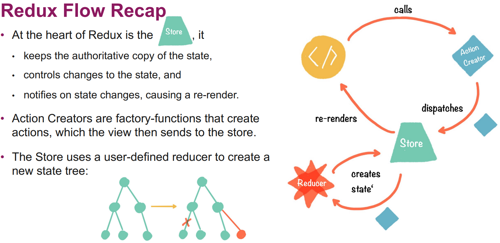

# React
{ width=75% }

# Redux

# Eclipse

{ width=75% }

## OSGi

- Specifies a component and service model for Java
- Components (bundles) can be installed, started, stopped, and uninstalled at runtime
- Each bundle gets its own classloader
- Bundles define dependencies and export some of their packages (unlike a JAR)
- Similar goals as Java 9 modularization
- Several OSGi implementations, Eclipse's is Equinox
- GlassFish, JBoss, WebSphere, IntelliJ, and many others are all based on OSGi
### Services
- OSGi also offers services to connect bundles
- Service is a POJO and can be registered at a Service Registry at bundle start
- For historical reasons, Eclipse does not use OSGi services but Extensions and Extension Points

### Extension Points

{ width=75% }

### GOF
- Platform
  -Singleton: getting Workbench, Plug-in
- Workspace Resources
  - Proxy and Bridge: Accessing File System
  - Composite: the workspace
  - Observer: tracking resource changes 
- Core Runtime
  - IAdaptable and Adapter Factories: Property View SWT
- SWT
  - Composite: composing widgets
  - Strategy: defining layouts
- JFace
  - Observer: responding to events
  - Pluggable adapter: Connecting widget to model
  - Strategy: customize a viewer without subclassing
  - Command: Actions
- UI Workbench
  - Virtual Proxy: lazy loading with E.P.
- LTK
  - Template Method, Composite, Memento
- CDT
  - Visitor: to traverse the AST

