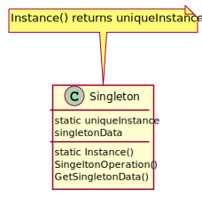
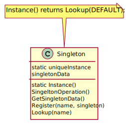
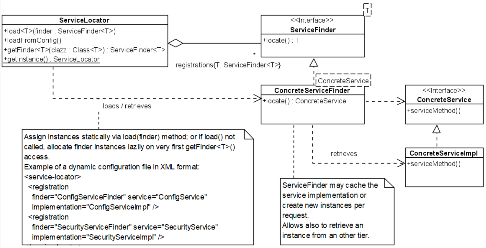
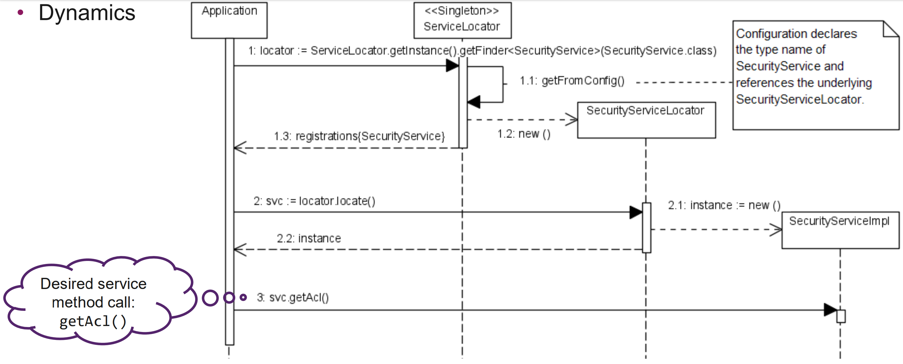
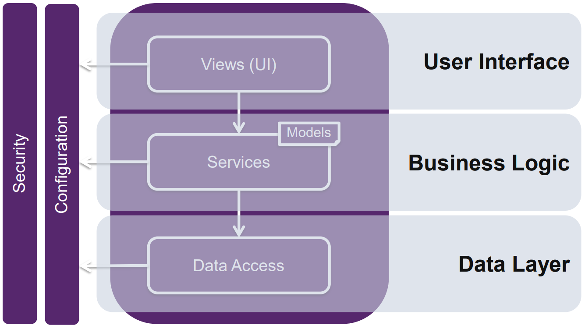
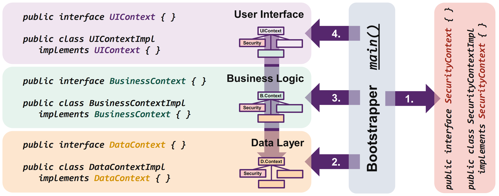
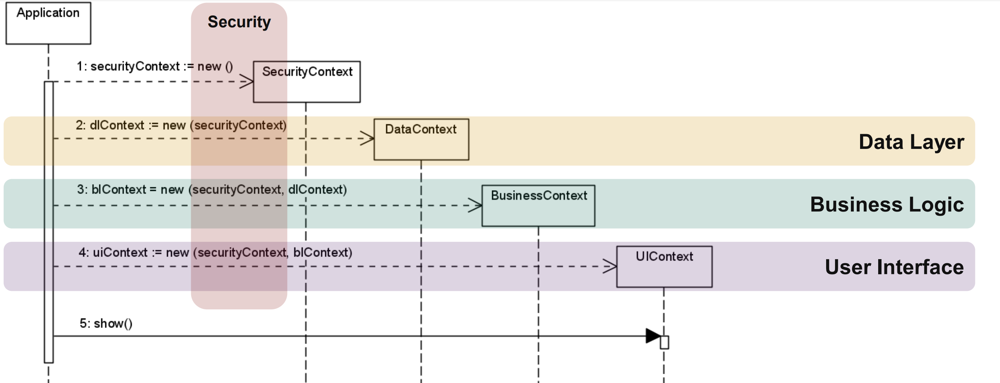
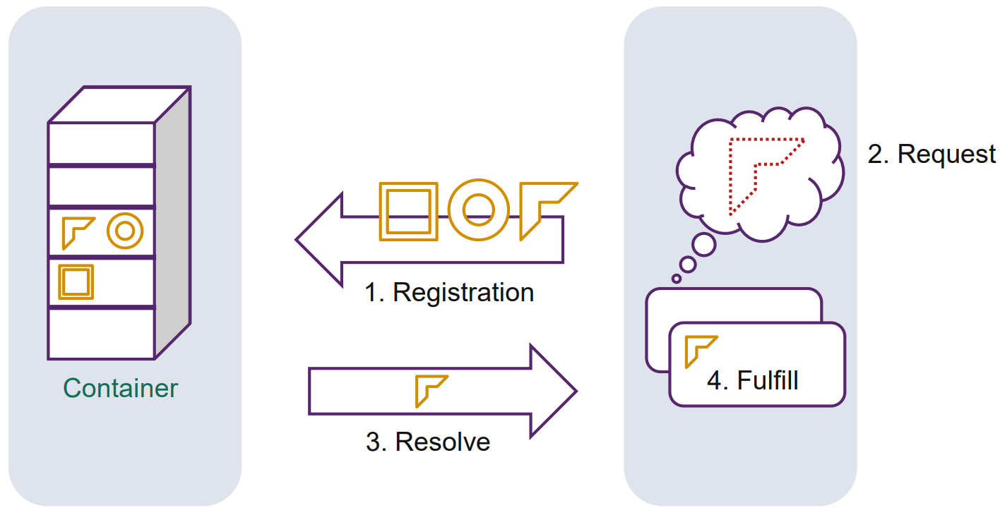
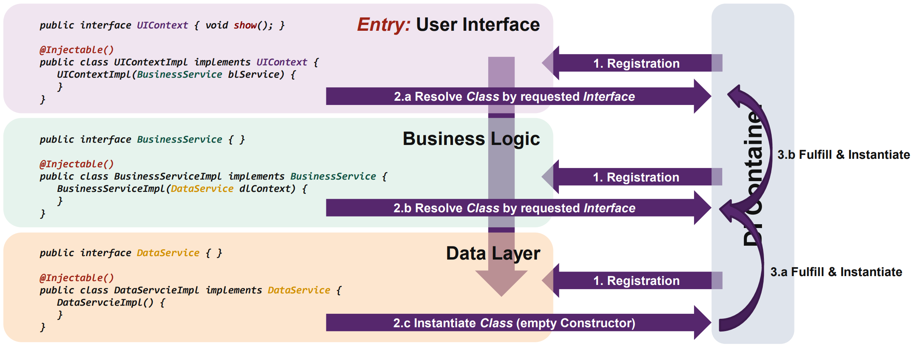

# Singleton

## Problem

- Von manchen Klassen möchte man nur eine Instanz.

Wie kann man garantieren das nur eine Instanz eines Objekt global verfügbar ist?

## Verwendung

1. Es darf nur eine Instanz einer Singleton Klasse existieren
2. Die Klasse muss über einen bekannten "access point" verwendbar sein.
3. Es sollte möglich sein von der Singleton Klasse zu erben.
4. Das "extenden" des Singleton darf keine existierenden Code brechen.

## Lösung



`static Instance()` kann für lazy Initialisierung verwendet werden.

## Implementation

```java
public class Singleton {
  private static class InstanceHolder {
    // Singleton will be instantiated as soon as the
    // ClassLoader instantiates the overlying class.
    private static final Singleton INSTANCE = new   Singleton();
  }
  public static Singleton getInstance() {
    return InstanceHolder.INSTANCE;
  }
  protected Singleton() { } // allow subclassing
}
```

## Vorteile

- Controlled access to sole instance
- Reduced name space
- Permits refinement of operations and representation
- Permits a variable number of instances
- More flexible than class operations

## Nachteile

Ursprünglich wurden keine definiert.

- Introduces a global variable/state
  - Clients bind statically to a global class member (tight coupling)
  - Problematic within multi-threaded environments; locking strategies needed
- Prevents polymorphism (interface abstraction is not foreseen)
  - Limits interchangeability
  - Limits unit testing (mocking) and disallows parallelism during the tests --> hinders maintainability
  - Limits application evolution
- Carries state until the app closes

- Singleton accommodates a global state and restricts unit testing due limited interchangeability

## Variation Registry



## Fragen

**Q**: Which patterns you know are contained within the Singleton pattern?

**A**: Class Factory Method, Lazy (& Eager) Acquisition

**Q**: Which benefit in terms of testability do you see in the Registry?

**A**: During the tests, a Singleton instance can be replaced with a test stub. This requires the test stub must also derive from the Singleton base class.

**Q**: How could you enhance the testability?

**A**: Derive the Singleton from a base interface. This allows to completely replace the object registered within the registry with a test implement.

# Killing Singleton

## Ausgangslage

Die Applikation verwendet ein Framework mit einem Singleton, desen Instanz als `private static` vorhanden ist.
Es ist nicht möglich die Funktionalität des Singleton zu verändern, das Singleton greift auf Hardware zu, welche im Test Environment nicht zur Verfügung steht.

Es muss aber trotzdem irgendwie möglich sein einen automatisierten Test zu schreiben, zum Verbessern der test coverage.

How can we get rid of the tight coupling to the Singleton, to support maintainability and
enable automated testing?

## Monostate

### Problem

- Mehrere Instanzen sollten dasselbe Verhalten haben.
- Die Instanzen sind simple unterschiedliche Namen für dasselbe Objekt.
- Sollte das Verhalten eines Singleton haben ohne die Nachteile eines Singleton.

Wie können sich zwei Instanzen so verhalten, als wären sie ein Objekt?

### Implementation

```java
// > Plain Monostate implementation
public class Monostate {
  private static int x;
  private static int y;
  public int getX() { return x; }
  public int getY() { return y; }
}
```

```java
// Example 2:
// > Mitigate Singleton & introduce interface
public interface Monostate {
  int getX();
  int getY();
}
public class MonostateImpl implements Monostate {
  public int getX() {
    return Singleton.getInstance().getX();
  }
  public int getY() {
    return Singleton.getInstance().getY();
  }
}
```

Der Code des Benutzer referenziert `Monostate` anstelle des Singleton, MonostateImpl leitet die Aufrufe ans Singleton weiter.

### Vorteile

- Transparency, no need to know about Monostate
- Derivability, subclasses allowed and share the same static variables
- Polymorphism, different derivatives can offer different behavior
  - Testability, implementation of Monostate interface can be replaced easily in test environments
- Well-defined creation and destruction (for static members)

### Nachteile

- Breaks inheritance hierarchy, a non-monostate class cannot be converted into a Monostate class through
  derivation
- Monostate is a real object, may go through many creations and destructions
- Monostate statics are always allocated, consumes memory
- Sharing Monostate objects across several tiers is not possible
- Shared state of Monostate may cause unexpected behavior

### Fragen

**Q**: What is the applicability of the Monostate pattern?

**A**: In a new and clean system, usage of that pattern should be avoided. Nevertheless, if a
dependent system already contains a Singleton, the liabilities could be mitigated.

**Q**: Which liability would be most damaging, if Monostate is not documented clearly?

**A**: The new operator does not allocate the memory for the new object. Therefore, Monostate internal concept is to hide a Singleton-like behavior. This conceptual inconsistency may confuse the developers using the Monostate object.
The Monostate is also called "Borg Pattern". Borgs are cybernetic organisms with a linked hive mind called "the Collective". Individual beings are forcibly transformed into "drones" by injecting nanoprobes.

**Q**: Why does the Monostate object break the inheritance hierarchy?

**A**: A non-Monostate class accommodates an internal state (non-static fields). Monostates must not. Thus, the hierarchies aren’t compatible.

## Service Locator

### Problem

- Die Implementation einer globalen Service Instanz solle austauschbar sein.
  - Es sollte möglich sein die Servicemethoden auf einem anderen Tier transparent auszuführen.

Wie kann man globale Service registrieren, sobald sie benötigt werden?

### Lösung

- Der `ServiceLocator` muss als Singleton `Registry` implementiert werden.
- Der `ServiceLocator`gibt die `finder` Instanz zurück welche benutzt wird, um den konkreten Service zu finden.





### Vorteile

- There’s exactly ONE Singleton in the application
- ServiceLocator interface (except static members) strongly rely on abstractness
  - Locators and services can be easily exchanged, even at runtime

### Nachteile

- Clients still rely on a static reference to ServiceLocator class (tight coupling)
- No possibility to replace the ServiceLocator implementation; but the locators/services are replaceable
- See Singleton for all liabilities…

### Kritik

- No real improvement over Singleton
  - Enhances the «Registry» variation with a highly configurable global factory
- Thus, pattern tries to combine Abstract Factory with Singleton pattern
  - But does not address real drawbacks of Singleton

## Parameterize from Above

### Problem

- Singleton gewährleistet keine Haltbarkeit und keine Testbarkeit.
  - Aber `application-wide` Daten müssen bereitgestellt werden.
- Die Applikation soll in logische Layer aufgeteilt werden.
  - Unter Berücksichtigung von `loose coupling` und ohne direkte `bottom-to-top` Abhängigkeiten.

Wie kann man die benötigten Daten den tiefen Layers zur Verfügung stellen ohne das sie global verfügbar sind?

### Lösung

Konfigurationparameter und "bekannte" Objekte werden via Constructor oder als Template Paramter übergeben und sind nicht mehr global verfügbar.

{ width=60% }

{ width=80% }



```java
public final class Bootstrapper {
  public static void main(string[] args) { // PfA applied
    // instantiate vertical layer contexts first
    SecurityContext securityContext = new SecurityContextImpl();
    ConfigurationSettings configuration = new ConfigurationSettingsImpl(args);
    // encapsulate variables into an application context
    var applicationContext = new ApplicationContextImpl(
    securityContext,
    configuration);
    // instantiate horizontal layer contexts from bottom to top
    DataContext dlContext = new DataContextImpl(applicationContext);
    BusinessContext blContext = new BusinessContextImpl(applicationContext, dlContext);
    UIContext uiContext = new UIContextImpl(applicationContext, blContext);
    // show initial UI dialog
    uiContext.show();
  }
}
```

### Vorteile

- No global variables
- Implementations of parametrized functionalities are exchangeable
  - Additional implementation possible, e.g. for test environment or production, per customer, …
- Enforces separation-of-concerns at architecture level
  - Reduces tight coupling between the layers
  - Lowers the risk of creating unmaintainable monoliths

### Nachteile

- Adds more complexity to the overall system
  - Object instances aren’t accessible from everywhere; access to application context needed
  - Programmers must understand and accept the concept
- Contexts must be passed through the whole application stack
- Fragile bootstrapper: application must be wired completely at startup

## Dependency Injection

### Problem

- User überschreiben vielleicht Implementation von existierenden Applikationskomponenten.
- Die Applikation sollte automatisch anhand der Interfaceimplementation verdrahtet werden.
  - So kann beispielsweise während eines Tests eine andere Implementation verwendet werden.
- Jede Komponente des Systems kann nach einem Objekt eines Interfaces verlangen, beispielsweise als constructor Argument oder als Property.

Wie können Frameworkbenutzer eine eigene Implementation einer vordefinierten Frameworkkomponente erstellen oder sogar das System mit eigenen Interfaces Definition und Implementation erweitern?

### Lösung

- Eine zentrale Container (Dependency Injection Container) Klasse agiert als `Registry`.
- Der Benutzer referenziert die Dependency anhand des benötigten Interface.
  - Die Implementation zu dem definierten Interface wird via Container zur Verfügung gestellt.
- Der Benutzer verwendet Annotations zum
  - referenzieren der benötigten Interfaces
  - deklarieren der Interface Implementationen.
- Benutzer verwenden den Container nicht direkt, sondern nur via Framework.

{ width=75% }

### Implementation

- Patterns `Service Locator` und `Parameterize from Above` kombinieren
  - Zentrale Container Instanz, als "highly configurable" `Registry` verwenden.
  - Je nach Anforderungen beherbergt der Container `Factories` oder Implementationen.
- Die Container Klasse darf im Benutzercode nicht statisch referenziert werden.
  - Indirektion über Annotationen forcieren, damit statisches Binding verhindert wird.



### Vorteile

- Reduces coupling between the consumer and the implementation
  - No need to reference the DI container directly
- The contracts between the classes are based on interfaces
  - Classes relate to each other not directly, but mediated by their interfaces
- Supports the open/closed principle
- Allows flexible replacement of an implementation
- Implementations can be marked as “single” (only one in the system) or “transient” (new instance per injection)

### Nachteile

- Adds black magic to the overall system
  - Wiring of the object tree is not transparent anymore (and not checked by the compiler)
- Debugging the object dependency tree may become hard
- Recursive dependencies are hard to find and may prevent the system from startup
- Relies on reflection and can result in a performance hit

### Fragen

**Q**: What’s the relation between Singleton and DI?

**A**: a) DI container may implement a mechanism to instantiate a requested dependency once per application («Single» instances). Depending on the DI container, such registrations are called «Singleton».

b) DI container implementations can be based on the «Registry» Singleton variation.

**Q**: What is the improvement of DI over the Service Locator pattern?

**A**: Client classes within the application don’t depend directly on the dependency injection container. The DI annotation/attribute allows to reduce the tight coupling between the DI container implementation and the declarative dependency requirements of a class. Service Locators are directly referenced by client classes
