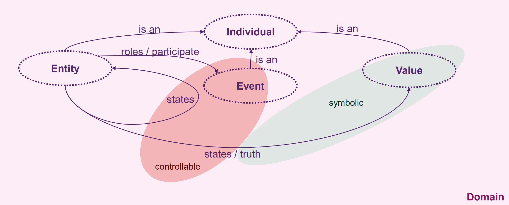
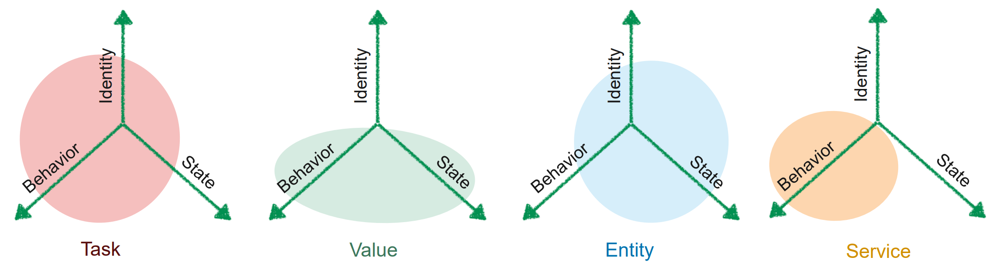

# Value Patterns

## Definition

Was ist der Unterschied zwischen einem Objekt und einem Value?

- Values sind immer kopiert, haben keine Identität
- Objekt können referenziert werden, die Referenz ist die Identität.

## System Analyse

### Values and Individuals

> An individual is something that can be named and reliably distinguished from other individuals.

Es gibt 3 Arten von Individuals:

- Events
  - An event is an individual happening, taking place at some particular point in time.
- Entities
  - An entity is an individual that persists over time and can change its properties and states from one point in time to another. Some entities may initiate events, some may cause spontaneous changes to their own states, some may be passive.
- Values
  - A value is an intangible individual that exists outside time and space, and is not subject to change.



#### Beispiele

Event: User action
Entity: Person
Value: Körpergrösse

## Software Design

**Entity**: Entitäten sind Systeminformationen, typischerweise persistenter Natur. Entitäten haben eine Identität, damit sie unterscheidbar sind.

**Service**: Service-based Objekte repräsentieren System Aktivitäten. Services werden anhand ihres Verhalten und nicht anhand ihres Zustands unterschieden.

**Values**: Das dominierende Merkmal von value-based Objekte ist der interpretierbare Inhalt, gefolgt vom Verhalten gemäss Zustand. Anders als Entitäten sind Values kurzlebig und benötigen keine Identität.

**Tasks**: Wie service-based Objekte repräsentieren Task System Aktivitäten. Aber Tasks haben immer eine Identität und einen Zustand wie beispielsweise Command objects oder Threads.

### Beispiele

Entity: User
Service: UserService
Value: Alter

### Object Aspects



# Values

## Characteristiken

- Werden mit einem Typ repräsentiert
  - Ein Typ repräsentiert ein Bereich von verfügbaren Werten
    - int: $-2^{31}$ .. $2^{31}-1$
  - Der Typ kann auch eine Dimension repräsentieren
    - Distanz in M oder Masse in kg
- Funktionen zuordnen/konvertieren Werte
  - Integer.parseInt("200")
- OO languages imitieren Values oft mit **object classes**.

## Value Objects

- Kommen normalerweise nicht in UML Klassendiagrammen vor.
  - ausser als Attribute Typ.
- Werden zum Modelieren von "fine-grained" Informationen verwendet.
  - enforce basic rules
- Beinhalten repetitiven code.
  - z.B. date arithmetic
  - used to add meaning to primitive value types
    - e.g. three ints meaning year, month, day
- Stellen type safety sicher.

### Beispiele

- ISBN
  - Länge von 10
  - wird von Dezimalzahlen repräsentiert
    - ausser dem letzten Zeichen, welches auch X sein kann
  - Das letzte Zeichen ist ein "check digit", berechnet aus den anderen Zeichen.

### Value Objects in OO Languages

- Values haben keine Identität
  - Aber references (pointers) sind eine Art von Identität (OO Design widerspricht Idee, ist problematisch)
- Die dominante Charakteristik einers Value ist der Inhalt
  - Immer einen Wertigkeitsvergleich machen und keine Identitätsvergleiche (`"Hello".equals("Hello")`)
- Ein Value hat ein Zustandspezifisches Verhalten
  - Beispielsweise eine Ordnung (Datum, alphabetisch)
  - beispielsweise construction constraints (ISBN)

Die Identität des Value Objekts ist nicht wichtig, auch wenn sich die Referenz ändert durch beispielsweise kopieren, bleibt das Value dasselbe.
Value Klassen haben normalerweise keine parent class oder childern. Eine Value Klasse kann einfach abgespeichert werden, das Value ist wichtig nicht die Identität.

### Language Specifics

- Support for automatic copying (pass by value)
  - C#: use struct types for automatic copying
  - Java: no automatic value copying, class must provide immutability and/or cloning
- Value classes must be protected from slicing (cutting off a subclass´ state)
  - C#: use struct types
  - Java: use record types or declare value class final
- Persistence/serialization of value classes
  - C#: structs are based on primitive types
  - Java: Persistence layer must convert value object from/to a corresponding native/primitive representative

### Fazit

- Idea of «referentially-transparent objects» in Java not directly supported (unlike C# / C++ does)
  - Exceptions are the "basic" value types: boolean, char, int, long, double

## Patterns of Value

### Whole Value

#### Problem

- Integer und floating-point Zahlen sind nicht sehr nützlich als domain values.
- Fehler in der Dimension und "Intent communication" sollten während dem kompilieren gelöst werden.

Wie kann man primitive Daten einer Problemdomäne ohne Bedeutungsverlust repräsentieren?

#### Lösung

- Eine `Whole Value` Klasse stellt sicher das kein Bedeutungsverlust eintrifft, durch das Zurverfügungstellen von Dimensionen und Bereichen.
- Ein Wrapper für simple Typen oder eine Gruppe von Attributen.
- Verbieten von Vererbung zum Verhindern von "slicing".

#### Beispiel

```java
public class Date {
  public Date(int year, int month, int day) {
  }
  …
}
Date first = new Date(year, month, day); // correct
Date second = new Date(day, month, year); // bad
Date third = new Date(month, day, year);  // bad
```

Die Klasse `Date` kann nicht eindeutig verwendet werden, das führt zu falsch instantiierten Objekten wie `second` und `third`.
Damit das vermieden wird, kann eine Klasse `Year` erstellt werden:

```java
public final class Year {
  public Year(int year) { value = year; }
  public int getValue() { return value; }
  private final int value;
}
```

und der Date Konstruktor entsprechend angepasst werden:

```java
public final class Date {
  public Date(Year year, Month month, Day day) { … }
  …
}
Date first = new Date(new Year(year), new Month(month), new Day(day));
```

### Value Object

#### Problem

- Vergleiche, indexing und Sortieren darf nicht auf der Objektidentität basieren, sondern auf dem Objektinhalt.

Wie definiert man eine Klasse die Values repräsentiert?

#### Lösung

- Überschreiben der Objektmethoden welche die Gleichheit definieren
  - Java:
    - boolean equals(Object other) { }
    - int hashCode() { }
    - implement Serializable / toString() if appropriate
  - TypeScript:
    - equals(other: Object): boolean { }
    - implement toString() if appropriate
- Das Überschreiben von toString() hilft das Value-Objekt zu Verwenden.

#### Beispiel

```java
public final class Date implements Serializable {
  // …
  private static final long serialVersionUID = -3248069808529497555L;
  // …
  @Override
  public boolean equals(Object o) {
    if (this == o) return true;
    if (o == null || getClass() != o.getClass()) return false;
    Date date = (Date) o;
    return year.equals(date.year) && month.equals(date.month) && day.equals(date.day);
  }
  @Override
  public int hashCode() {
    return Objects.hash(year, month, day);
  }
}
```

### Conversion Method

#### Problem

- Values are strongly informational objects without a role for separate identity
- Meistens sind Value Objects irgendwie zusammenhängend, können aber nicht direkt miteinander verwendet werden, ohne sie zu konvertieren.

Wie kann man verschiedene miteinander zusammenhängende Value Objects zusammen verwenden, ohne vom unterliegenden primitiven Typen abhängig zu sein?

#### Lösung

- Provide a constructor which converts between types
  - No additional method call needed
  - Most intuitive when applied to convert from more generic to current type
    - …but can be implemented by your own Value Classes only
- A conversion instance method converts from a user-defined type to another type
  - Can be accomplished with a “toOtherType()“ instance method
- Create a Class Factory Method with conversion characteristics
  - Inverse relationship with “toOtherType()“ methods
  - More about Class Factory Method later…

#### Implementation

```java
/** Immutable Value Object with range check. */
public final class Day {
  private static final int SECONDS_PER_DAY = 86400;
  private final int value;
  public Day(int value) {
    if (value < 1) { // range check
      throw new IllegalArgumentException();
    }
    this.value = value;
  }
  /** Conversion constructor to be used when values should be converted.
   * @param second Seconds to convert into days. */
  public Day(@NotNull Second second) {
    this.value = second.getValue() / SECONDS_PER_DAY;
  }
  /** Conversion instance method, convert seconds into Day format. */
  @NotNull
  public Second toSecond() {
    return Second.of(value * SECONDS_PER_DAY);
  }
  public int getValue() {
    return value;
  }
  // add Serializable / equals() / hashCode() / toString()
}
```

### Immutable Value

#### Problem

- Ein Value existiert ausserhalb von Zeit und Raum und darf nicht verändert werden.
  - Verhindern von Problemen, wenn Value Objects geteilt werden.
  - Wenn mehrere Threads dasselbe Value verwenden, muss Thread safety gewährleistet sein.
  - Values werden oft als Key für associative Tabellen verwendet

Wie kann man Value Objects teilen und garantieren, dass keine Side Effects auftreten?

#### Lösung

- Setzten des internen Zustands während der Konstruktion des Objekts und alle Felder auf `private final` setzten.
  - Klasse mit final markieren
  - keine Synchronisation benötigt, weil keine `race conditions` auftreten können.
- Complementary techniques
  - Mutable Companion, provide a complete and intuitive set of constructors
  - Class Factory Methods

#### Beispiel

```java
public final class Date {
  private final Year year;
  private final Month month;
  private final Day day;
  public Date(Year year, Month month, Day day) {
    // range checks …
    this.year = year;
    this.month = month;
    this.day = day;
  }
  // …
}
```

#### Lösung

- Record classe verwenden

```java
record Day(@GreaterThanZero int dayOfMonth) {
  // generates:
  // private final int dayOfMonth;
  // public Day(int dayOfMonth) {
    // this.dayOfMonth = dayOfMonth;
  // }
  // int dayOfMonth() { return dayOfMonth; }
  // equals() / hashCode() / toString()
}
```

- Enforces private final (readonly) fields
- Implicitly generates
  - equals()
  - hashCode()
  - toString() Value Objects methods according to the declared members.
- Constructor annotations (e.g. @GreaterThanZero) are also propagated to members (if appropriate)

```java
/**
 * Immutable Date Value Object AS RECORD
 *  > with generated equals() / hashCode() / toString()
 *  > serialVersionUID not needed for record classes, see https://docs.oracle.com/en/java/javase/15/serializable-records/index.html
 *  > @org.jetbrains.annotations.NotNull injects non-null checks (assertions)
 */
public record Date(@NotNull Year year, @NotNull Month month, @NotNull Day day) implements Serializable {
}

/**
 * Immutable Year Value Object AS RECORD
 *  > with generated equals() / hashCode() / toString()
 *  > serialVersionUID not needed for record classes, see link in Date
 */
public record Year(int value) implements Serializable {
  public Year {
    if (value < 1970) { // range check
      throw new IllegalArgumentException();
    }
  }
}

/**
 * Immutable Month Value Object AS RECORD
 *  > with generated equals() / hashCode() / toString()
 *  > serialVersionUID not needed for record classes, see link in Date
 */
public record Month(int value) implements Serializable {
  public Month {
    if (value < 1 || value > 12) { // range check
      throw new IllegalArgumentException();
    }
  }
}

/**
 * Immutable Day Value Object AS RECORD
 *  > with generated equals() / hashCode() / toString()
 *  > serialVersionUID not needed for record classes, see link in Date
 */
public record Day (int value) implements Serializable {
  public Day {
    if (value < 1 || value > 31) { // range check
      throw new IllegalArgumentException();
    }
  }
}
```

### Enumeration Values

#### Problem

- Ein fixer Bereich von Werten solle typisiert werden, beispielsweise Monate.
  - int Konstanten zu verwenden, hilft nicht.
  - `Whole Value` ist nur die hälfte der Lösung, der Bereich muss ebenfalls konstant sein.

Wie kann man eine fixe gruppe von konstanten Werten "type safe" repräsentieren?

#### Solution

- Implement a Whole Value and declare the Enumeration Values as public read-only fields
  - To type the constant values, they represent instances of the containing Whole Value
- Prevent inadvertently changing the constants
  - Enumeration Values must be immutable and constructed by the Whole Value only
- Today, the Enumeration Values pattern is built-in
  - Java: Use the enum keyword, declare values as private final
    - Enum classes are automatically serializable and final, constructors are defined implicitly private
  - TypeScript: Built-in, use the enum keyword

#### Beispiel

```java
public enum Month {
  JANUARY(1),
  // …
  DECEMBER(12);
  private final int value;
  private Month(int value) {
    if (value < 1 || value > 12) { // avoid careless mistakes, check value range
      throw new IllegalArgumentException();
    }
    this.value = value;
  }
  public int getValue() {
    return value;
  }
}
```

### Copied Value and Cloning

#### Problem

- Values müssen veränderbar sein, ohne den internen Zustand zu ändern.

Wie kann ein modifizierbares Value Object an Methoden übergeben werden ohne das Aufrufer den zustand des originalen Object verändern?
(How can you pass a modifiable Value Object into and out of methods without permitting callers or called methods to affect the original object?)

#### Lösung

- Cloning is the base idea of this pattern
  - Cloning means, create a copy of the current instance and all containing fields
  - In Java by convention, the marker interface Cloneable and Object.clone() method must be overridden
  - If cloning needs a non-standard (deep) behavior, fields must be non-final and re-assigned during clone
- Clone every Value Object leaked across boundaries:
  - when passed as parameter
  - when returned from a method call
- May result in immense object creation overhead
  - Cloning is an expensive operation
- Imitates call-by-value / return-by-value behavior of value types

#### Beispiel

```java
Order firstOrder, secondOrder;
...
Date date = new Date(year, month, day);
firstOrder.setDeliveryDate(date);
date.nextYear();
secondOrder.setDeliveryDate(date);
```

```java
class Order {
  // …
  private Date deliveryDate;
  public void setDeliveryDate(Date newDeliveryDate) {
    deliveryDate = newDeliveryDate.clone();
  }
  public Date getDeliveryDate() {
    return deliveryDate.clone();
  }
}
public final class Date implements Cloneable {
  private Year year;
  // …
  public void nextYear() {
    year = new Year(year.getValue() + 1);
  }
  @Override
  public Date clone() { /* … */ }
}
```

### Copy Constructor

#### Problem

- In einem Value Object weiss man oft genau was kopiert werden soll

Wie können Objekte kopiert werden ohne das eine `clone` Methode implmentiert werden muss?

#### Solution

- Declare the class as final and derive from Object only
  - Prevents violation of Class Invariant (copy constructor behavior)
- Create a copy constructor, which consumes an instance with same type
  - This constructor is responsible of copying all the required information
  - Results in less code and possibility to implement cloning optimizations

#### Beispiele

```java
Order firstOrder, secondOrder;
...
Date date = new Date(year, month, day);
firstOrder.setDeliveryDate(date);
date.nextYear();
secondOrder.setDeliveryDate(date);
```

```java
public final class Date {
  // …
  public void nextYear() {
    year = new Year(year.getValue() + 1);
  }
  public Date(Date other) {
    // …
    this.year = new Year(other.year);
  }
}
class Order {
  // …
  private Date deliveryDate;
  public void setDeliveryDate(Date newDeliveryDate) {
    deliveryDate = new Date(newDeliveryDate);
  }
  public Date getDeliveryDate() {
    return new Date(deliveryDate);
  }
}
```

### Class Factory Method

#### Problem

- Die Konstruktion von Value Objects kann teuer sein
  - Aber solche Objekte beherbergen oft denselben Zustand.
- Unterschiedliche Constructor Logik wird benötigt, was in einer hohen Anzahl Constructors endet.

Wie kann das Konstruieren von Value Objects vereinfacht und optimitert werden ohne ds zusätzliche Constructors benötigt werden?

#### Lösung

- Declare static one or more creation method on the class
  - Define constructors private; the are invoked by the Class Factory Method
- The static methods could also contain caching mechanisms

#### Beispiel

```java
Order firstOrder;
...
Date date = new Date(Year.of(2020));
firstOrder.setDeliveryDate(date);

public final class Year {
  // …
  public static Year of(int value) {
    // … query cache for given year, otherwise:
    return new Year(value);
  }
  private Year(int value) {
    // …
    this.value = value;
  }
}
```

### Mutable Companion

#### Problem

- Es muss mit Values gerechnet werden, beispielsweise Welches Datum ist 15 Tage nach der Prüfung?
- Class Factory Methods helfen, aber sind nur einmalig verwendbar.

Wie kann man das komplexe Erstllen eines immutable Value vereinfachen?

#### Lösung

- Ein `Mutable Compoanion` ist ein `factory object` für immutable values.
  - Addressiert Effizienz und API usability issues.
- Modifiers allow for cumulative or complex state changes and a query method to access resulting
  immutable value
- Companion is neither a subtype nor a supertype of the Immutable Value, so it doesn‘t belong to
  the same family
- In combination with companion, the factory is called Plain Factory Method

#### Beispiel

- java.lang.StringBuilder

```java
var yearBuilder = new YearCompanion(
Year.of(2020));
yearBuilder.next();
var nextYear = yearBuilder.asValue();

public final class YearCompanion {
  private int value;
  // …
  public YearCompanion(Year toModify) {
    this.value = toModify.getValue();
  }
  public void next() {
    value++;
  }
  public Year asValue() { // factory method
    return Year.of(value);
  }
}
```

In Kombination mit `companion`, wird die factory methode `Plain Factory Method` genannt. Eine `Plain Factory Method` ist eine `instance method`, welche zum Erstellen neuer Objekte einer anderen Typ verwendet wird. Anders als bei beim GOF `Factory Method` Pattern wird keine Vererbung benötigt.

```java
public final class YearCompanion {
  private int value;
  // …
  public void next() {
    value++;
  }
  public Year asValue() {
    return new Year(value);
  }
}
// Immutable Value Object as record
public record Year(int value) {}
```

### Relative Values

#### Problem

- Value objects werden anhand ihres Zustand vergleichen und nicht anhand ihrer Identität.
- Relative comparison between Value Objects for appropriate values should be provided

Wie kann ein Value Object mit einem anderen in einem "typed way" verglichen werden?

#### Lösung

- Override-Overload Method Pair
  Comparable<?> and equals(? other) should be overridden as pair
- Type <T> Specific Overload
  - Implement Comparable<T>.compareTo(T other) and equals(T other) for the current type <T>
  - If you need to compare another Value Object type:
    - Create a Comparator class and implement Comparator<TOther> interface
- Bridge Method
  - Provide a Bridge Method for equals(Object other) and forward it to equals(T other)
  - (Bridge Method for compareTo() not needed anymore due typed Comparable<T> interface)

#### Beispiel

```java
public final class Year implements Comparable<Year> /*, … */ {
  // …
  @Override
  public boolean equals(Object o) { // Bridge Method, override generic equals()
    if (o == null || getClass() != o.getClass()) return false;
      return equals((Year)o); // forward to typed method
    }
  public boolean equals(Year o) { // Override-Overload Method Pair
    if (this == o) return true;
    if (o == null) return false;
    return value == o.value;
  }
  @Override
  public int compareTo(Year o) { // Override-Overload Method Pair, Type Specific Overload
    if (o.value == value) return 0;
    return (value < o.value) ? -1 : 1;
  }
}
```

### Fragen

Q: Was ist der unterschied zwischen dem `Whole Value` und dem `Immutable Value` Pattern?

A: Whole Value macht ein Value Objekt das ein primitives Value kapselt und sagt nicht aus ob es mutable oder immutable ist, Immutable Value hingegen bestimmt explizit das es immutable sein muss, also ein Whole Value das immutable ist

Q: Wann sollte man `Class Factory Method` dem `conversion constructor` bevorzugen?

A: Use a Class Factory Method if a foreign value type should be converted into the current value format.
Use a conversion constructor if a more generic type should be converted into the current object, e.g. String(char[] value) , TimeStamp(Second value), …

Q: Was sind die wichtigsten Verantwortungen des `mutable value` concept?

A: Concept of Cloning / Copied Value may be missed by the programmer which results in to hard to find errors.

### Zusammenhang mit GOF Patterns

**Copied Value**: Prototype, (Factory Method)

**Mutable Companion**: Builder

**Class Factory Method**: Flyweight
