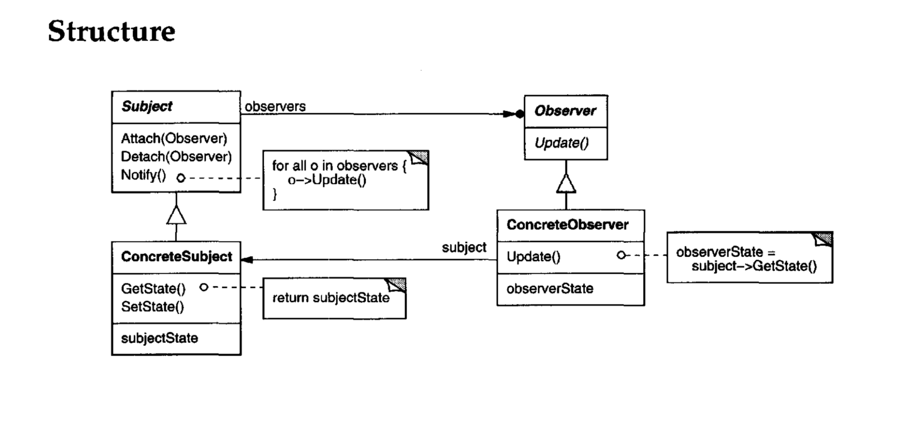
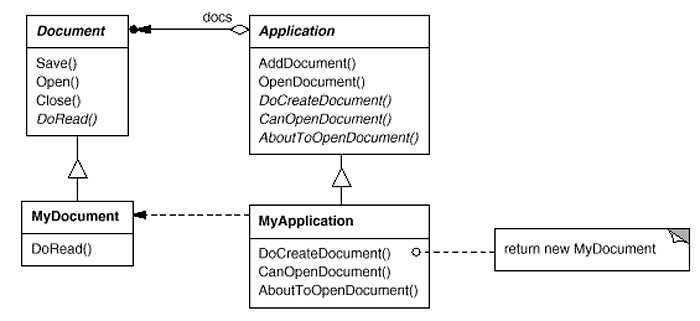
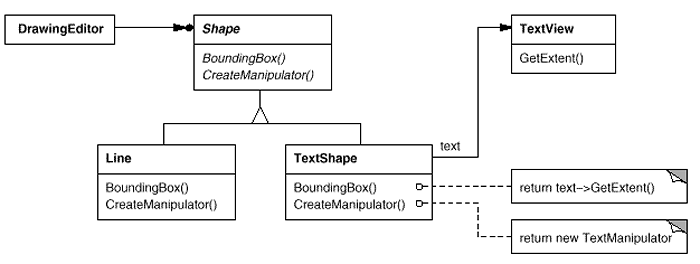
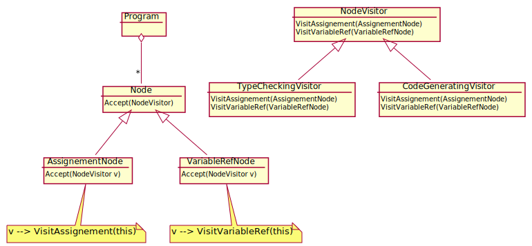

# Was sind Patterns nicht?

- A panacea (Allheilmittel)
- A silver bullet
- A novices' tool
- A ready-made component
- A means to turn off your brain

Patterns are not ready-made components to solve every single problem.

# Was sind Patterns?

- Description of successfull engineering stories
- Adressing recurring problems, decribes generic solution that worked
- Tell about forces
- Benefits and Liabilities
- Give names to talk about

## Arten von Patterns

- Architecture Patterns
- Software Patterns
  - Design Patterns [GoF]
  - POSA
  - Pattern oriented sw arch
  - weitere: Organizational, Learning, Teaching, Documentation… Patterns

# Creational Pattern

Creational Patterns These design patterns provide ways to create objects while hiding the creation logic, instead of instantiating objects directly using the new operator. This gives the program more flexibility in deciding which objects need to be created for a given use case.

# Structural Pattern

Structural Patterns These design patterns deal with class and object composition. The concept of inheritance is used to compose interfaces and define ways to compose objects to obtain new functionality.

# Behavioral Patterns

Behavioral Patterns: These design patterns are specifically concerned with communication between objects.

# Observer

Behavioral Pattern



Definiert eine one-to-many Abhängigkeit zwischen Objekten, sodass wenn ein Objekt seinen Zustand ändert alle davon abhängenden Objekte informiert werden.

## Beziehung zu anderen Patterns

Ist wie `Chain of Responsibility`, `Command` und `Mediator` ein Weg um Sender und Empfänger miteinander zu verbinden.

There’s a popular implementation of the Mediator pattern that relies on Observer. The mediator object plays the role of publisher, and the components act as subscribers which subscribe to and unsubscribe from the mediator’s events. When Mediator is implemented this way, it may look very similar to Observer.

# Strategy

Behavioral Pattern


Definieren einer Gruppe von Algorithmen, welche unabhängig voneinander sind aber auswechselbar.
Mit dem Strategy Pattern kann der Algorithmus je nach Benutzer nach einer anderen Strategie durchgeführt werden.

## Beziehung zu anderen Patterns

- `Bridge Method`, `State`, `Strategy` und zu einem Teil `Adapter` haben ähnliche Strukturen und alle basieren auf dem `Composite` Pattern. Aber alle lösen unterschiedliche Probleme.
- `Decorator` bietet eine Möglichkeit die Repräsentation nach Aussen zu erweitern, während `Strategy` nach Aussen dieselbe Repräsentation beibehaltet, aber die Funktionsweise total verändern kann.
- `State` könnte als Erweiterung von `Strategy` betrachtet werden. Bei `State` ist es aber erlaubt, dass es Abhängigkeiten zwischen unterschiedlichen Zuständen gibt.
- Kann mit der Verwendung von `Observers` implementiert werden. 

# Template Method

Behavioral Pattern



Das Skelett eines Algorithmus wird anhand von Operationen definiert.
Eine Subklasse kann einzelne Operationen überschreiben und damit den Algorithmus beeinflussen, ohne das die Struktur des Algorithmus ändert.

## Beziehung zu anderen Patterns

- `Template Method` abrietet auf dem `class level`, `Strategy` auf dem `object level` und erlaubt es dadurch das Verhalten während der Laufzeit auszuwechseln.

# Factory Method

Creational Pattern


Es wird ein Interface zum Erstellen eines Objekts definiert, aber die Subklasse davon entscheidet welche konkrete Implementation des Objekts erstellt wird.
Factory Method lässt die Instantiation zur Subklasse verschieben.
Im Diagramm wäre das Beispielsweise `MyDocument` eine andere `Application` würde beispielsweise `YourDocument` erstellen.

## Beziehung zu anderen Patterns

- `Abstract Factory` Klassen basieren oft auf einer Sammlung von `Factory Methods`.
- `Factory Method` ist eine Spezialisierung von `Template Method`.

# Abstract Factory

Creational Pattern


Stellt ein Interface zur Verfügung zum Erstellen einer Gruppe von abhängenden Objekten, ohne das konkreten Klassen spezifiziert werden.

## Beziehung zu anderen Patterns

- `Builder` ist spezialisiert auf das Erstellen von komplexen Objekten Schritt für Schritt. `Abstract Factory` hingegen auf das Erstellen einer Sammlung von abhängigen Objekten.
- `Abstract Factory` Klassen basieren oft auf einer Sammlung von `Factory Methods`.
- Kann als Alternative zu `Facade` verwendet werden.

# Prototype

Creational Pattern


Spezifizieren der Art von Objekten die erstellt werden unter Verwendung einer `prototypical instance` und erstellt neue Objekte durch das Kopieren des Prototypes.

## Beziehung zu anderen Patterns

- Ist manchmal eine simplere Alternative zu `Memento`, falls die History unkompliziert ist.

# Composite

Structural Pattern


Objekte die eine Baumstruktur abbilden zum Repräsentieren von part-whole Hierarchien. Mit dem Composite Pattern können einzelne Objekte und mehrere zusammengesetzte Objekte gleich behandelt werden.

## Beziehung zu anderen Patterns

- Kann mit `Iterator` traversiert werden.
- Kann als `Flyweight` implementiert werden um RAM zu speichern.

# Decorator

Structural Pattern

{ width=75% }


Zusätzliche Verantwortung kann einem Objekt dynamisch hinzugefügt werden. Eine flexible alternative anstelle zusätzliche Funktionalität mit Subclassing zu erreichen.

## Beziehung zu anderen Patterns

- `Adapter` ändert das Interface eines Objekts, während `Decorator` das Interface des Objekts erweitert und `Proxy` das Interface unverändert belässt.
- A Decorator is like a Composite but only has one child component
- `Decorator` bietet eine Möglichkeit die Repräsentation nach Aussen zu erweitern, während `Strategy` nach Aussen dieselbe Repräsentation beibehaltet, aber die Funktionsweise total verändern kann.

# Adapter

Structural Pattern



Konvertieren eines Interface einer Klasse zu einem anderen Interface.
Das Adapter Pattern ermöglicht es Klassen zusammenzuarbeiten, welche sonst wegen der inkompatiblen Interfaces Schwierigkeiten hätten.

## Beziehung zu anderen Patterns

- `Adapter` ändert das Interface eines Objekts, während `Decorator` das Interface des Objekts erweitert und `Proxy` das Interface unverändert belässt.
- `Facade` stellt ein neues Interface für ein existierendes Objekt zur Verfügung, `Adapter` hingegen versucht ein bestehendes Interface nutzbar zu machen. `Adapter` ist gewöhnlicherweise nur für ein Objekt, während `Facade` mit mehreren Interfaces arbeitet.

# Proxy

Structural Pattern


Stellt einen Stellvertreter oder Platzhalter für ein anderes Objekt zur Verfügung und kontrolliert damit den Zugriff auf dieses Objekt.

## Beziehung zu anderen Patterns

- `Adapter` ändert das Interface eines Objekts, während `Decorator` das Interface des Objekts erweitert und `Proxy` das Interface unverändert belässt.

# Facade

Structural Pattern


Stellt ein vereinheitlichtes Interface für mehrere Interfaces eines Subsystems zur Verfügung. Das Facade Pattern stellt ein higher-level Interface, welches den Zugriff auf das Subsystem vereinfacht zur Verfügung

## Beziehung zu anderen Patterns

- `Facade` und `Mediator` haben ähnliche Aufgaben, beide versuchen die Zusammenarbeit nahestehender Klassen zu organisieren.
- `Facade` stellt ein neues Interface für ein existierendes Objekt zur Verfügung, `Adapter` hingegen versucht ein bestehendes Interface nutzbar zu machen. `Adapter` ist gewöhnlicherweise nur für ein Objekt, während `Facade` mit mehreren Interfaces arbeitet.

# Mediator

## Problem

- Zu viele Abhängigkeiten zwischen Objekten.
- Im schlimmsten Fall weiss jedes Objekt von jedem anderen.

Wie kann man `strong coupling` zwischen mehreren Objekten verhinder und die Kommunikation vereinfachen?

## Teilnehmer

**Mediator**: Kapselt die Kommunikation zwischen den Objekten
**Colleagues**: Verwenden den Mediator, dadurch wird `loose coupling` erreicht.

## Wann sollte das Pattern verwendet werden

- Objekte können nicht wiederverwendet werden, weil sie von zu vielen anderen Objekten abhängen.
- Mehrere Objekte verwenden eine komplexe Kommunikation.
- Das Verhalten von mehreren Klassen sollte anpassbar sein, ohne viel Subclassing zu verwenden.

## Lösung

{ width=75% }

Die Verbindung zwischen `ConcreteMediator` und `ConcreteColleagueX` ist bidirektional und könnte als Observer implementiert werden.

## Dynamik

{ width=75% }

## Implementation

- `Mediator` als `Observer`
- `Colleague` als `Subject`

## Vorteile

- `Colleague` Klassen werden besser wiederverwendbar, dank `low coupling`
- Die Kommunikation zwischen Objekten ist zentralisiert
- Protokolle können abgekapselt werden.

## Nachteile

- Zusätzliche Komplexität
- Single point of failure
- Limitationen bezüglich subclassing (mitigated if bi-directions
  are dissolved by an Observer)
- Kann in einem schwer Wartbaren Monolith Enden (mitigated if bi-directions are dissolved by an Observer)

## Beziehung zu anderen Patterns

- `Facade` und `Mediator` haben ähnliche Aufgaben, beide versuchen die Zusammenarbeit nahestehender Klassen zu organisieren.
- There’s a popular implementation of the Mediator pattern that relies on Observer. The mediator object plays the role of publisher, and the components act as subscribers which subscribe to and unsubscribe from the mediator’s events. When Mediator is implemented this way, it may look very similar to Observer.
- Ist wie `Chain of Responsibility`, `Command` und `Mediator` ein Weg um Sender und Empfänger miteinander zu verbinden.

# Memento

## Problem

- Manchmal ist es notwendig den internen Zustand eines Objekts aufzuzeichnen
- Objekte "verstecken" ihren Zustand normalerweise

Wie kann der Zustand eines Objekts extern verfügbar sein ohne die "encapsulation" des Objekts zu verletzen?

## Teilnehmer

**Memento**:

- Speichert einen Teil oder alles des internen Zustands des `Originator`
- Erlaubt es nur dem `Originator` auf die internen Informationen zuzugreifen.

**Originator**:

- Kann an strategischen Punkten `Memento` Objekte erstellen, um seinen internen Zustand abzuspeichern.
- Kann seinen eigenen Zustand wiederherstellen, entsprechen dem das vom `Memento` diktiert wird.

**Caretaker**:

- Speicher das `Memento` Objekt des `Originators`
- Kann weder den Inhalt des `Memento` Objekt untersuchen noch damit arbeiten.

## Lösung


{ width=75% }

## Implementation

- Originator erstellt Memento und verschiebt seinen internen Zustand
  - Beispielsweise kombiniert mit einer Factory Method
- Originator als `friend` des Mementor markieren, damit der Originator den Zustand aus dem Memento auslesen kann.

```java
public class MementoTest {

	@Test
	public void testMemento_setState_succeed() {
		Originator orig = new Originator();
		Memento state = orig.createMemento();
		// not possible: state.getState()
		orig.setMemento(state);
		// asserts here
	}
}

public class Memento {
	private final String savedState;

	@Nullable
	String getState() {
		return savedState;
	}
	Memento(@Nullable String state) {
		savedState = state;
	}
}


public class Originator {
	private String internalData;

	@NotNull
	public Memento createMemento() {
		return new Memento(internalData);
	}

	public void setMemento(@NotNull Memento memento) {
		internalData = memento.getState();
	}
}
```

## Vorteile

- Der interne Zustand eines Objekt kann gespeichert werden und das Objekt kann zu jeder Zeit zurückgesetzt werden.
- "Encapsulation" der Attribute wird nicht verletzt.
- Zustand der Objekte kann wiederhergestellt werden.

## Nachteile

- Erstellt jedes Mal eine komplette Kopie des Objekts, kein "diff".
- Kein Zugriff auf den gespeicherten Zustand, er muss zuerst wiederhergestellt werden.

## Beziehung zu anderen Patterns

- Kann mit `Command` zusammen verwendet werden zum rückgängig machen von Aktionen.
- Kann mit `Iterator` verwendet werden, um den momentanen internen Zustand festzuhalten und Aktionen zum rückgängig machen ausführen.

# Command

## Problem

- Entkoppeln der Entscheidung was ausführen von der Entscheidung wann es auszuführen ist.
- Das Ausführen benötigt einen zusätzlich Parametrisierten Kontext.
  Wie können Kommandos entkoppelt werden, sodass sie parametrisierbar, planbar, protokollierbar und zurücksetzbar sind?

## Lösung

{ width=60% }

{ width=90% }

## Vorteile

- Dasselbe Command kann von unterschiedlichen Objekten aktiviert werden.
- Neue Commandos können schnell und einfach hinzugefügt werden.
- Commandos können in einem command Verlauf abgespeichert werden.
- Stellt inversion of controll zur Verfügung, ermutigt es Zeit und Raum zu entkuppeln

## Nachteile

- Eine hohe Anzahle commandos führt zu vielen kleinen command Klassen wodurch das Design beschädigt wird.

## Criticism

- Nothing new, reification of a method call, with context
- Command pattern describes nothing about history/undo management

**Lösung**: Command Processor von POSA1

## Beziehung zu anderen Patterns

- Ist wie `Chain of Responsibility`, `Command` und `Mediator` ein Weg um Sender und Empfänger miteinander zu verbinden.
- `Chain of Responsibility` kann als `Command` implementiert werden.
- Kann mit `Memento` zusammen verwendet werden.
- `Visitor` ist eine mächtige Version des Command
- Sieht ähnlich aus wie `Strategy`, aber hat ein anderes Ziel. `Strategy` ermöglicht es unterschiedliche Wege etwas zu erreichen, `Command` hingegen erlaubt es Operationen als Objekte darzustellen.
- Verwendet `Interpreter` zum Besuchen der Resultate

# Command Processor

## Problem

- Herkömmliche UI Applikationen unterstützen `do` und `undo` sowie mehrmaliges aufrufen von `undo`.
- Schritte `forward` und `backward` sind in einem Verlauf vorhanden

Wie kann man command Objekte verwenden, sodass die Ausführung separiert vom Aufruf ist und die Ausführung zu einem späteren Zeitpunkt zurückgesetzt werden kann?

## Teilnehmer

**Command Processor**:

- Ein seperates Processor Objekt welches die Verantwortung für mehrere Commands handhaben kann.
- Diese Verantwortung sollte nicht zu einem Durcheinander des Command Verlauf oder des Client Code führen.

**Command**:

- Ein einheitliches Interface zum Ausführen von Funktionen.

**Controller**:

- Übersetzt Anfragen in Commands und leitet diese commands dem `Command Processor` weiter.

## Lösung

{ width=75% }

{ width=75% }

{ width=90% }

## Implementation

- `Command Processor` beinhaltet einen `Stack<Command>`, in welchem sich der Command Verlauf befindet
- `Controller` erstellt die Commands und übergibt sie dem `Command Processor`
  - Zum Erstellen der Commands könnte eine `Simple Factory` verwendet werden.

```java
public interface Command {
	void doCommand();
	void undoCommand();
}

public class CapitalizeCommand implements Command {
	@Override
	public void doCommand() {
		// getSelection()
		// capitalize()
	}
	@Override
	public void undoCommand() {
		// restoreText()
	}
}

public class CommandProcessor {
	private final Stack<Command> commandStack = new Stack<>();
	public void doIt(@NotNull Command c) {
		commandStack.push(c);
		c.doCommand();
	}
	public void undoIt() {
		commandStack.pop().undoCommand();
	}
}

public class CommandProcessorTest {
	@Test
	public void testCommandProcessor_undo_succeed() {
		CommandProcessor proc = new CommandProcessor();
		Command cmd = new CapitalizeCommand();
		proc.doIt(cmd);
		proc.undoIt();
		// asserts here
	}
}

```

## Fazit

- Command Processor complements Command by handling responsibility for execution policy
- Describes an additional and complementary micro-architecture for Command

### Vorteile

- Flexibilität, `Command Processor` und `Controller` werden unabhängig von den `Commands` implementiert
- Zentraler `Command Processor` erlaubt es Services, die zum Ausführen der `Commands` benötigt werden zu erweitern.
- Verbesserte Testbarkeit, `Command Processor` kann zum Ausführen von Regression Test verwendet werden.

### Nachteile

- Effizienzverlust durch die zusätzliche Indirektion.

# Visitor

## Problem

- Operationen von Klassen sollen verändert oder hinzugefügt werden ohne das die Klasse modifiziert wird.
- Unterschiedliche Algorithmen verarbeiten einen "object tree"

Wie kann das Verhalten von individuellen Elementen einer Datenstruktur verändert/ersetzt werden, ohne das Element zu verändern?

## Lösung



## Implementation 1

- Properties wie in Lösung beschrieben implementiert
  - 2 Klassen hierarchien
    - Elements (object tree to visit)
    - Visitors
- Visitors iterieren über Objekthierarchie

```java
public abstract class Component {
	@NotNull
	public String getName() {
		return getClass().getSimpleName();
	}
	public abstract void accept(@NotNull Visitor visitor);
}

public class Composite extends Component {
	private final ArrayList<Component> components = new ArrayList<>();
	@NotNull
	public List<Component> getChildren(){
		return components;
	}
	@Override
	public void accept(@NotNull Visitor visitor) {
		visitor.visitCompositeStart(this);
		getChildren().forEach((c) -> c.accept(visitor));
		visitor.visitCompositeEnd(this);
	}
}
public class Leaf extends Component {
	@Override
	public void accept(@NotNull Visitor visitor) {
		visitor.visitLeafStart(this);
		visitor.visitLeafEnd(this);
	}
}

public interface Visitor {
	void visitLeafStart(@NotNull Leaf leaf);
	void visitLeafEnd(@NotNull Leaf leaf);

	void visitCompositeStart(@NotNull Composite comp);
	void visitCompositeEnd(@NotNull Composite comp);
}

public class XmlVisitor implements Visitor {
	private final StringBuffer buffer = new StringBuffer();
	@Override
	public void visitLeafStart(@NotNull Leaf leaf) {
		visitComponentStart(leaf);
	}
	@Override
	public void visitLeafEnd(@NotNull Leaf leaf) {
		visitComponentEnd(leaf);
	}
	@Override
	public void visitCompositeStart(@NotNull Composite comp) {
		if (comp.getChildren().size() != 0) {
			buffer.append("<");
			buffer.append(comp.getName());
			buffer.append(">\n");
		}
		else {
			visitComponentStart(comp);
		}
	}
	@Override
	public void visitCompositeEnd(@NotNull Composite comp) {
		if (comp.getChildren().size() != 0) {
			buffer.append("</");
			buffer.append(comp.getName());
			buffer.append(">\n");
		}
		else {
			visitComponentEnd(comp);
		}
	}
	@Override
	public String toString() {
		return buffer.toString();
	}
	private void visitComponentStart(Component comp) {
		buffer.append("<");
		buffer.append(comp.getName());
	}
	private void visitComponentEnd(Component comp) {
		buffer.append(" />\n");
	}
}


public class XmlVisitorTest {
	@Test
	public void testXmlVisitor_serialization_succeed() {
		var v = new XmlVisitor();
		var root = new Composite();
		root.getChildren().add(new Leaf());
		root.accept(v);
		assertEquals("<Composite>\n<Leaf />\n</Composite>\n", v.toString());
		// asserts here
	}
}
```

## Implementation 2

- Visitor solves Double-Dispatch problem of single dispatched programming languages
- Double-Dispatch of methods
  - Combination of two types defines method to call:
  - Element-type x Visitor-type

## Kritik

- Visitor kann zu oft verwendet werden
  - Put important stuff into node classes, see Interpreter
- Visitor ist schlecht falls sich die Klassenhierarchie verändert
  - Hard to change or adapt existing visitors
- Der Zustand wird während der Besuche gespeichert
  - Zustand wird innerhalb des Visitor Objekt geteilt
  - Führt zu Schwierigkeiten, wenn mehrere Visitors zusammenarbeiten

## Vorteile

- Das Hinzufügen von neuen Operationen ist einfach.
- Separiert wichtige Operationen von unwichtigen.

## Nachteile

- Das Hinzufügen von neuen Node Klassen ist schwer
- Visitor teilt Logik auf.

## Beziehung zu anderen Patterns

- `Visitor` ist eine mächtige Version des `Command`.
- `Visitor` kann verwendet werden, um Operationen über eine `Composite` Baum auszuführen.
- Kann zusammen mit `Iterator` verwendet werden um über komplexe Datenstrukturen zu iterieren.

# External Iterator

## Problem

- Iterieren durch eine Collection abhängig von der Zielimplementierung.
- Separieren der Logik der Iteration in ein Objekt um mehrere Iterations-Strategien zu erlauben.
  Wie kann man `strong coupling` zwischen Iteration und Collection vermeiden und eine Collection optimierte Iteration zur Verfügung stellen?

## Lösung

- Das Wissen für die Iteration ist in ein separates Objekt ausgelagert

{ width=75% }


## Vorteile

- Stellt ein einzelnes Interface zur Verfügung um durch jede Art von Collection zu iterieren.

## Nachteile

- Mehrere Iteratoren können gleichzeitig durch dieselbe Collection iterieren
  - Falls sich die Collection verändert ist die Robustheit schwer zu gewährleisten.
- Life-cycle management of iterator objects
  - might require a disposal method
  - or iterator must observe its collection
- `Close coupling` zwischen Iterator und dazugehörender Collection.
- Indexing ist möglicherweise intuitiver für Entwickler.

## Beziehung zu anderen Patterns

- Kann mit `Composite`, `Factory Method`, `Memento` und `Visitor` verwendet werden.

# Internal Iterator

## Problem

- Der Verwender der Collection hat die Verantwortung über den Iterator.
- Verhindern von Zustandsmanagement zwischen Collection und Iteration.

Wie kann über eine Collection iteriert werden unter Berücksichtigung des Collectionzustand und wie kann das Zustandsmanagement weiter reduziert werden?

## Lösung 1

{ width=75% }

## Lösung 2

- Programming languages already implement Enumeration Method as their loop construct
- Rendered idiomatically in different languages, e.g.
  - Collection.forEach() / Stream.forEach() method in Java
  - List<T>.ForEach(Action<T>) in C#
  - Array.prototype.forEach() in EcmaScript

## Vorteile

- Client ist nicht verantwortlich für "loop houskeeping"
- Synchronisation kann auf dem Level der Traversierung bereitgestellt werden und nicht nur für jeden Elementzugriff.

## Nachteile

- Funktionaler Ansatz, benötigt komplexere Syntax
- Wird oft als zu abstract für Entwickler betrachtet
- Nutzt Command Objekte (Leverages Command objects)

## Kritik

- GoF tries to accommodate both C-like and functional-style iteration in one pattern
  - The external and internal variants of Iterator
  - However, most developers equate Iterator withthe external variant and do not consider the internal one
- Solution structure and the consequences are totally different
  - Two quite distinct patterns Iterator and Enumeration Method not one pattern with two variations

# Batch Method

## Problem

- Collection und Client(iterator user) sind nicht auf derselben Maschine.
- Operationen aufrufen ist nicht mehr trivial.

Wie kann über eine collection iteriert werden, die auf mehreren Tiers verteilt ist, ohne das viel mehr Zeit für Kommunikation als für die Berechnung verwendet wird?

{ width=75% }

## Lösung

- Eine Datenstruktur definieren, welche Interface Aufrufe gruppiert.
  - Eine angemessenere Granularität durch welche Kommunikations- und Synchronisations-Kosten gesenkt werden.
- Ein Interface zur Verfügung stellen, welches es erlaubt auf eine Gruppe von Elementen zuzugreifen.

# State

{ width=75% }

## Objects for State (The State Pattern)

### Problem 1

- Das Verhalten eines Objekts hängt von seinem Zustand ab, das Verhalten muss während Runtime verändert werden.
- Operationen haben grosse mehrteilige "conditional statements (flags)", welche abhängig sind vom Objektzustand.

Wie kann ein objekt sich gemäss seines Zustands verhalten ohne mehrteilige "conditional statements" zu verwenden?

### Problem 2

- What is the real Intent?
  - Intent by GoF can be considered vague and a little misleading
    - Describes a dynamic inheritance to motivate the pattern
- Many programmers misunderstood the intent or the pattern as a whole

### Lösung 1


### Lösung 2


### Kritik

- Das Pattern ist komplex, aber deckt die Komplexität nicht angemessen ab.
- Oft ist das Pattern Overkill.
  - Flags oder Tables sind manchmal simpler.

### Implementation

Results in a lot of classes and structures (at least one class per state plus state machine and optionally a data context class).

## Methods for State

### Lösung 1

{ width=75% }

- Jeder Zustand ist als Tabelle oder Sammlung von Methoden Referenzen repräsentiert.
- Die referenzierten Methoden liegen auf der "State Machine" (context) Objekt.

### Lösung 2


### Vorteile

- Erlaubt es einer Klasse alle verschiedenen Verhalten in normalen eigenen Methoden abzubilden.
- Das Verhalten ist mit der State Machine verbunden und nicht mit verteilt über mehrere kleine Klassen.
- Jedem Verhalten werden eindeutige die entsprechenden Methoden zugeordnet.
- Kein Objektkontext muss herumgegeben werden, Methoden können einfach den internen Zustand der State Machine abfragen.

### Nachteile

- Benötigt zusätzliche 2 Indirektionslevels, um einen Methodenaufruf auszuführen.
- Die State Machine kann grösser werden als erwartet und wird dadurch schwerer zu handhaben.

### Implementation

Propagates a single class with a lot of methods.

## Collections for State

### Lösung 1

{ width=75% }

Separieren der Objekte in Collections entsprechend dem Objekzustand.

### Lösung 2


### Vorteile

- Es muss nicht für jeden Zustand eine Klasse erstellt werden.
- Optimiert für mehrere Objekte (state machines) in einem bestimmten Zustand
- Die Collection eines Objekts bestimmt implizit seinen Zustand
  - Der Zustand muss nicht intern repräsentiert werden.
- Kann mit anderen State Machine Ansätzen (Object / Methods) kombiniert werden

### Nachteile

- Kann zu komplexeren State Managern führen.

### Implementation

allows to manage multiple state machines with the same logic
splits logic and transaction management into two classes

```java
public class CollectionClockStateMachine implements ClockStateMachine {
	// contains all states
	private final List<Workpiece> workpieces = new ArrayList<>();

	private final List<Workpiece> displayingTime = new ArrayList<>();
	private final List<Workpiece> settingHours = new ArrayList<>();
	private final List<Workpiece> settingMinutes = new ArrayList<>();

	// the following fields/properties are only for demonstration purposes; not part of the pattern
	private final Workpiece defaultPiece;

	@Override
	public int getHour() { return defaultPiece.getHour(); }
	@Override
	public int getMinute() { return defaultPiece.getMinute(); }
	@Override
	public int getSecond() { return defaultPiece.getSecond(); }

	/** State machine construction logic goes here... */
	public CollectionClockStateMachine(int hour, int minute, int second) {
		// #defaultPiece isn't part of the pattern
		defaultPiece = new Workpiece(hour, minute, second);

		workpieces.add(defaultPiece); // in real world, there are *many* such objects with a state
		displayingTime.addAll(workpieces);
	}
	@Override
	public void tick() {
		displayingTime.forEach(Workpiece::tick);
	}
	@Override
	public void increment() {
		settingHours.forEach(Workpiece::incrementHour);
		settingMinutes.forEach(Workpiece::incrementMinute);
	}
	@Override
	public void changeMode() {
		// simply rotate the objects within the collections
		ArrayList<Workpiece> displayingTimePieces = new ArrayList<>(displayingTime);
		displayingTime.clear();

		displayingTime.addAll(settingMinutes);
		settingMinutes.clear();

		settingMinutes.addAll(settingHours);
		settingHours.clear();

		settingHours.addAll(displayingTimePieces);
	}
}

public class Workpiece {

	private int hour;
	private int minute;
	private int second;

	public int getHour() { return hour; }
	public void setHour(int hour) { this.hour= hour; }

	public int getMinute() { return minute; }
	public void setMinute(int minute) { this.minute = minute; }

	public int getSecond() { return second; }
	public void setSecond(int second) { this.second = second; }
	/**
	 * State machine construction logic goes here...
	 */
	public Workpiece(int hour, int minute, int second) {
		this.hour = hour;
		this.minute = minute;
		this.second = second;
	}
	/** Forward 'increment' event to current state. */
	public void incrementMinute() {
		minute = (minute + 1) % 24;
	}
	/** Forward 'increment' event to current state. */
	public void incrementHour() {
		hour = (hour + 1) % 24;
	}
	/** Forward 'tick' event to current state. */
	public void tick() {
		if (++second == 60) {
			second = 0;
			if (++minute == 60) {
				minute = 0;
				hour = (hour + 1) % 24;
			}
		}
	}
}

public class CollectionClockStateMachineTest extends ClockStateMachineTest {
	@Override
	protected ClockStateMachine createStateMachine(int hour, int minute, int second) {
		return new CollectionClockStateMachine(hour, minute, second);
	}
}
public abstract class ClockStateMachineTest {
	@Test
	public void testStateMachine_forward_succeed() {
		var stateMachine = createStateMachine(0, 0, 0);
		assertEquals(0, stateMachine.getHour());
		assertEquals(0, stateMachine.getMinute());
		assertEquals(0, stateMachine.getSecond());
		stateMachine.increment(); // do nothing
		assertEquals(0, stateMachine.getHour());
		assertEquals(0, stateMachine.getMinute());
		assertEquals(0, stateMachine.getSecond());

		stateMachine.changeMode(); // change to settingHours
		stateMachine.increment(); // increment hours
		assertEquals(1, stateMachine.getHour());
		assertEquals(0, stateMachine.getMinute());
		assertEquals(0, stateMachine.getSecond());

		stateMachine.changeMode(); // change to settingMinutes
		stateMachine.increment(); // increment minutes
		assertEquals(1, stateMachine.getHour());
		assertEquals(1, stateMachine.getMinute());
		assertEquals(0, stateMachine.getSecond());

		stateMachine.changeMode(); // change to displayingTime
		stateMachine.increment(); // do nothing
		assertEquals(1, stateMachine.getHour());
		assertEquals(1, stateMachine.getMinute());
		assertEquals(0, stateMachine.getSecond());
	}
	protected abstract ClockStateMachine createStateMachine(int hour, int minute, int second);
}
```

## Fazit

- Many successful recurring solutions for expressing modal (state) behavior
  - Many are complementary and can be used together
- State patterns focus mainly on the representation of modal state less on the mechanics of transition

## Resources

https://hillside.net/europlop/HillsideEurope/Papers/CollectionsForStates.pdf
https://gitlab.ost.ch/pf/examples/-/tree/master/03_beyond-gof/java/src/ch/ost/apf/state
