# Was sind Patterns nicht?

-   A panacea (Allheilmittel)
-   A silver bullet
-   A novices' tool
-   A ready-made component
-   A means to turn off your brain

Patterns are not ready-made components to solve every single problem.

# Observer

Behavioral Pattern

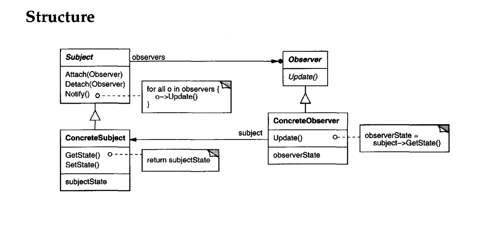

Definiert eine one-to-many Abhängigkeit zwischen Objekten, sodass wenn
ein Objekt seinen Zustand ändert alle davon abhängenden Objekte
informiert werden.

# Strategy

Behavioral Pattern


Definieren einer Gruppe von Algorithmen, welche unabhängig voneinander
sind aber auswechselbar. Mit dem Strategy Pattern kann der Algorithmus
je nach Benutzer nach einer anderen Strategie durchgeführt werden.

# Template Method

Behavioral Pattern

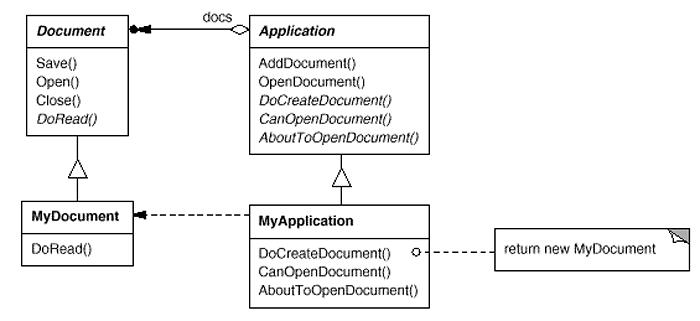

Das Skelett eines Algorithmus wird anhand von Operationen definiert.
Eine Subklasse kann einzelne Operationen überschreiben und damit den
Algorithmus beeinflussen, ohne das die Struktur des Algorithmus ändert.

# Factory Method

Creational Pattern


Es wird ein Interface zum Erstellen eines Objekts definiert, aber die
Subklasse davon entscheidet welche konkrete Implementation des Objekts
erstellt wird. Facotry Method lässt die Instantiation zur Subklasse
verschieben. Im Diagramm wäre das Beispielsweise `MyDocument` eine
andere `Application` würde beispielsweise `YourDocument` erstellen.

# Abstract Factory

Creational Pattern

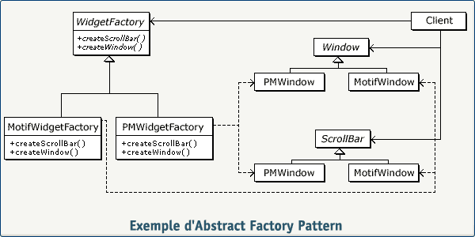

Stellt ein Interface zur Verfügung zum Erstellen einer Gruppe von
abhängenden Objekten, ohne das konkreten Klassen spezifiziert werden.

# Prototype

Creational Pattern


Spezifizieren der Art von Objekten die erstellt werden unter Verwendung
einer `prototypical instance` und erstellt neue Objekte durch das
Kopieren des Prototypes.

# Composite

Structural Pattern


Objekte die eine Baumstruktur abbilden zum Repräsentieren von part-whole
Hierarchien. Mit dem Composite Pattern können einzelne Objekte und
mehrere zusammengesetzte Objekte gleich behandelt werden.

# Decorator

Structural Pattern

 

Zusätzliche Verantwortung kann einem Objekt dynamisch hinzugefügt
werden. Eine flexible alternative anstelle zusätzliche Funktionalität
mit Subclassing zu erreichen.

# Adapter

Structural Pattern

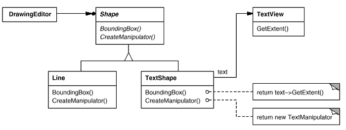

Konvertieren eines Interface einer Klasse zu einem anderen Interface.
Das Adapter Pattern ermöglicht es Klassen zusammenzuarbeiten, welche
sonst wegen der inkompatiblen Interfaces Schwierigkeiten hätten.

# Proxy

Structural Pattern


Stellt einen Stellvertreter oder Platzhalter für ein anderes Objekt zur
Verfügung und kontrolliert damit den Zugriff auf dieses Objekt.

# Facade

Structural Pattern

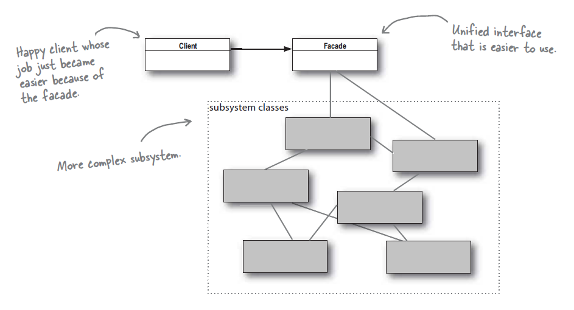

Stellt ein vereinheitlichtes Interface für mehrere Interfaces eines
Subsystems zur Verfügung. Das Facade Pattern stellt ein higher-level
Interface, welches den Zugriff auf das Subsystem vereinfacht zur
Verfügung

# Mediator

## Problem

-   Zu viele Abhängigkeiten zwischen Objekten.
-   Im schlimmsten Fall weiss jedes Objekt von jedem anderen. Wie kann
    man `strong coupling` zwischen mehreren Objekten verhinder und die
    Kommunikation vereinfachen?

## Teilnehmer

**Mediator**: Kapselt die Kommunikation zwischen den Objekten
**Colleagues**: Verwenden den Mediator, dadurch wird `loose coupling`
erreicht.

## Wann sollte das Pattern verwendet werden

-   Objekte können nicht wiederverwendet werden, weil sie von zu vielen
    anderen Objekten abhängen.
-   Mehrere Objekte verwenden eine komplexe Kommunikation.
-   Das Verhalten von mehreren Klassen sollte anpassbar sein, ohne viel
    Subclassing zu verwenden.

## Lösung


Die Verbindung zwischen `ConcreteMediator` und `ConcreteColleagueX` ist
bidirektional und könnte als Observer implementiert werden.

## Dynamik

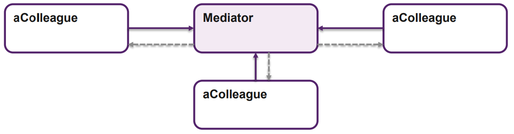

## Implementation

-   `Mediator` als `Observer`
-   `Colleague` als `Subject`

## Vorteile

-   `Colleague` Klassen werden besser wiederverwendbar, dank
    `low coupling`
-   Die Kommunikation zwischen Objekten ist zentralisiert
-   Protokolle können abgekapselt werden.

## Nachteile

-   Zusätzliche Komplexität
-   Single point of failure
-   Limitationen bezüglich subclassing (mitigated if bi-directions are
    dissolved by an Observer)
-   Kann in einem schwer Wartbaren Monolith Enden (mitigated if
    bi-directions are dissolved by an Observer)

# Memento

## Problem

-   Manchmal ist es notwendig den internen Zustand eines Objekts
    aufzuzeichnen
-   Objekte "verstecken" ihren Zustand normalerweise

Wie kann der Zustand eines Objekts extern verfügbar sein ohne die
"encapsulation" des Objekts zu verletzen?

## Teilnehmer

**Memento**: - Speichert einen Teil oder alles des internen Zustands des
`Originator` - Erlaubt es nur dem `Originator` auf die internen
Informationen zuzugreifen. **Originator**: - Kann an strategischen
Punkten `Memento` Objekte erstellen, um seinen internen Zustand
abzuspeichern. - Kann seinen eigenen Zustand wiederherstellen,
entsprechen dem das vom `Memento` diktiert wird. **Cartaker**: -
Speicher das `Memento` Objekt des `Originators` - Kann weder den Inhalt
des `Memento` Objekt untersuchen noch damit arbeiten.

## Lösung

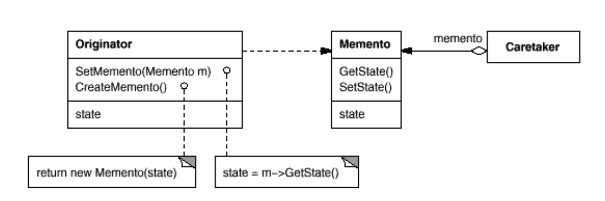 

## Implementation

-   Originator erstellt memento und verschiebt seinen internen Zustand
    -   Beispielsweise kombiniert mit einer Factory Method
-   Originator als `friend` des Mementor markieren, damit der Originator
    den Zustand aus dem Memento auslesen kann.

``` java
public class MementoTest {

    @Test
    public void testMemento_setState_succeed() {
        Originator orig = new Originator();
        Memento state = orig.createMemento();
        // not possible: state.getState()
        orig.setMemento(state);
        // asserts here
    }
}

public class Memento {
    private final String savedState;

    @Nullable
    String getState() {
        return savedState;
    }
    Memento(@Nullable String state) {
        savedState = state;
    }
}


public class Originator {
    private String internalData;

    @NotNull
    public Memento createMemento() {
        return new Memento(internalData);
    }
    
    public void setMemento(@NotNull Memento memento) {
        internalData = memento.getState();
    }
}
```

## Vorteile

-   Der interne Zustand eines Objekt kann gespeichert werden und das
    Objekt kann zu jeder Zeit zurückgesetzt werden.
-   "Encapsulation" der Attribute wird nicht verletzt.
-   Zustand der Objekte kann wiederhergestellt werden.

## Nachteile

-   Erstellt jedes Mal eine komplette Kopie des Objekts, kein "diff".
-   Kein Zugriff auf den gespeicherten Zustand, er muss zuerst
    wiederhergestellt werden.

# Command

## Problem

-   Entkoppeln der Entscheidung was ausführen von der Entscheidung wann
    es auszuführen ist.
-   Das Ausführen benötigt einen zusätzlich Parametrisierten Kontext.
    Wie können Kommandos entkoppelt werden, sodass sie parametrisierbar,
    planbar, protokollierbar und zurücksetzbar sind?

## Lösung

 

## Vorteile

-   Dasselbe Command kann von unterschiedlichen Objekten aktiviert
    werden.
-   Neue Commandos können schnell und einfach hinzugefügt werden.
-   Commandos können in einem command Verlauf abgespeichert werden.
-   Stellt inversion of controll zur Verfügung, ermutigt es Zeit und
    Raum zu entkuppeln

## Nachteile

-   Eine hohe Anzahle commandos führt zu vielen kleinen command Klassen
    wodurch das Design beschädigt wird.

## Criticism

-   Nothing new, reification of a method call, with context
-   Command pattern describes nothing about history/undo management
    **Lösung**: Command Processor von POSA1

# Command Processor

## Problem

-   Herkömmliche UI Applikationen unterstützen `do` und `undo` sowie
    mehrmaliges aufrufen von `undo`.
-   Schritte `forward` und `backward` sind in einem Verlauf vorhanden
    Wie kann man command Objekte verwenden, sodass die Ausführung
    separiert vom Aufruf ist und die Ausführung zu einem späteren
    Zeitpunkt zurückgesetzt werden kann?

## Teilnehmer

**Command Processor**: - Ein seperates Processor Objekt welches die
Verantwortung für mehrere Commands handhaben kann. - Diese Verantwortung
sollte nicht zu einem Durcheinander des Command Verlauf oder des Client
Code führen. **Command**: - Ein einheitliches Interface zum Ausführen
von Funktionen. **Controller**: - Übersetzt Anfragen in Commands und
leitet diese commands dem `Command Processor` weiter.

## Lösung

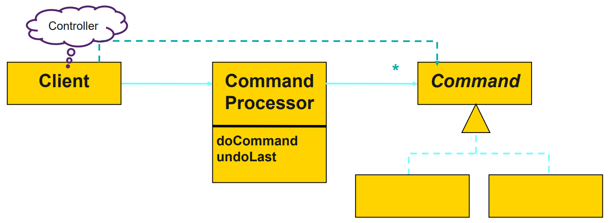


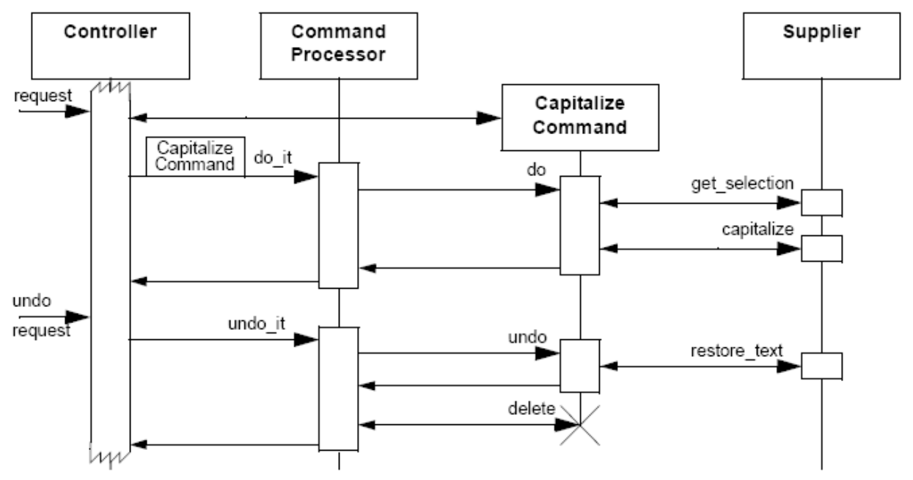

## Implementation

-   `Command Processor` beinhaltet einen `Stack<Command>`, in welchem
    sich der Command Verlauf befindet
-   `Controller` erstellt die Commands und übergibt sie dem
    `Command Processor`
    -   Zum Erstellen der Commands könnte eine `Simple Factory`
        verwendet werden.

``` java
public interface Command {
    void doCommand();
    void undoCommand();
}

public class CapitalizeCommand implements Command {
    @Override
    public void doCommand() {
        // getSelection()
        // capitalize()
    }
    @Override
    public void undoCommand() {
        // restoreText()
    }
}

public class CommandProcessor {
    private final Stack<Command> commandStack = new Stack<>();
    public void doIt(@NotNull Command c) {
        commandStack.push(c);
        c.doCommand();
    }
    public void undoIt() {
        commandStack.pop().undoCommand();
    }
}

public class CommandProcessorTest {
    @Test
    public void testCommandProcessor_undo_succeed() {
        CommandProcessor proc = new CommandProcessor();
        Command cmd = new CapitalizeCommand();
        proc.doIt(cmd);
        proc.undoIt();
        // asserts here
    }
}
```

## Fazit

-   Command Processor complements Command by handling responsibility for
    execution policy
-   Describes an additional and complementary micro-architecture for
    Command ##\# Vorteile
-   Flexibilität, `Command Processor` und `Controller` werden unabhängig
    von den `Commands` implementiert
-   Zentraler `Command Processor` erlaubt es Services, die zum Ausführen
    der `Commands` benötigt werden zu erweitern.
-   Verbesserte Testbarkeit, `Command Processor` kann zum Ausführen von
    Regression Test verwendet werden. ##\# Nachteile
-   Effizienzverlust durch die zusätzliche Indirektion.

# Visitor

## Problem

-   Operationen von Klassen sollen verändert oder hinzugefügt werden
    ohne das die Klasse modifiziert wird.
-   Unterschiedliche Algorithmen verarbeiten einen "object tree" Wie
    kann das Verhalten von individuellen Elementen einer Datenstruktur
    verändert/ersetzt werden, ohne das Element zu verändern?

## Lösung

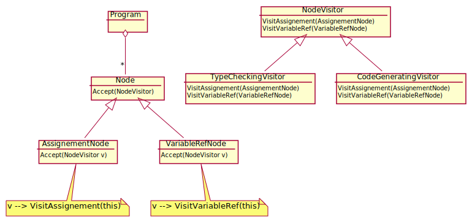

## Implementation 1

-   Properties wie in Lösung beschrieben implementiert
    -   2 Klassen hierarchien
        -   Elements (object tree to visit)
            -   Visitors
-   Visitors iterieren über Objekthierarchie

``` java
public abstract class Component {
    @NotNull
    public String getName() {
        return getClass().getSimpleName();
    }
    public abstract void accept(@NotNull Visitor visitor);
}

public class Composite extends Component {
    private final ArrayList<Component> components = new ArrayList<>();
    @NotNull
    public List<Component> getChildren(){
        return components;
    }
    @Override
    public void accept(@NotNull Visitor visitor) {
        visitor.visitCompositeStart(this);
        getChildren().forEach((c) -> c.accept(visitor));
        visitor.visitCompositeEnd(this);
    }
}
public class Leaf extends Component {
    @Override
    public void accept(@NotNull Visitor visitor) {
        visitor.visitLeafStart(this);
        visitor.visitLeafEnd(this);
    }
}

public interface Visitor {
    void visitLeafStart(@NotNull Leaf leaf);
    void visitLeafEnd(@NotNull Leaf leaf);
    
    void visitCompositeStart(@NotNull Composite comp);
    void visitCompositeEnd(@NotNull Composite comp);
}

public class XmlVisitor implements Visitor {
    private final StringBuffer buffer = new StringBuffer();
    @Override
    public void visitLeafStart(@NotNull Leaf leaf) {
        visitComponentStart(leaf);
    }
    @Override
    public void visitLeafEnd(@NotNull Leaf leaf) {
        visitComponentEnd(leaf);
    }
    @Override
    public void visitCompositeStart(@NotNull Composite comp) {
        if (comp.getChildren().size() != 0) {
            buffer.append("<");
            buffer.append(comp.getName());
            buffer.append(">\n");
        }
        else {
            visitComponentStart(comp);      
        }
    }
    @Override
    public void visitCompositeEnd(@NotNull Composite comp) {
        if (comp.getChildren().size() != 0) {
            buffer.append("</");
            buffer.append(comp.getName());
            buffer.append(">\n");
        }
        else {
            visitComponentEnd(comp);    
        }
    }
    @Override
    public String toString() {
        return buffer.toString();
    }
    private void visitComponentStart(Component comp) {
        buffer.append("<");
        buffer.append(comp.getName());
    }
    private void visitComponentEnd(Component comp) {
        buffer.append(" />\n");
    }
}


public class XmlVisitorTest {
    @Test
    public void testXmlVisitor_serialization_succeed() {
        var v = new XmlVisitor();
        var root = new Composite();
        root.getChildren().add(new Leaf());
        root.accept(v);
        assertEquals("<Composite>\n<Leaf />\n</Composite>\n", v.toString());
        // asserts here
    }
}
```

## Implementation 2

-   Visitor solves Double-Dispatch problem of single dispatched
    programming languages
-   Double-Dispatch of methods
    -   Combination of two types defines method to call:
    -   Element-type x Visitor-type

## Kritik

-   Visitor kann zu oft verwendet werden
    -   Put important stuff into node classes, see Interpreter
-   Visitor ist schlecht falls sich die Klassenhierarchie verändert
    -   Hard to change or adapt existing visitors
-   Der Zustand wird während der Besuche gespeichert
    -   Zustand wird innerhalb des Visitor Objekt geteilt
        -   Führt zu Schwierigkeiten, wenn mehrere Visitors
            zusammenarbeiten

## Vorteile

-   Das Hinzufügen von neuen Operationen ist einfach.
-   Separiert wichtige Operationen von unwichtigen.

## Nachteile

-   Das Hinzufügen von neuen Node Klassen ist schwer
-   Visitor teilt Logik auf.

# External Iterator

## Problem

-   Iterieren durch eine Collection abhängig von der
    Zielimplementierung.
-   Separieren der Logik der Iteration in ein Objekt um mehrere
    Iterations-Strategien zu erlauben. Wie kann man `strong coupling`
    zwischen Iteration und Collection vermeiden und eine Collection
    optimierte Iteration zur Verfügung stellen?

## Lösung

-   Das Wissen für die Iteration ist in ein separates Objekt ausgelagert

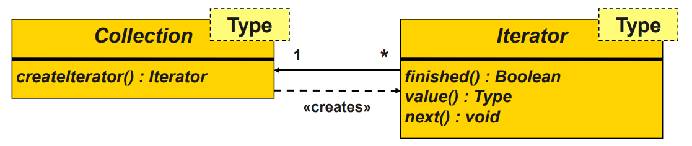

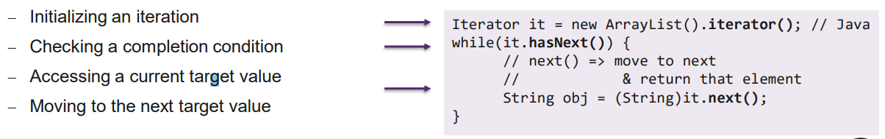

## Vorteile

-   Stellt ein einzelnes Interface zur Verfügung um durch jede Art von
    Collection zu iterieren.

## Nachteile

-   Mehrere Iteratoren können gleichzeitig durch dieselbe Collection
    iterieren
    -   Falls sich die Collection verändert ist die Robustheit schwer zu
        gewährleisten.
-   Life-cycle management of iterator objects
    -   might require a disposal method
        -   or iterator must observe its collection
-   `Close coupling` zwischen Iterator und dazugehörender Collection.
-   Indexing ist möglicherweise intuitiver für Entwickler.

# Internal Iterator

## Problem

-   Der Verwender der Collection hat die Verantwortung über den
    Iterator.
-   Verhindern von Zustandsmanagement zwischen Collection und Iteration.

Wie kann über eine Collection iteriert werden unter Berücksichtigung des
Collectionzustand und wie kann das Zustandsmanagement weiter reduziert
werden?

## Lösung 1

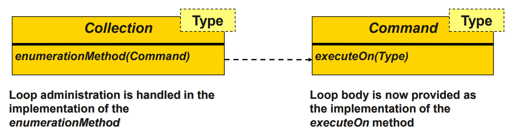

## Lösung 2

-   Programming languages already implement Enumeration Method as their
    loop construct
-   Rendered idiomatically in different languages, e.g.
    -   Collection.forEach() / Stream.forEach() method in Java
    -   List`<T>`{=html}.ForEach(Action`<T>`{=html}) in C#
        -   Array.prototype.forEach() in EcmaScript

## Vorteile

-   Client ist nicht verantwortlich für "loop houskeeping"
-   Synchronisation kann auf dem Level der Traversierung bereitgestellt
    werden und nicht nur für jeden Elementzugriff.

## Nachteile

-   Funktionaler Ansatz, benötigt komplexere Syntax
-   Wird oft als zu abstract für Entwickler betrachtet
-   Nutzt Command Objekte (Leverages Command objects)

## Kritik

-   GoF tries to accommodate both C-like and functional-style iteration
    in one pattern
    -   The external and internal variants of Iterator
    -   However, most developers equate Iterator withthe external
        variant and do not consider the internal one
-   Solution structure and the consequences are totally different
    -   Two quite distinct patterns Iterator and Enumeration Method not
        one pattern with two variations

# Batch Method

## Problem

-   Collection und Client(iterator user) sind nicht auf derselben
    Maschine.
-   Operationen aufrufen ist nicht mehr trivial.

Wie kann über eine collection iteriert werden, die auf mehreren Tiers
verteilt ist, ohne das viel mehr Zeit für Kommunikation als für die
Berechnung verwendet wird?


## Lösung

-   Eine Datenstruktur definieren, welche Interface Aufrufe gruppiert.
    -   Eine angemessenere Granularität durch welche Kommunikations- und
        Synchronisations-Kosten gesenkt werden.
-   Ein Interface zur Verfügung stellen, welches es erlaubt auf eine
    Gruppe von Elementen zuzugreifen.

# State

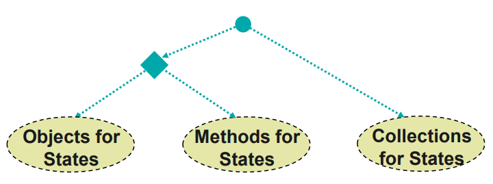

## Objects for State (The State Pattern)

### Problem 1

-   Das Verhalten eines Objekts hängt von seinem Zustand ab, das
    Verhalten muss während Runtime verändert werden.
-   Operationen haben grosse mehrteilige "conditional statements
    (flags)", welche abhängig sind vom Objektzustand.

Wie kann ein objekt sich gemäss seines Zustands verhalten ohne
mehrteilige "conditional statements" zu verwenden?

### Problem 2

-   What is the real Intent?
    -   Intent by GoF can be considered vague and a little misleading
        -   Describes a dynamic inheritance to motivate the pattern
-   Many programmers misunderstood the intent or the pattern as a whole

### Lösung 1

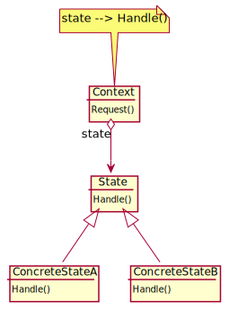

### Lösung 2

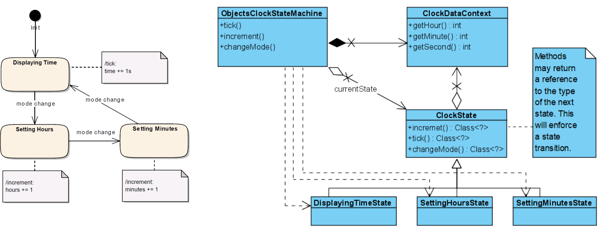

### Kritik

-   Das Pattern ist komplex, aber deckt die Komplexität nicht angemessen
    ab.
-   Oft ist das Pattern Overkill.
    -   Flags oder Tables sind manchmal simpler.

### Implementation

Results in a lot of classes and structures (at least one class per state
plus state machine and optionally a data context class).

## Methods for State

### Lösung 1

 -
Jeder Zustand ist als Tabelle oder Sammlung von Methoden Referenzen
repräsentiert. - Die referenzierten Methoden liegen auf der "State
Machine" (context) Objekt.

### Lösung 2


### Vorteile

-   Erlaubt es einer Klasse alle verschiedenen Verhalten in normalen
    eigenen Methoden abzubilden.
-   Das Verhalten ist mit der State Machine verbunden und nicht mit
    verteilt über mehrere kleine Klassen.
-   Jedem Verhalten werden eindeutige die entsprechenden Methoden
    zugeordnet.
-   Kein Objektkontext muss herumgegeben werden, Methoden können einfach
    den internen Zustand der State Machine abfragen.

### Nachteile

-   Benötigt zusätzliche 2 Indirektionslevels, um einen Methodenaufruf
    auszuführen.
-   Die State Machine kann grösser werden als erwartet und wird dadurch
    schwerer zu handhaben.

### Implementation

Propagates a single class with a lot of methods.

## Collections for State

### Lösung 1

 Separieren der
Objekte in Collections entsprechend dem Objekzustand.

### Lösung 2


### Vorteile

-   Es muss nicht für jeden Zustand eine Klasse erstellt werden.
-   Optimiert für mehrere Objekte (state machines) in einem bestimmten
    Zustand
-   Die Collection eines Objekts bestimmt implizit seinen Zustand
    -   Der Zustand muss nicht intern repräsentiert werden.
-   Kann mit anderen State Machine Ansätzen (Object / Methods)
    kombiniert werden

### Nachteile

-   Kann zu komplexeren State Managern führen.

### Implementation

allows to manage multiple state machines with the same logic splits
logic and transaction management into two classes

``` java
public class CollectionClockStateMachine implements ClockStateMachine {
    // contains all states
    private final List<Workpiece> workpieces = new ArrayList<>();

    private final List<Workpiece> displayingTime = new ArrayList<>();
    private final List<Workpiece> settingHours = new ArrayList<>();
    private final List<Workpiece> settingMinutes = new ArrayList<>();
    
    // the following fields/properties are only for demonstration purposes; not part of the pattern
    private final Workpiece defaultPiece;

    @Override
    public int getHour() { return defaultPiece.getHour(); }
    @Override
    public int getMinute() { return defaultPiece.getMinute(); }
    @Override
    public int getSecond() { return defaultPiece.getSecond(); }
    
    /** State machine construction logic goes here... */
    public CollectionClockStateMachine(int hour, int minute, int second) {
        // #defaultPiece isn't part of the pattern
        defaultPiece = new Workpiece(hour, minute, second);
        
        workpieces.add(defaultPiece); // in real world, there are *many* such objects with a state
        displayingTime.addAll(workpieces);
    }
    @Override
    public void tick() {
        displayingTime.forEach(Workpiece::tick);
    }
    @Override
    public void increment() {
        settingHours.forEach(Workpiece::incrementHour);
        settingMinutes.forEach(Workpiece::incrementMinute);
    }
    @Override
    public void changeMode() {
        // simply rotate the objects within the collections
        ArrayList<Workpiece> displayingTimePieces = new ArrayList<>(displayingTime);
        displayingTime.clear();
        
        displayingTime.addAll(settingMinutes);
        settingMinutes.clear();
        
        settingMinutes.addAll(settingHours);
        settingHours.clear();
        
        settingHours.addAll(displayingTimePieces);
    }
}

public class Workpiece {
    
    private int hour;
    private int minute;
    private int second;
    
    public int getHour() { return hour; }
    public void setHour(int hour) { this.hour= hour; }
    
    public int getMinute() { return minute; }
    public void setMinute(int minute) { this.minute = minute; }
    
    public int getSecond() { return second; }
    public void setSecond(int second) { this.second = second; }
    /**
     * State machine construction logic goes here...
     */
    public Workpiece(int hour, int minute, int second) {
        this.hour = hour;
        this.minute = minute;
        this.second = second;
    }
    /** Forward 'increment' event to current state. */
    public void incrementMinute() {
        minute = (minute + 1) % 24;
    }
    /** Forward 'increment' event to current state. */
    public void incrementHour() {
        hour = (hour + 1) % 24;
    }
    /** Forward 'tick' event to current state. */
    public void tick() {
        if (++second == 60) {
            second = 0;
            if (++minute == 60) {
                minute = 0;
                hour = (hour + 1) % 24;
            }
        }
    }
}

public class CollectionClockStateMachineTest extends ClockStateMachineTest {
    @Override
    protected ClockStateMachine createStateMachine(int hour, int minute, int second) {
        return new CollectionClockStateMachine(hour, minute, second);
    }
}
public abstract class ClockStateMachineTest {
    @Test
    public void testStateMachine_forward_succeed() {
        var stateMachine = createStateMachine(0, 0, 0);
        assertEquals(0, stateMachine.getHour());
        assertEquals(0, stateMachine.getMinute());
        assertEquals(0, stateMachine.getSecond());
        stateMachine.increment(); // do nothing
        assertEquals(0, stateMachine.getHour());
        assertEquals(0, stateMachine.getMinute());
        assertEquals(0, stateMachine.getSecond());
        
        stateMachine.changeMode(); // change to settingHours
        stateMachine.increment(); // increment hours
        assertEquals(1, stateMachine.getHour());
        assertEquals(0, stateMachine.getMinute());
        assertEquals(0, stateMachine.getSecond());
        
        stateMachine.changeMode(); // change to settingMinutes
        stateMachine.increment(); // increment minutes
        assertEquals(1, stateMachine.getHour());
        assertEquals(1, stateMachine.getMinute());
        assertEquals(0, stateMachine.getSecond());
        
        stateMachine.changeMode(); // change to displayingTime
        stateMachine.increment(); // do nothing
        assertEquals(1, stateMachine.getHour());
        assertEquals(1, stateMachine.getMinute());
        assertEquals(0, stateMachine.getSecond());
    }
    protected abstract ClockStateMachine createStateMachine(int hour, int minute, int second);
}
```

## Fazit

-   Many successful recurring solutions for expressing modal (state)
    behavior
    -   Many are complementary and can be used together
-   State patterns focus mainly on the representation of modal state
    less on the mechanics of transition

## Resources

https://hillside.net/europlop/HillsideEurope/Papers/CollectionsForStates.pdf
https://gitlab.ost.ch/pf/examples/-/tree/master/03_beyond-gof/java/src/ch/ost/apf/state

# Value Patterns

## Definition

Was ist der Unterschied zwischen einem Objekt und einem Value? - Values
sind immer kopiert, haben keine Identität - Objekt können referenziert
werden, die Referenz ist die Identität.

## System Analyse

### Values and Individuals

> An individual is something that can be named and reliably
> distinguished from other individuals.

Es gibt 3 Arten von Individuals: - Events - An event is an individual
happening, taking place at some particular point in time. - Entities -
An entity is an individual that persists over time and can change its
properties and states from one point in time to another. Some entities
may initiate events, some may cause spontaneous changes to their own
states, some may be passive. - Values - A value is an intangible
individual that exists outside time and space, and is not subject to
change.

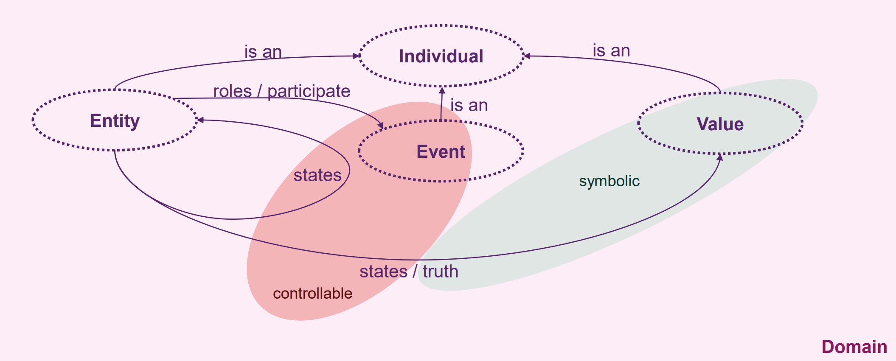

#### Beispiele

Event: User action Entity: Person Value: Körpergrösse

## Software Design

**Entity**: Entitäten sind Systeminformationen, typischerweise
persistenter Natur. Entitäten haben eine Identität, damit sie
unterscheidbar sind.

**Service**: Service-based Objekte repräsentieren System Aktivitäten.
Services werden anhand ihres Verhalten und nicht anhand ihres Zustands
unterschieden.

**Values**: Das dominierende Merkmal von value-based Objekte ist der
interpretierbare Inhalt, gefolgt vom Verhalten gemäss Zustand. Anders
als Entitäten sind Values kurzlebig und benötigen keine Identität.

**Tasks**: Wie service-based Objekte repräsentieren Task System
Aktivitäten. Aber Tasks haben immer eine Identität und einen Zustand wie
beispielsweise Command objects oder Threads.

### Beispiele

Entity: User Service: UserService Value: Alter

### Object Aspects


# Values

## Characteristiken

-   Werden mit einem Typ repräsentiert
    -   Ein Typ repräsentiert ein Bereich von verfügbaren Werten
        -   int: $-2^{31}$ .. $2^{31}-1$
    -   Der Typ kann auch eine Dimension repräsentieren
        -   Distanz in M oder Masse in kg
-   Funktionen zuordnen/konvertieren Werte
    -   Integer.parseInt("200")
-   OO languages imitieren Values oft mit **object classes**. ## Value
    Objects
-   Kommen normalerweise nicht in UML Klassendiagrammen vor.
    -   ausser als Attribute Typ.
-   Werden zum Modelieren von "fine-grained" Informationen verwendet.
    -   enforce basic rules
-   Beinhalten repetitiven code.
    -   z.B. date arithmetic
    -   used to add meaning to primitive value types
        -   e.g. three ints meaning year, month, day
-   Stellen type safety sicher.

### Beispiele

-   ISBN
    -   Länge von 10
    -   wird von Dezimalzahlen repräsentiert
        -   ausser dem letzten Zeichen, welches auch X sein kann
    -   Das letzte Zeichen ist ein "check digit", berechnet aus den
        anderen Zeichen.

### Value Objects in OO Languages

-   Values haben keine Identität
    -   Aber references (pointers) sind eine Art von Identität (OO
        Design widerspricht Idee, ist problematisch)
-   Die dominante Charakteristik einers Value ist der Inhalt
    -   Immer einen Wertigkeitsvergleich machen und keine
        Identitätsvergleiche (`"Hello".equals("Hello")`)
-   Ein Value hat ein Zustandspezifisches Verhalten
    -   Beispielsweise eine Ordnung (Datum, alphabetisch)
    -   beispielsweise construction constraints (ISBN)

Die Identität des Value Objekts ist nicht wichtig, auch wenn sich die
Referenz ändert durch beispielsweise kopieren, bleibt das Value
dasselbe. Value Klassen haben normalerweise keine parent class oder
childern. Eine Value Klasse kann einfach abgespeichert werden, das Value
ist wichtig nicht die Identität.

### Language Specifics

-   Support for automatic copying (pass by value)
    -   C#: use struct types for automatic copying
    -   Java: no automatic value copying, class must provide
        immutability and/or cloning
-   Value classes must be protected from slicing (cutting off a
    subclass´ state)
    -   C#: use struct types
    -   Java: use record types or declare value class final
-   Persistence/serialization of value classes
    -   C#: structs are based on primitive types
    -   Java: Persistence layer must convert value object from/to a
        corresponding native/primitive representative

### Fazit

-   Idea of «referentially-transparent objects» in Java not directly
    supported (unlike C# / C++ does)
    -   Exceptions are the "basic" value types: boolean, char, int,
        long, double

## Patterns of Value

### Whole Value

#### Problem

-   Integer und floating-point Zahlen sind nicht sehr nützlich als
    domain values.
-   Fehler in der Dimension und "Intent communication" sollten während
    dem kompilieren gelöst werden.

Wie kann man primitive Daten einer Problemdomäne ohne Bedeutungsverlust
repräsentieren?

#### Lösung

-   Eine `Whole Value` Klasse stellt sicher das kein Bedeutungsverlust
    eintrifft, durch das Zurverfügungstellen von Dimensionen und
    Bereichen.
-   Ein Wrapper für simple Typen oder eine Gruppe von Attributen.
-   Verbieten von Vererbung zum Verhindern von "slicing".

#### Beispiel

``` java
public class Date {
  public Date(int year, int month, int day) {
  }
  …
}
Date first = new Date(year, month, day); // correct
Date second = new Date(day, month, year); // bad
Date third = new Date(month, day, year);  // bad
```

Die Klasse `Date` kann nicht eindeutig verwendet werden, das führt zu
falsch instantiierten Objekten wie `second` und `third`. Damit das
vermieden wird, kann eine Klasse `Year` erstellt werden:

``` java
public final class Year {
  public Year(int year) { value = year; }
  public int getValue() { return value; }
  private final int value;
}
```

und der Date Konstruktor entsprechend angepasst werden:

``` java
public final class Date {
  public Date(Year year, Month month, Day day) { … }
  …
}
Date first = new Date(new Year(year), new Month(month), new Day(day));
```

### Value Object

#### Problem

-   Vergleiche, indexing und Sortieren darf nicht auf der
    Objektidentität basieren, sondern auf dem Objektinhalt.

Wie definiert man eine Klasse die Values repräsentiert?

#### Lösung

-   Überschreiben der Objektmethoden welche die Gleichheit definieren
    -   Java:
        -   boolean equals(Object other) { }
        -   int hashCode() { }
        -   implement Serializable / toString() if appropriate
    -   TypeScript:
        -   equals(other: Object): boolean { }
        -   implement toString() if appropriate
-   Das Überschreiben von toString() hilft das Value-Objekt zu
    Verwenden.

#### Beispiel

``` java
public final class Date implements Serializable {
  // …
  private static final long serialVersionUID = -3248069808529497555L;
  // …
  @Override
  public boolean equals(Object o) {
    if (this == o) return true;
    if (o == null || getClass() != o.getClass()) return false;
    Date date = (Date) o;
    return year.equals(date.year) && month.equals(date.month) && day.equals(date.day);
  }
  @Override
  public int hashCode() {
    return Objects.hash(year, month, day);
  }
}
```

### Conversion Method

#### Problem

-   Values are strongly informational objects without a role for
    separate identity
-   Meistens sind Value Objects irgendwie zusammenhängend, können aber
    nicht direkt miteinander verwendet werden, ohne sie zu konvertieren.

Wie kann man verschiedene miteinander zusammenhängende Value Objects
zusammen verwenden, ohne vom unterliegenden primitiven Typen abhängig zu
sein?

#### Lösung

-   Provide a constructor which converts between types
    -   No additional method call needed
    -   Most intuitive when applied to convert from more generic to
        current type
        -   ...but can be implemented by your own Value Classes only
-   A conversion instance method converts from a user-defined type to
    another type
    -   Can be accomplished with a "toOtherType()" instance method
-   Create a Class Factory Method with conversion characteristics
    -   Inverse relationship with "toOtherType()" methods
    -   More about Class Factory Method later...

#### Implementation

``` java
/** Immutable Value Object with range check. */
public final class Day {
  private static final int SECONDS_PER_DAY = 86400;
  private final int value;
  public Day(int value) {
    if (value < 1) { // range check
      throw new IllegalArgumentException();
    }
    this.value = value;
  }
  /** Conversion constructor to be used when values should be converted.
   * @param second Seconds to convert into days. */
  public Day(@NotNull Second second) {
    this.value = second.getValue() / SECONDS_PER_DAY;
  }
  /** Conversion instance method, convert seconds into Day format. */
  @NotNull
  public Second toSecond() {
    return Second.of(value * SECONDS_PER_DAY);
  }
  public int getValue() {
    return value;
  }
  // add Serializable / equals() / hashCode() / toString()
}
```

### Immutable Value

#### Problem

-   Ein Value existiert ausserhalb von Zeit und Raum und darf nicht
    verändert werden.
    -   Verhindern von Problemen, wenn Value Objects geteilt werden.
    -   Wenn mehrere Threads dasselbe Value verwenden, muss Thread
        safety gewährleistet sein.
    -   Values werden oft als Key für associative Tabellen verwendet

Wie kann man Value Objects teilen und garantieren, dass keine Side
Effects auftreten?

#### Lösung

-   Setzten des internen Zustands während der Konstruktion des Objekts
    und alle Felder auf `private final` setzten.
    -   Klasse mit final markieren
    -   keine Synchronisation benötigt, weil keine `race conditions`
        auftreten können.
-   Complementary techniques
    -   Mutable Companion, provide a complete and intuitive set of
        constructors
    -   Class Factory Methods

#### Beispiel

``` java
public final class Date {
  private final Year year;
  private final Month month;
  private final Day day;
  public Date(Year year, Month month, Day day) {
    // range checks …
    this.year = year;
    this.month = month;
    this.day = day;
  }
  // …
}
```

#### Lösung

-   Record classe verwenden

``` java
record Day(@GreaterThanZero int dayOfMonth) {
  // generates:
  // private final int dayOfMonth;
  // public Day(int dayOfMonth) {
    // this.dayOfMonth = dayOfMonth;
  // }
  // int dayOfMonth() { return dayOfMonth; }
  // equals() / hashCode() / toString()
}
```

-   Enforces private final (readonly) fields
-   Implicitly generates
    -   equals()
    -   hashCode()
    -   toString() Value Objects methods according to the declared
        members.
-   Constructor annotations (e.g. @GreaterThanZero) are also propagated
    to members (if appropriate)

``` java
/**
 * Immutable Date Value Object AS RECORD
 *  > with generated equals() / hashCode() / toString()
 *  > serialVersionUID not needed for record classes, see https://docs.oracle.com/en/java/javase/15/serializable-records/index.html
 *  > @org.jetbrains.annotations.NotNull injects non-null checks (assertions)
 */
public record Date(@NotNull Year year, @NotNull Month month, @NotNull Day day) implements Serializable {
}

/**
 * Immutable Year Value Object AS RECORD
 *  > with generated equals() / hashCode() / toString()
 *  > serialVersionUID not needed for record classes, see link in Date
 */
public record Year(int value) implements Serializable {
  public Year {
    if (value < 1970) { // range check
      throw new IllegalArgumentException();
    }
  }
}

/**
 * Immutable Month Value Object AS RECORD
 *  > with generated equals() / hashCode() / toString()
 *  > serialVersionUID not needed for record classes, see link in Date
 */
public record Month(int value) implements Serializable {
  public Month {
    if (value < 1 || value > 12) { // range check
      throw new IllegalArgumentException();
    }
  }
}

/**
 * Immutable Day Value Object AS RECORD
 *  > with generated equals() / hashCode() / toString()
 *  > serialVersionUID not needed for record classes, see link in Date
 */
public record Day (int value) implements Serializable {
  public Day {
    if (value < 1 || value > 31) { // range check
      throw new IllegalArgumentException();
    }
  }
}
```

### Enumeration Values

#### Problem

-   Ein fixer Bereich von Werten solle typisiert werden, beispielsweise
    Monate.
    -   int Konstanten zu verwenden, hilft nicht.
    -   `Whole Value` ist nur die hälfte der Lösung, der Bereich muss
        ebenfalls konstant sein.

Wie kann man eine fixe gruppe von konstanten Werten "type safe"
repräsentieren?

#### Solution

-   Implement a Whole Value and declare the Enumeration Values as public
    read-only fields
    -   To type the constant values, they represent instances of the
        containing Whole Value
-   Prevent inadvertently changing the constants
    -   Enumeration Values must be immutable and constructed by the
        Whole Value only
-   Today, the Enumeration Values pattern is built-in
    -   Java: Use the enum keyword, declare values as private final
        -   Enum classes are automatically serializable and final,
            constructors are defined implicitly private
    -   TypeScript: Built-in, use the enum keyword

#### Beispiel

``` java
public enum Month {
  JANUARY(1),
  // …
  DECEMBER(12);
  private final int value;
  private Month(int value) {
    if (value < 1 || value > 12) { // avoid careless mistakes, check value range
      throw new IllegalArgumentException();
    }
    this.value = value;
  }
  public int getValue() {
    return value;
  }
}
```

### Copied Value and Cloning

#### Problem

-   Values müssen veränderbar sein, ohne den internen Zustand zu ändern.

Wie kann ein modifizierbares Value Object an Methoden übergeben werden
ohne das Aufrufer den zustand des originalen Object verändern? (How can
you pass a modifiable Value Object into and out of methods without
permitting callers or called methods to affect the original object?)

#### Lösung

-   Cloning is the base idea of this pattern
    -   Cloning means, create a copy of the current instance and all
        containing fields
    -   In Java by convention, the marker interface Cloneable and
        Object.clone() method must be overridden
    -   If cloning needs a non-standard (deep) behavior, fields must be
        non-final and re-assigned during clone
-   Clone every Value Object leaked across boundaries:
    -   when passed as parameter
    -   when returned from a method call
-   May result in immense object creation overhead
    -   Cloning is an expensive operation
-   Imitates call-by-value / return-by-value behavior of value types

#### Beispiel

``` java
Order firstOrder, secondOrder;
...
Date date = new Date(year, month, day);
firstOrder.setDeliveryDate(date);
date.nextYear();
secondOrder.setDeliveryDate(date);
```

``` java
class Order {
  // …
  private Date deliveryDate;
  public void setDeliveryDate(Date newDeliveryDate) {
    deliveryDate = newDeliveryDate.clone();
  }
  public Date getDeliveryDate() {
    return deliveryDate.clone();
  }
}
public final class Date implements Cloneable {
  private Year year;
  // …
  public void nextYear() {
    year = new Year(year.getValue() + 1);
  }
  @Override
  public Date clone() { /* … */ }
}
```

### Copy Constructor

#### Problem

-   In einem Value Object weiss man oft genau was kopiert werden soll

Wie können Objekte kopiert werden ohne das eine `clone` Methode
implmentiert werden muss?

#### Solution

-   Declare the class as final and derive from Object only
    -   Prevents violation of Class Invariant (copy constructor
        behavior)
-   Create a copy constructor, which consumes an instance with same type
    -   This constructor is responsible of copying all the required
        information
    -   Results in less code and possibility to implement cloning
        optimizations

#### Beispiele

``` java
Order firstOrder, secondOrder;
...
Date date = new Date(year, month, day);
firstOrder.setDeliveryDate(date);
date.nextYear();
secondOrder.setDeliveryDate(date);
```

``` java
public final class Date {
  // …
  public void nextYear() {
    year = new Year(year.getValue() + 1);
  }
  public Date(Date other) {
    // …
    this.year = new Year(other.year);
  }
}
class Order {
  // …
  private Date deliveryDate;
  public void setDeliveryDate(Date newDeliveryDate) {
    deliveryDate = new Date(newDeliveryDate);
  }
  public Date getDeliveryDate() {
    return new Date(deliveryDate);
  }
}
```

### Class Factory Method

#### Problem

-   Die Konstruktion von Value Objects kann teuer sein
    -   Aber solche Objekte beherbergen oft denselben Zustand.
-   Unterschiedliche Constructor Logik wird benötigt, was in einer hohen
    Anzahl Constructors endet.

Wie kann das Konstruieren von Value Objects vereinfacht und optimitert
werden ohne ds zusätzliche Constructors benötigt werden?

#### Lösung

-   Declare static one or more creation method on the class
    -   Define constructors private; the are invoked by the Class
        Factory Method
-   The static methods could also contain caching mechanisms

#### Beispiel

``` java
Order firstOrder;
...
Date date = new Date(Year.of(2020));
firstOrder.setDeliveryDate(date);

public final class Year {
  // …
  public static Year of(int value) {
    // … query cache for given year, otherwise:
    return new Year(value);
  }
  private Year(int value) {
    // …
    this.value = value;
  }
}
```

### Mutable Companion

#### Problem

-   Es muss mit Values gerechnet werden, beispielsweise Welches Datum
    ist 15 Tage nach der Prüfung?
-   Class Factory Methods helfen, aber sind nur einmalig verwendbar.

Wie kann man das komplexe Erstllen eines immutable Value vereinfachen?

#### Lösung

-   Ein `Mutable Compoanion` ist ein `factory object` für immutable
    values.
    -   Addressiert Effizienz und API usability issues.
-   Modifiers allow for cumulative or complex state changes and a query
    method to access resulting immutable value
-   Companion is neither a subtype nor a supertype of the Immutable
    Value, so it doesn't belong to the same family
-   In combination with companion, the factory is called Plain Factory
    Method

#### Beispiel

-   java.lang.StringBuilder

``` java
var yearBuilder = new YearCompanion(
Year.of(2020));
yearBuilder.next();
var nextYear = yearBuilder.asValue();

public final class YearCompanion {
  private int value;
  // …
  public YearCompanion(Year toModify) {
    this.value = toModify.getValue();
  }
  public void next() {
    value++;
  }
  public Year asValue() { // factory method
    return Year.of(value);
  }
}
```

In Kombination mit `companion`, wird die factory methode
`Plain Factory Method` genannt. Eine `Plain Factory Method` ist eine
`instance method`, welche zum Erstellen neuer Objekte einer anderen Typ
verwendet wird. Anders als bei beim GOF `Factory Method` Pattern wird
keine Vererbung benötigt.

``` java
public final class YearCompanion {
  private int value;
  // …
  public void next() {
    value++;
  }
  public Year asValue() {
    return new Year(value);
  }
}
// Immutable Value Object as record
public record Year(int value) {}
```

### Relative Values

#### Problem

-   Value objects werden anhand ihres Zustand vergleichen und nicht
    anhand ihrer Identität.
-   Relative comparison between Value Objects for appropriate values
    should be provided

Wie kann ein Value Object mit einem anderen in einem "typed way"
verglichen werden?

#### Lösung

-   Override-Overload Method Pair Comparable\<?> and equals(? other)
    should be overridden as pair
-   Type `<T>`{=html} Specific Overload
    -   Implement Comparable`<T>`{=html}.compareTo(T other) and equals(T
        other) for the current type `<T>`{=html}
    -   If you need to compare another Value Object type:
        -   Create a Comparator class and implement
            Comparator`<TOther>`{=html} interface
-   Bridge Method
    -   Provide a Bridge Method for equals(Object other) and forward it
        to equals(T other)
    -   (Bridge Method for compareTo() not needed anymore due typed
        Comparable`<T>`{=html} interface)

#### Beispiel

``` java
public final class Year implements Comparable<Year> /*, … */ {
  // …
  @Override
  public boolean equals(Object o) { // Bridge Method, override generic equals()
    if (o == null || getClass() != o.getClass()) return false;
      return equals((Year)o); // forward to typed method
    }
  public boolean equals(Year o) { // Override-Overload Method Pair
    if (this == o) return true;
    if (o == null) return false;
    return value == o.value;
  }
  @Override
  public int compareTo(Year o) { // Override-Overload Method Pair, Type Specific Overload
    if (o.value == value) return 0;
    return (value < o.value) ? -1 : 1;
  }
}
```

### Fragen

Q: Was ist der unterschied zwischen dem `Whole Value` und dem
`Immutable Value` Pattern?

A: Whole Value macht ein Value Objekt das ein primitives Value kapselt
und sagt nicht aus ob es mutable oder immutable ist, Immutable Value
hingegen bestimmt explizit das es immutable sein muss, also ein Whole
Value das immutable ist

Q: Wann sollte man `Class Factory Method` dem `conversion constructor`
bevorzugen?

A: Use a Class Factory Method if a foreign value type should be
converted into the current value format. Use a conversion constructor if
a more generic type should be converted into the current object,
e.g. String(char\[\] value) , TimeStamp(Second value), ...

Q: Was sind die wichtigsten Verantwortungen des `mutable value` concept?

A: Concept of Cloning / Copied Value may be missed by the programmer
which results in to hard to find errors.

### Zusammenhang mit GOF Patterns

**Copied Value**: Prototype, (Factory Method)

**Mutable Companion**: Builder

**Class Factory Method**: Flyweight

# CHECKS Patterns

Das Ziel ist es Validen und nicht validen Input zu unterscheiden. Jede
input-based Applikation benötigt solche integrity checks. Die Checks
sollten durchgeführt werden, ohne die Komplexität des Programms zu
erhöhen.


## Meaningful Quantities

### Exceptional Behaviour

#### Problem

-   Es ist unmöglich invalide oder fehlende Werte in einem Domänen Model
    zu vermeiden.
-   Die Domänen Logik sollte in der Lage sein, diese Art von fehlende
    Daten zu behandeln.

Wie kann man Ausnahmefälle ausgelöst durch einen invaliden Input
handhaben, ohne einen Fehler zu werfen?\
#### Lösung - Invalide Werte führen dazu das `Exceptional Values`
erstellt werden. - Ein `Enumeration Value` als `Exceptional Value` kann
Aussagen was falsch ist. - Domänen Logik akzeptiert das
`Excpetional Value` als legalen Input zumindest temporär. - For main
success scenario, it should not be required to test for exceptional
values - Only expected value type is used for computation, Exceptional
Values are ignored - Produces meaningful behavior

#### Beispiel

``` typescript
export enum CalculationError {
  DivByZero = "div/0",
  NumeratorIsNaN = "NaN(numerator)",
  DivisorIsNaN = "NaN(divisor)"
}
export class Calculator {
  public static divide(numerator: number, divisor: number): number | CalculationError {
    if (divisor === 0) { return CalculationError.DivByZero; }
    if (isNaN(numerator)) { return CalculationError.NumeratorIsNaN; }
    if (isNaN(divisor)) { return CalculationError.DivisorIsNaN; }
    return numerator / divisor;
  }
}
```

### Meaningless Behavior

#### Problem

Wegen des Error Handling wird die Domänen Logik komplexer als
ursprünglich geplant.

Wie kann man Ausnahmefälle ausgelöst durch einen invaliden Input
handhaben, ohne einen Fehler zu werfen?

#### Lösung

-   Initiate computation
    -   If it fails
        1.  recover from failure and continue processing
        2.  ensure the error is logged/visualized on surface
-   Choose meaningless behavior unless a condition has domain meaning
-   As opposed to "operational" meaning (e.g. not-yet-filled-out)
-   Represents an alternative implementation of Exceptional Value
    -   But provides potentially the lower error information granularity
        -   Is it an API usage fault?
        -   Is it a user input fault?
        -   Is it an internal system fault?

#### Beispiel

``` java
public class Calculator {
  public static double divide(double numerator, double divisor) {
    return numerator / divisor; // may result in Double.NaN if divisor is 0.0
    // CAUTION: x / 0 (integer) will throw an ArithmeticException
  }
  public static int divide(int numerator, int divisor) throws ArithmeticException {
    return numerator / divisor; // CAUTION: x / 0 (integer) will throw an ArithmeticException
  }
}

public class CalculatorUi {
  public void onDivideClick(double leftInput, double rightInput) {
    try {
      double result = Calculator.divide(leftInput, rightInput);

      if (!Double.isNaN(result)) {
        // action when calculation completed and a result is available
      } else {
        // action when calculation failed, visualize error on UI
      }
    } catch (ArithmeticException e) {
      // calculation failed, visualize error on UI
    }
  }
}
```

# Frameworks

## Wieso Frameworks

-   Verhindern von Rad-neu-erfinden.
-   Es ist einfach aber ineffizient dasselbe immer wieder zu
    programmieren.

## Was ist ein Framework

Objektorientierte Klassen die zusammenarbeiten, viele Design Patterns
sind micro-frameworks. Frameworks stellen `hooks` und `extension` zur
Verfügung, Clients erben oder implementieren beispielsweise Klassen und
Interfaces eines Frameworks.

Im Gegenteil zu einer `Library` kontrolliert ein Framework den Flow und
nicht der Client. Das nennt man auch `Hollywood-Principle` "Don't call
us, we call you!".

## Was ist ein Application Framework

-   Objektorientiert Klassenbibliothek.
-   `Main()` befindet sich im `Application Framework`.
    -   Architektur wird vom Framework vorgegeben.
-   Stellt `hooks` und `callback` zur Verfügung.
-   Stellt ready-made Klassen zur Verfügung.
    -   Hauptsächlich bei Konfiguration und Kombination.
-   Wiederverwenden von Architektur und Infrastruktur für eine Art von
    Applikationen.
-   Qualitätsansprüche an Application Frameworks sind sehr hoch.
-   Die Entwicklung von Application Frameworks entsteht über Zeit, wenn
    man alles versucht zu planen führt das oft zu YAGNI (you ain't gonna
    need it).
-   Tipp: Wenn man ein Framework entwickelt sollte man mindestens 2 -3
    konkrete Applikationen, die das Framework verwenden parallel
    entwickeln.

### Beispiele

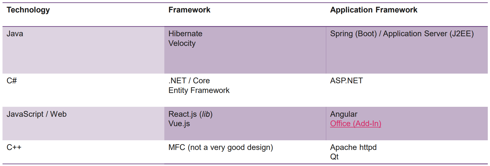

## Micro Frameworks

Viele Design Patterns sind Micro Frameworks

### Template Method


### Strategy

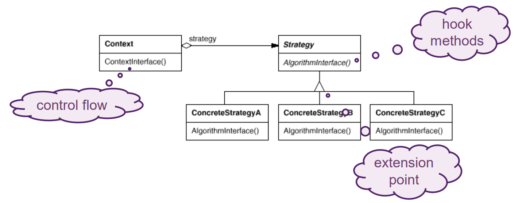

### Command Processor


### Fragen

**Q**: Explain the differences between Library / Framework / Application
Framework

**A**: - Libraries contain 3rd party features which do not control the
application flow. Example: Math Library - Frameworks provide hooks and
extension points. They strongly rely on IoC principle: The framework
defines when hooks (=activities) are called thus controls part of the
application flow. Example: JRE, .NET Fx, Vue, React - Application
Frameworks contain the main()-Procedure. Clients implement plugins or
components defined as extension points by the framework. The Application
Framework completely controls the application flow. Example: Spring
Boot, ASP.NET, Angular Often used by Application Families (JetBrains
IntelliJ, Microsoft Office, Eclipse RCP).

# Meta Patterns

-   Reflection wird hauptsächlich verwendet für `Meta Programming`.
-   Reflection wird verwendet um Implementation von `extension points`
    und `hooks` zu finden. Reflection hilft also unbekannte Komponenten
    zu integrieren
-   Reflection stellt "-ilities" zur verfügung:
    -   Flexibility
    -   Adaptability
    -   Generality

## Reflection Definition

**Introspection**: The ability for a program to observe and therefore
reason about its own state.

**Intercession**: The ability for a program to modify its own execution
state or alter its own interpretation or meaning.

-   Meta level provides a self-representation
    -   Gives the Software a knowledge of its own structure
    -   Consists of meta objects
    -   Interface for manipulating meta objects is called MOP
        (metaobject protocol)
-   Base level defines the application logic
    -   Its implementation may use the meta objects


### Meta Objects

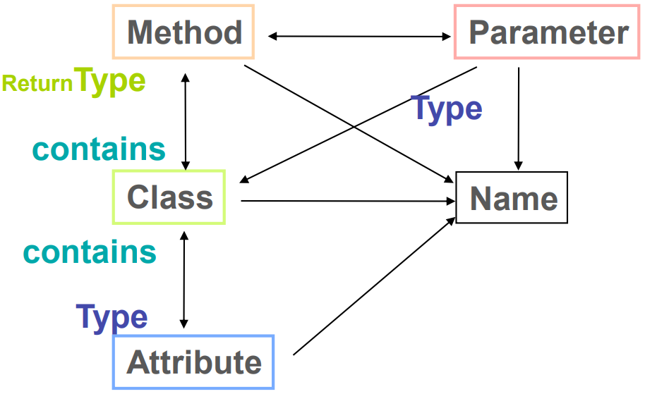

## Reflection Usage

-   Java:
    -   Can be used to
    -   load of JAR / DLL files at runtime
    -   invoke methods
    -   read out properties/fields
    -   create object instances
    -   search for annotations on Classes / Methods / Fields / ...
-   Unterstützt das Implementieren der folgenden Konzepte
    -   Dependency Injection (DI)
    -   Convention over Configuration
    -   Object-Relation Mapper
    -   Serialization / Deserialization (Remote Marshalling /
        Unmarshalling)
    -   Plugin Architectures

### Beispiele

``` java
if (origin instanceof Cloneable) {
  cloned = ((Cloneable)origin).clone();
} else {
  cloned = origin.getClass().getDeclaredConstructor().newInstance();
  // …
  BeanUtils.copyProperties(origin, cloned); // get data from getters, fill into setters
}
```

## Reflection Vorteile

-   Adapting a software system is easy
    -   Tool to build big systems that evolve over time
-   Support for many kinds of changes

## Reflection Nachteile

-   Produces non-transparent "black magic" APIs
    -   control flow already hard to understand with polymorphism
-   Binding at runtime ("Late Binding")
    -   limited type safety
    -   lower efficiency, no compiler-optimization (often combined with
        code generation)

## Reflection Gefahren

-   Different mechanisms for similar semantics confuse
-   More indirection costs efficiency - sometimes too much
-   Too much work to configure and instantiate systems
    -   "you can do what you want with FLEX-TREME, it just takes you
        years to configure it"
-   Users of reflective solutions misuse liberty which results in
    obscure APIs
-   Overengineered solutions
    -   "hey, lets just use another level of indirection and this
        problem can be solved"
-   Security mechanisms get in the way or are undermined
    -   obscurity (in control flow) is one reason

## DiY Reflection

Other self-representation approaches come with less liabilities -
Self-representation as a part of the domain - Sometimes, descriptive
(meta) data need to be persisted and even modified by the user

## Type Object

### Problem

-   Wir wollen allgemeines Verhalten und Daten an einem Ort aufbewahren.
-   DRY Implementation von Domain

Wie kann man Objekte kategorisieren, eventuell dynamisch?

### Lösung

-   Create a category (type) object which describes multiple objects
-   Objects forward the calls to the underlying type
-   Allow objects to change their type at runtime
    -   But ensure identity is kept

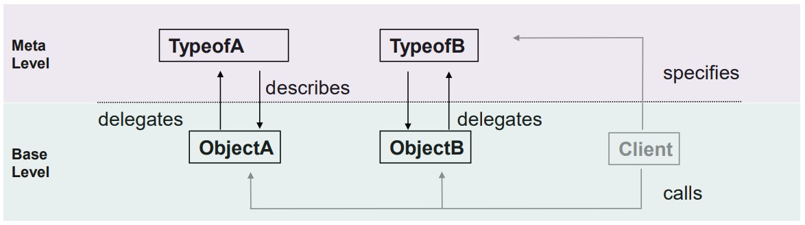 

### Vorteile

-   Categories can be added easily, event at runtime
-   Avoids explosion of (trivial) subclasses
-   Allows multiple 'meta-levels' (type-objects for type-objects)

### Nachteile

-   Confusing mess of "classes" and class mutations, because of
    separation
-   Lower efficiency because of indirection
-   Changing database schemas can be tricky
    -   Solution needs to store different object layouts persistently
        (mitigated with OR-mapping)

### Beispiel

``` java
// Base Level
public class Copy {
  protected MediaType type; // typeof this
  protected int copyid; // e.g. inventory no
  // current identity of this copy
  public int getId() {
    return copyid;
  }
  // example of delegation
  public String getTypeId() {
    return type.getId();
  }
  public String getTitle() {
    return type.getTitle();
  }
  //…
}

// Meta Level
public class MediaType {
  protected String title;
  protected String typeid;
  public String getId() {
    return typeid;
  }
  public String getTitle() {
    return title;
  }
  //…
}
```

### Fragen

**Q**: On which GoF pattern is Type Object based?

**A**: Strategy Pattern; every type represents an own strategy for item
objects

**Q**: Have you already encountered a similar intent of a GoF pattern?

**A**: Yes, it's similar to the State pattern, which "seems to change
its class" at runtime.

**Q**: Do you know any OOA Pattern with a similar intent?

**A**: Item-Descriptor pattern \[Coad92\].

## Property List

### Problem

-   Attribute sollen nach dem Kompilieren hinzugefügt oder entfernt
    werden.
-   Objekte teilen Attribute / Parameter über die Klassenhierarchie.

Wie definiert man Properties (und Argumente) auf eine flexible Art,
welche es ermöglicht, dass sie während der Runtime entfernt und
hinzugefügt werden können?

### Lösung

-   Property list maps attribute names to values.
-   Each name defines a "slot".
    -   May be represented by any Relative Value Type (e.g. a String).
-   In a class hierarchy, the same slot can be used for attributes with
    identical semantics.
-   Objects can be triggered to list all slot names and values.

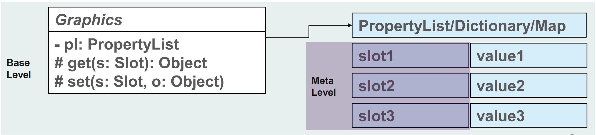

### Vorteile

-   Black-box extensibility of attributes, attributes can be added
    dynamically
-   Object extension while keeping object identity
-   Attribute iteration can be implemented easily
-   Same "attribute" can be used for attributes with identical semantics
    across hierarchies
-   (Property List as parameters, variation): Flexible parameters for
    generic method interfaces

### Nachteile

-   Different ways to access regular and dynamic attributes
-   Type safety left to the programmer
-   Naming not checked by a compiler ('color' vs. 'colour')
-   Semantics of attributes not given by class code only by clients
-   Run-time overhead can be substantial because of name-lookup
-   Memory Management: should get return a reference or a copy of an PL
    value

### Beispiel

``` java
public class Graphics {
  private Properties pl;
  // generic access to properties
  public String get(String prop) {
    return pl.getProperty(prop, "");
  }
  public void set(String prop, Object value) {
    pl.setProperty(prop, value);
  }
}
```

``` java
package java.util;
public class Properties {
  // …
  // Meta Level
  public Set<String> stringPropertyNames() {
    // …
  }
  public String getProperty( String prop, String defaultValue) {
    // …
  }
  public Object setProperty(String prop, Object value) {
    // …
  }
}
```

### Fragen

**Q**: Ideen zum milder der Nachteil?

**A**: A schema could be applied which dynamically perform type and name
checks.

## Bridge Method

-   Strict typing of well-known and predefined properties mitigate
    liabilities
-   A typed schema allows to enforce property names and types
    -   Class code can handle regular and dynamic attributes in the same
        way
    -   Type safety enforced by Bridge Method
    -   Slot name checked on a single point
-   Bridge Methods can be added with Extension Methods (C#)
    -   ...or added to the Graphics prototype (TypeScript / EcmaScript)
-   When using Java, Project Lombok can be used to create
    @ExtensionMethods

### Beispiel

``` java
public class Graphics {
  private HashMap<String, Object> pl;
  private static final NAME_PROP = "name";
  // optional: Bridge Method for property name
  public String getName() {
    return (String)getProp(NAME_PROP, "name");
  }
  public void setName(String name) {
    return setProp(NAME_PROP, name);
  }
  // protected access to properties
  protected Object get(String prop, String def) {
    return pl.getOrDefault(prop, def);
  }
  protected void set(String prop, Object value) {
    pl.put(prop, value);
  }
}
```

``` java
package java.util;
public class HashMap<Key, Value> {
  // …
  // Meta Level
  public Set<Key> keySet() {
    // …
  }
  public Object get(Key key) {
    // …
  }
  public Value put(Key key, Value value) {
    // …
  }
}
```

## Anything

-   What is Anything?
    -   Arbitrary data structure
    -   Recursively structured Property List
    -   Internal representation of today's JSON structure

    ``` json
    [
    {
      "trackid": "AA-1234",
      "reported_dt": "12/31/2019 23:59:59",
      "longitude": -111.1250000,
      "latitude": 33.35500000
    },
    {
      "trackid": "BB-7890",
      "reported_dt": "12/31/2019 23:59:59",
      "longitude": -113.6250000,
      "latitude": 35
    }
    ] 
    ```

### Beispiele

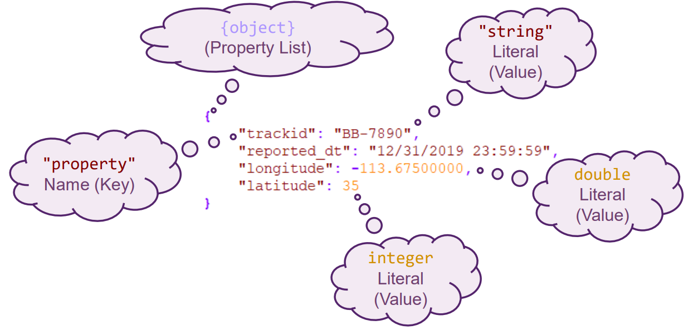 

Komibinierte Variante als Beispiel om vorherigen Abschnitt.

### Problem

-   Es soll eine Sammlung von Daten aufbewahrt werden, ähnlich wie bei
    `Property List`.
-   Strukturierte Daten beinhalten auch Sequenzen von Daten.
-   Daten sollten rekursiv aufgebaut sein.

Wie stellt man eine generische Konfigurations- oder
Kommunikations-Datenstruktur die erweiterbar ist zur Verfügung?

### Lösung

-   Implement a representation for all simple values (including null and
    undefined)
-   In addition, add an implementation for a sequenceof values and
    provide key-value access
-   Provide a default value if the requested value cannot be converted

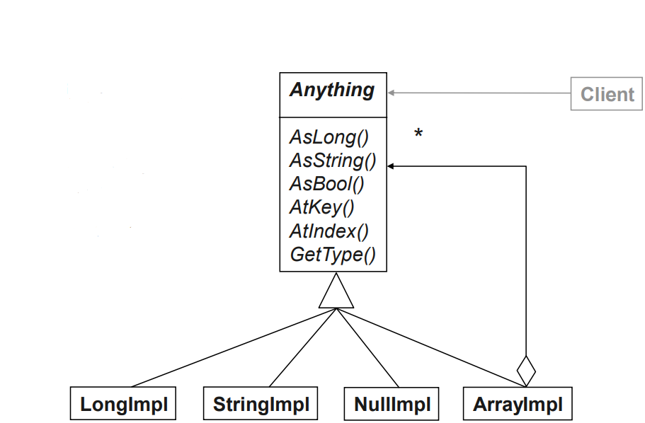

### Vorteile

-   Readable streaming format and appropriate for configuration data
-   Universally applicable, flexible interchange across class/object
    boundaries

### Nachteile

-   Less type safety, but might ask for individual type
-   Intent of parameter elements not always obvious
-   Overhead for value lookup and member access
-   No real object, just data

### Fragen

**Q**: Which GoF pattern (and variation) does the Anything pattern
implement?

**A**: Transparent Composite Pattern

**Q**: Have you discovered any other pattern?

**A**: Null Object

# Frameworkers Dilemma

## Vorteile von Frameworks

-   Less code to write
-   More reliable and robust code
-   More consistent and modular code
-   More focus on areas of expertise, less focus on areas of system
    compatibility
-   Generic solutions that can be reused for other, related problems
-   Improved maintenance and orderly program evolution
-   Additionally, Application Frameworks provide improved integration
    -   Often by implementing plug-ins for a specific product
        environment

## Frameworkers Lock-In

Frameworkbenutzer implementieren ihre Applikation indem sie von
Frameworkklassen erben und vordefinierte Konfigurationen verwenden,
dadurch entsteht ein Framework `lock-in`. Der `lock-in` verhindert
`portability`, `testability` und `evolution`, weil die Vererbung
`strong coupling` bewirkt.

`Portability` ist schwer umzusetzen, weil der Code zu fest auf dem
Framework basiert, dadurch wir code portieren oder Framework auswechseln
erschwert.

`Testability` ist schwer umzusetzen, weil das Framework stark integriert
ist und es dadurch erschwert wird einzelne Teile zu isolieren und zu
testen.

`Evolution` ist schwer umzusetzen, weil man sich auf die
Frameworkentwickler verlassen muss und im Falle von `breaking changes`
auf entsprechende Dokumentation angewiesen ist.

## Meta Frameworks

-   A Framework for Evaluating Software Technology by Brown & Wallnau,
    1996 Describes competing concerns regarding new frameworks:
    -   Initial technology acquisition cost
-   Long-term effect on quality, time to market, and cost of the
    organization's products and services when using the technology
-   Training and support services' impact of introducing the technology
-   Relationship of this technology to the organization's future
    technology plans
-   Response of direct competitor organizations to this new technology

### Framework Evaluation Deltas

1.  understanding how the evaluated technology differs from other
    technologies; and
2.  understanding how these differences address the needs of specific
    usage contexts.

### Phasen

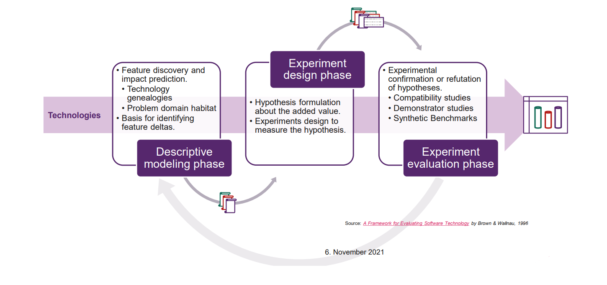 ##\#
Result 

## Developing Frameworks

-   Frameworks need evolutionary improvement
-   Stagnancy in framework development is often interpreted prematurely
    -   Is the framework dead?
    -   Are there alternative frameworks with similar features and
        further development?

Developers may choose competing frameworks due lack of visible progress;
even if there's still work in progress on the framework.

There are two reasons for lack of framework evolution and improvement:

1.  no application uses the framework

-   no users, no need to improve or evolve
-   no experience on what to improve

2.  one or more applications use the framework

-   changing the framework risks breaking applications
-   applications produce work-arounds to framework deficiencies and
    break when those "features" are fixed

## Dilema

Potential ways out of the dilemma: 1. Think very hard up-front - Very
very hard, may work a little bit the second or third time - Requires
very experienced persons - Without concrete applications, it is hard to
decide what to abstract and generalize in a framework - Can lead to
expensive and unusable over-engineered frameworks (e.g. Taligent) -
Takes too long to hit window of opportunity - Might still be sub-optimal
to use 2. Don't care too much about framework users - Lay the burden of
porting applications to the application's developer - Provide many good
and useful new features to make porting a "must" - Might require porting
tools, training/guidelines and conventions - Support old versions
indefinitely or fight hard to keep it backward compatible - Caution:
inhibits framework evolution 3. Let framework users participate - Social
process can help, e.g. by giving users time to migrate - deprecated
interfaces (that get never deleted) - Tendency for infinite backward
compatibility - with a strong user community - Design by committee is
almost always over-engineered and brittle 4. Use helping technology -
Configurability - less direct code-dependencies - Simple and flexible
interfaces - tendency to be more stable - Patterns - Encapsulate
Context, Extension Interface - already known: Reflection, Property List,
Anything

### Konfiguration

-   Use configuration to reduce code-dependencies
    -   Let the framework do as much as possible without writing code
-   Apply Reflection to identify interfaces, classes (extension points)
    and methods (hooks)
    -   Rely on annotations (attributes) which configures application
        wiring
        -   and can be extended later-on without breaking user's code
        -   e.g. Angular Dependency Injection (@Injectable /
            InjectionToken)
-   Reflection allows to use Conventions over Configuration paradigm
    -   Completely eliminates the need of directly coupling the
        framework API
    -   ...but introduces black magic ##\# Einfache und felxible
        Interfaces
-   Choose carefully between calling and subclassing APIs
    -   Subclassing of framework classes result in stronger coupling
        -   No decoupling between framework and user's code
        -   User's code may access and break framework internals
            (slicing / violate contract and invariant)
        -   Further changes in framework classes break user's code
-   Rely on abstractions with generic method arguments
    -   Specific arguments change more often; this may break framework
        user's code
    -   Most flexible and simplest interface specification defines
        methods with no arguments
-   Encapsulate the parameters/properties into another object

## Encapsulate Context (Optional)

Ein Pattern zum vermindern des Framework Dilema

### Problem

-   Ein System beinhaltet Daten, welche divergierenden Teilen des
    Systems zur Verfügung stehen.
-   Wir möchten lange Parameter Listen für Funktionen oder globale Daten
    vermeiden.

Wie kann vermieden werden, dass spezfische Listen von Parametern an
Funktionen übergeben werden müssen um die felxibilität der Interfaces zu
gewährleisten?

### Lösung

-   Einen `Context container` zur verfügung stellen, welcher alle Daten
    sammelt.
-   Der Context agiert als Container für Zustandsdaten des Programms.
-   Das Contextobjekt kann erweitert werden ohne bestehenden Code zu
    brechen.

### Beispiel für eine schlechte Lösung

``` java
// Framework Code V1
public interface ProviderFactory {
  Provider create(
  int id,
  String name
  Object parent // V2
  );
}

// Framework User’s Code (based on V1)
public class WebProviderFactory implements ProviderFactory {
  public Provider create(int id,  String name ) {
    return new WebEndPointProvider(id, name);
  }
}
```

Zum Verwenden der Version 2 muss der Benutzer seinen Code anpassen und
beim Aufruf von `create` zusätzlich den parent übergeben

### Beispiel für eine korrekte Lösung

``` java
// Framework Code V1
public interface ProviderFactory {
  Provider create(FactoryContext context);
}
public interface FactoryContext {
  int getId();
  String getName();
  Object getParent(); // V2 
}
// Framework User’s Code (compatible with V1 & V2)
public class WebProviderFactory implements ProviderFactory {
  public Provider create(FactoryContext context) {
    return new WebEndPiontProvider(
      context.getId(),
      context.getName());
  }
}
```

### Weitere Beispiele

schlecht:

``` java
// Framework Code V1
public abstract class EndPointBase {
  protected String address; //V2: null is newly allowed for localhost connections
  protected int port;
  private Connection conn;
  protected abstract Connection open();
}

// Framework User’s Code (based on V1)
public class WebEndPoint extends EndPointBase {
  @Override
  protected Connection open() {
    return new WebConnection(address, port);
  }
}
public class WebConnection extends Connection {
  WebConnection(String address, int port) {
    if (address == null) { //Contract of V1 is enforced; breaks in V2
      throw new InvalidArgumentException();
    }
  }
}
```

gut:

``` java
// Framework Code V1
public abstract class EndPointBase {
  // no access to fields (avoid slicing)
  protected abstract Connection open(@NotNull ConnectionContext connCtx);
}
// define contract as API part explicitly
public interface ConnectionContext {
  int getId();
  @NotNull String getAddress();
}

// Framework User’s Code (compatible with V1 & V2)
public class WebEndPoint extends EndPointBase {
  @Override
  protected Connection open(@NotNull connCtx) {
    return new WebConnection(connCtx);
  }
}
public class WebConnection extends EndPointBase {
  WebConnection(@NotNull ConnectionContext connCtx) {
  }
}
```

### Fragen

**Q**: Which already discussed patterns could be used to accomplish a
similar result?

**A**: Anything Pattern, Property List Pattern

**Q**: Which pattern would you prefer in consideration of interface
flexibility? Explain your answer.

**A**: - Anything: benefits of Property List but hierarchically
structured. - Property List: Passing a property list as a parameter
allows a client component to extend the amount of data passed to an
operation at will. If you want to keep stable interfaces, shared by
different teams, but are still heavily under development, property lists
as parameters or attributes can be a real life-safer.

## Extension Interface (Optional)

### Problem

-   Erlauben mehrere Interfaces zur Verfügung zustellen aber gleichzeit
    Verhindern von `interface bloating`.
-   Verhindern das client code bricht, wenn einer Komponente zusätzliche
    Funktionalität hinzugefügt wird.

Wie kann man Interfaces designen für unbekanntes und "bloated base
classes" vermeiden?

### Lösung

 

### Vorteile

-   Extensibility: Adding interfaces is easier (like adding properties)
-   Separation of concerns
-   Prevents bloated class interfaces, by aggregating extension
    interfaces
-   Different clients can perceive an abstraction differently
-   Classes need not be related to have a common interface (facet)
    -   loser coupling, no inheritance required

### Nachteile

-   Clients become more complex (first obtain facet then use it)
-   Subject's original interface does not convey intent; less
    type-safety
-   Run-time overhead
-   May split APIs into in-coherent parts

### Fragen

**Q**: Which patterns are incorporated (eingebaut) by the Extension
Interface Pattern?

**A**: Simple Factory, Composite

# React

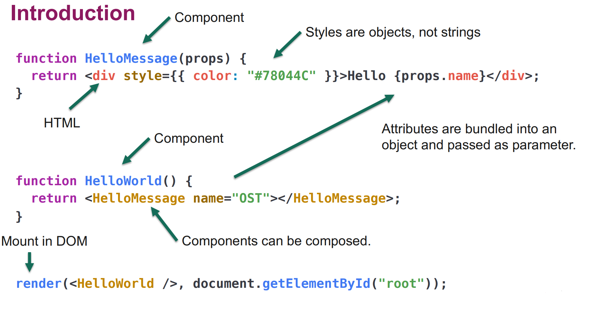

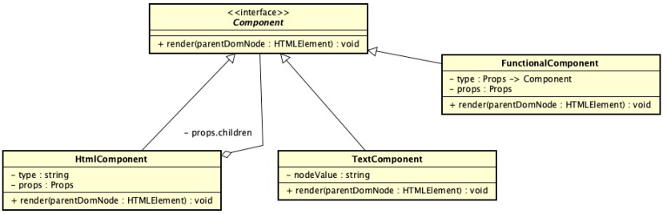

# Redux

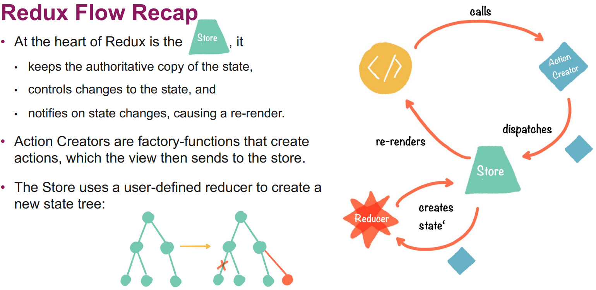

# Eclipse

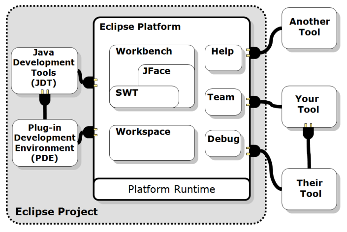

## OSGi

-   Specifies a component and service model for Java
-   Components (bundles) can be installed, started, stopped, and
    uninstalled at runtime
-   Each bundle gets its own classloader
-   Bundles define dependencies and export some of their packages
    (unlike a JAR)
-   Similar goals as Java 9 modularization
-   Several OSGi implementations, Eclipse's is Equinox
-   GlassFish, JBoss, WebSphere, IntelliJ, and many others are all based
    on OSGi ##\# Services
-   OSGi also offers services to connect bundles
-   Service is a POJO and can be registered at a Service Registry at
    bundle start
-   For historical reasons, Eclipse does not use OSGi services but
    Extensions and Extension Points

### Extension Points

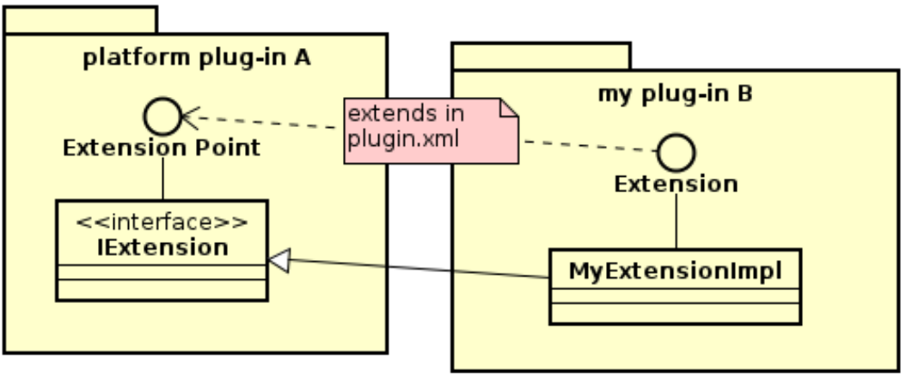

### GOF

-   Platform -Singleton: getting Workbench, Plug-in
-   Workspace Resources
    -   Proxy and Bridge: Accessing File System
    -   Composite: the workspace
    -   Observer: tracking resource changes
-   Core Runtime
    -   IAdaptable and Adapter Factories: Property View SWT
-   SWT
    -   Composite: composing widgets
    -   Strategy: defining layouts
-   JFace
    -   Observer: responding to events
    -   Pluggable adapter: Connecting widget to model
    -   Strategy: customize a viewer without subclassing
    -   Command: Actions
-   UI Workbench
    -   Virtual Proxy: lazy loading with E.P.
-   LTK
    -   Template Method, Composite, Memento
-   CDT
    -   Visitor: to traverse the AST

# Singleton

## Problem

-   Von manchen Klassen möchte man nur eine Instanz.

Wie kann man garantieren das nur eine Instanz eines Objekt global
verfügbar ist?

## Verwendung

1.  Es darf nur eine Instanz einer Singleton Klasse existieren
2.  Die Klasse muss über einen bekannten "access point" verwendbar sein.
3.  Es sollte möglich sein von der Singleton Klasse zu erben.
4.  Das "extenden" des Singleton darf keine existierenden Code brechen.

## Lösung


`static Instance()` kann für lazy Initialisierung verwendet werden.

## Implementation

``` java
public class Singleton {
  private static class InstanceHolder {
    // Singleton will be instantiated as soon as the
    // ClassLoader instantiates the overlying class.
    private static final Singleton INSTANCE = new   Singleton();
  }
  public static Singleton getInstance() {
    return InstanceHolder.INSTANCE;
  }
  protected Singleton() { } // allow subclassing
}
```

## Vorteile

-   Controlled access to sole instance
-   Reduced name space
-   Permits refinement of operations and representation
-   Permits a variable number of instances
-   More flexible than class operations

## Nachteile

Ursprünglich wurden keine definiert.

-   Introduces a global variable/state

    -   Clients bind statically to a global class member (tight
        coupling)
    -   Problematic within multi-threaded environments; locking
        strategies needed

-   Prevents polymorphism (interface abstraction is not foreseen)

    -   Limits interchangeability
    -   Limits unit testing (mocking) and disallows parallelism during
        the tests --> hinders maintainability
    -   Limits application evolution

-   Carries state until the app closes

-   Singleton accommodates a global state and restricts unit testing due
    limited interchangeability

## Variation Registry


## Fragen

**Q**: Which patterns you know are contained within the Singleton
pattern?

**A**: Class Factory Method, Lazy (& Eager) Acquisition

**Q**: Which benefit in terms of testability do you see in the Registry?

**A**: During the tests, a Singleton instance can be replaced with a
test stub. This requires the test stub must also derive from the
Singleton base class.

**Q**: How could you enhance the testability?

**A**: Derive the Singleton from a base interface. This allows to
completely replace the object registered within the registry with a test
implement.

# Killing Singleton

## Ausgangslage

Die Applikation verwendet ein Framework mit einem Singleton, desen
Instanz als `private static` vorhanden ist. Es ist nicht möglich die
Funktionalität des Singleton zu verändern, das Singleton greift auf
Hardware zu, welche im Test Environment nicht zur Verfügung steht.

Es muss aber trotzdem irgendwie möglich sein einen automatisierten Test
zu schreiben, zum Verbessern der test coverage.

How can we get rid of the tight coupling to the Singleton, to support
maintainability and enable automated testing?

## Monostate

### Problem

-   Mehrere Instanzen sollten dasselbe Verhalten haben.
-   Die Instanzen sind simple unterschiedliche Namen für dasselbe
    Objekt.
-   Sollte das Verhalten eines Singleton haben ohne die Nachteile eines
    Singleton.

Wie können sich zwei Instanzen so verhalten, als wären sie ein Objekt?

### Implementation

``` java
// > Plain Monostate implementation
public class Monostate {
  private static int x;
  private static int y;
  public int getX() { return x; }
  public int getY() { return y; }
}
```

``` java
// Example 2:
// > Mitigate Singleton & introduce interface
public interface Monostate {
  int getX();
  int getY();
}
public class MonostateImpl implements Monostate {
  public int getX() {
    return Singleton.getInstance().getX();
  }
  public int getY() {
    return Singleton.getInstance().getY();
  }
}
```

Der Code des Benutzer referenziert `Monostate` anstelle des Singleton,
MonostateImpl leitet die Aufrufe ans Singleton weiter.

### Vorteile

-   Transparency, no need to know about Monostate
-   Derivability, subclasses allowed and share the same static variables
-   Polymorphism, different derivatives can offer different behavior
    -   Testability, implementation of Monostate interface can be
        replaced easily in test environments
-   Well-defined creation and destruction (for static members)

### Nachteile

-   Breaks inheritance hierarchy, a non-monostate class cannot be
    converted into a Monostate class through derivation
-   Monostate is a real object, may go through many creations and
    destructions
-   Monostate statics are always allocated, consumes memory
-   Sharing Monostate objects across several tiers is not possible
-   Shared state of Monostate may cause unexpected behavior

### Fragen

**Q**: What is the applicability of the Monostate pattern?

**A**: In a new and clean system, usage of that pattern should be
avoided. Nevertheless, if a dependent system already contains a
Singleton, the liabilities could be mitigated.

**Q**: Which liability would be most damaging, if Monostate is not
documented clearly?

**A**: The new operator does not allocate the memory for the new object.
Therefore, Monostate internal concept is to hide a Singleton-like
behavior. This conceptual inconsistency may confuse the developers using
the Monostate object. The Monostate is also called "Borg Pattern". Borgs
are cybernetic organisms with a linked hive mind called "the
Collective". Individual beings are forcibly transformed into "drones" by
injecting nanoprobes.

**Q**: Why does the Monostate object break the inheritance hierarchy?

**A**: A non-Monostate class accommodates an internal state (non-static
fields). Monostates must not. Thus, the hierarchies aren't compatible.

## Service Locator

### Problem

-   Die Implementation einer globalen Service Instanz solle austauschbar
    sein.
    -   Es sollte möglich sein die Servicemethoden auf einem anderen
        Tier transparent auszuführen.

Wie kann man globale Service registrieren, sobald sie benötigt werden?

### Lösung

-   Der `ServiceLocator` muss als Singleton `Registry` implementiert
    werden.
-   Der `ServiceLocator`gibt die `finder` Instanz zurück welche benutzt
    wird, um den konkreten Service zu finden.


### Vorteile

-   There's exactly ONE Singleton in the application
-   ServiceLocator interface (except static members) strongly rely on
    abstractness
    -   Locators and services can be easily exchanged, even at runtime

### Nachteile

-   Clients still rely on a static reference to ServiceLocator class
    (tight coupling)
-   No possibility to replace the ServiceLocator implementation; but the
    locators/services are replaceable
-   See Singleton for all liabilities...

### Kritik

-   No real improvement over Singleton
    -   Enhances the «Registry» variation with a highly configurable
        global factory
-   Thus, pattern tries to combine Abstract Factory with Singleton
    pattern
    -   But does not address real drawbacks of Singleton

## Parameterize from Above

### Problem

-   Singleton gewährleistet keine Haltbarkeit und keine Testbarkeit.
    -   Aber `application-wide` Daten müssen bereitgestellt werden.
-   Die Applikation soll in logische Layer aufgeteilt werden.
    -   Unter Berücksichtigung von `loose coupling` und ohne direkte
        `bottom-to-top` Abhängigkeiten.

Wie kann man die benötigten Daten den tiefen Layers zur Verfügung
stellen ohne das sie global verfügbar sind?

### Lösung

Konfigurationparameter und "bekannte" Objekte werden via Constructor
oder als Template Paramter übergeben und sind nicht mehr global
verfügbar.


``` java
public final class Bootstrapper {
  public static void main(string[] args) { // PfA applied
    // instantiate vertical layer contexts first
    SecurityContext securityContext = new SecurityContextImpl();
    ConfigurationSettings configuration = new ConfigurationSettingsImpl(args);
    // encapsulate variables into an application context
    var applicationContext = new ApplicationContextImpl(
    securityContext,
    configuration);
    // instantiate horizontal layer contexts from bottom to top
    DataContext dlContext = new DataContextImpl(applicationContext);
    BusinessContext blContext = new BusinessContextImpl(applicationContext, dlContext);
    UIContext uiContext = new UIContextImpl(applicationContext, blContext);
    // show initial UI dialog
    uiContext.show();
  }
}
```

### Vorteile

-   No global variables
-   Implementations of parametrized functionalities are exchangeable
    -   Additional implementation possible, e.g. for test environment or
        production, per customer, ...
-   Enforces separation-of-concerns at architecture level
    -   Reduces tight coupling between the layers
    -   Lowers the risk of creating unmaintainable monoliths

### Nachteile

-   Adds more complexity to the overall system
    -   Object instances aren't accessible from everywhere; access to
        application context needed
    -   Programmers must understand and accept the concept
-   Contexts must be passed through the whole application stack
-   Fragile bootstrapper: application must be wired completely at
    startup

## Dependency Injection

### Problem

-   User überschreiben vielleicht Implementation von existierenden
    Applikationskomponenten.
-   Die Applikation sollte automatisch anhand der
    Interfaceimplementation verdrahtet werden.
    -   So kann beispielsweise während eines Tests eine andere
        Implementation verwendet werden.
-   Jede Komponente des Systems kann nach einem Objekt eines Interfaces
    verlangen, beispielsweise als constructor Argument oder als
    Property.

Wie können Frameworkbenutzer eine eigene Implementation einer
vordefinierten Frameworkkomponente erstellen oder sogar das System mit
eigenen Interfaces Definition und Implementation erweitern?

### Lösung

-   Eine zentrale Container (Dependency Injection Container) Klasse
    agiert als `Registry`.
-   Der Benutzer referenziert die Dependency anhand des benötigten
    Interface.
    -   Die Implementation zu dem definierten Interface wird via
        Container zur Verfügung gestellt.
-   Der Benutzer verwendet Annotations zum
    -   referenzieren der benötigten Interfaces
    -   deklarieren der Interface Implementationen.
-   Benutzer verwenden den Container nicht direkt, sondern nur via
    Framework.


### Implementation

-   Patterns `Service Locator` und `Parameterize from Above` kombinieren
    -   Zentrale Container Instanz, als "highly configurable" `Registry`
        verwenden.
    -   Je nach Anforderungen beherbergt der Container `Factories` oder
        Implementationen.
-   Die Container Klasse darf im Benutzercode nicht statisch
    referenziert werden.
    -   Indirektion über Annotationen forcieren, damit statisches
        Binding verhindert wird.


### Vorteile

-   Reduces coupling between the consumer and the implementation
    -   No need to reference the DI container directly
-   The contracts between the classes are based on interfaces
    -   Classes relate to each other not directly, but mediated by their
        interfaces
-   Supports the open/closed principle
-   Allows flexible replacement of an implementation
-   Implementations can be marked as "single" (only one in the system)
    or "transient" (new instance per injection)

### Nachteile

-   Adds black magic to the overall system
    -   Wiring of the object tree is not transparent anymore (and not
        checked by the compiler)
-   Debugging the object dependency tree may become hard
-   Recursive dependencies are hard to find and may prevent the system
    from startup
-   Relies on reflection and can result in a performance hit

### Fragen

**Q**: What's the relation between Singleton and DI?

**A**: a) DI container may implement a mechanism to instantiate a
requested dependency once per application («Single» instances).
Depending on the DI container, such registrations are called
«Singleton».

b)  DI container implementations can be based on the «Registry»
    Singleton variation.

**Q**: What is the improvement of DI over the Service Locator pattern?

**A**: Client classes within the application don't depend directly on
the dependency injection container. The DI annotation/attribute allows
to reduce the tight coupling between the DI container implementation and
the declarative dependency requirements of a class. Service Locators are
directly referenced by client classes

# Flyweight

## Problem

-   Speicherkosten sind hoch wegen der hohen Anzahle von Objekten.
-   Viele Objekte können mit wenigen geteilten Objekten ersetzt werden.
-   Objekte hängen nicht von Objektidentität ab.

Wie kann das Existieren mehrerer Kopien von identischen konstanten
Objekten vermieden werden?

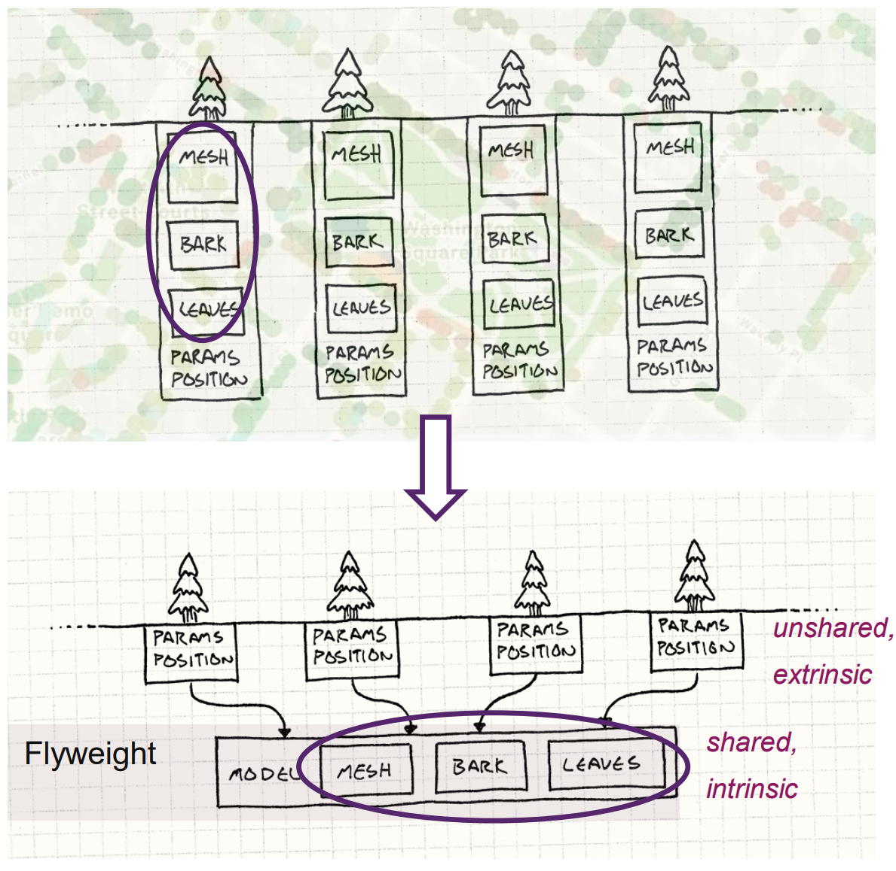

## Lösung

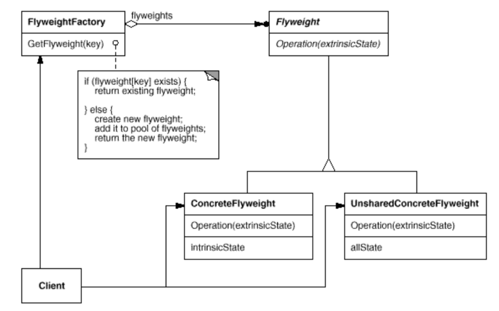

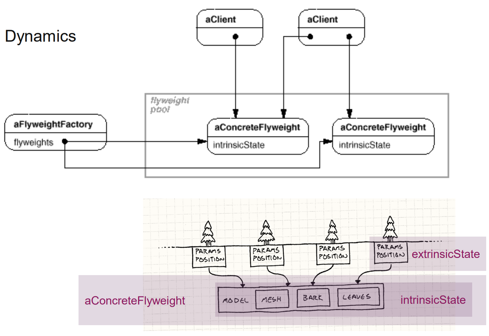

## Implementation

``` java
public interface FlyweightChar {
    int getCharCode();
}
public class ConcreteFlyweightChar implements FlyweightChar {
    private final char character;
    public int getCharCode() {
        return character;
    }
    ConcreteFlyweightChar(char character) {
        this.character = character;
    }
}

public class FlyweightFactory {
  private final Hashtable<Character, FlyweightChar> chars = new Hashtable<>();
  public FlyweightChar getFlyweight(char key) {
    if (!chars.containsKey(key)) {
      chars.put(key, createFlyweight(key));
    }
    return chars.get(key);
  }
  protected FlyweightChar createFlyweight(char key) {
    return new ConcreteFlyweightChar(key);
  }
}
public class FlyweightFactoryTest {
  @Test
  public void testFlyweight_getChar_succeed() {
    FlyweightFactory factory = new FlyweightFactory();
    FlyweightChar aChar = factory.getFlyweight('a');
    FlyweightChar bChar = factory.getFlyweight('b');

    assertEquals(aChar, factory.getFlyweight('a'));
    assertEquals(bChar, factory.getFlyweight('b'));
  }
}
```

## Vorteile

-   Reduction of the total number of instances (space savings). Savings
    depend on several factors:
-   the reduction in the total number of instances comes from sharing.
-   the amount of intrinsic state per object.
-   whether extrinsic state is computed (=computation time) or stored (=
    space cost).

## Nachteile

-   Can't rely on object identity; stored elements contain Value
    characteristics
-   May introduce run-time costs associated finding Flyweights, and/or
    computing extrinsic state

## Zusammenhänge

-   Wird oft mit `Composite` kombiniert.
    -   Hierarchische Strukturen als Graph mit geteilten `leaf` notes.
        -   `Leaf` nodes cannot store a pointer to their parent
        -   Parent pointer is passed to the flyweight as part of its
            extrinsic state
        -   Impacts on how the objects in the hierarchy communicate with
            each other
